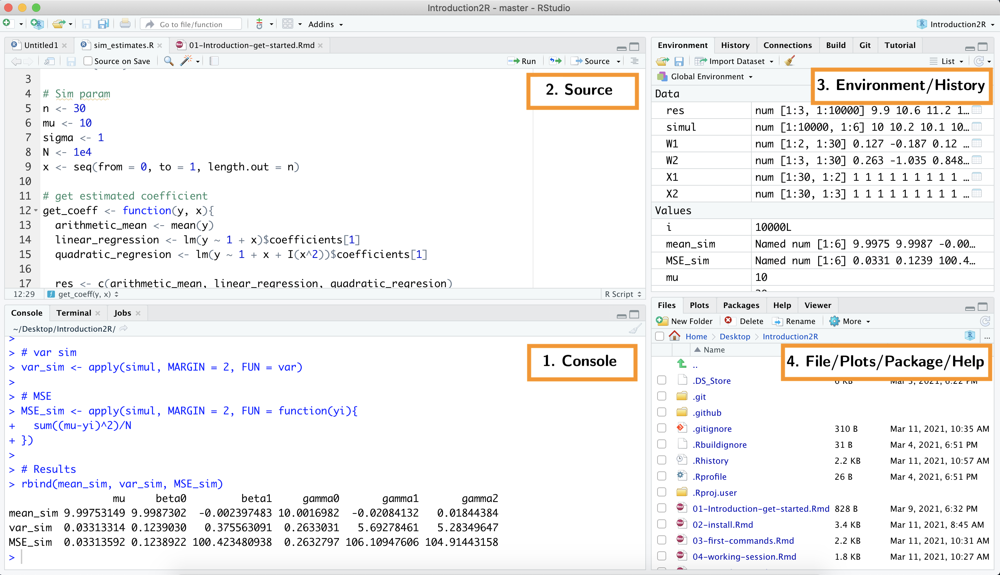
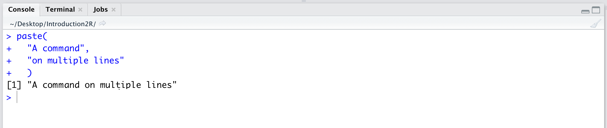
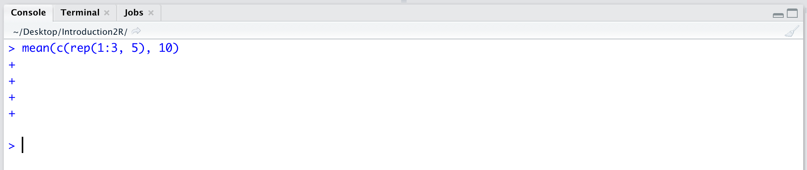
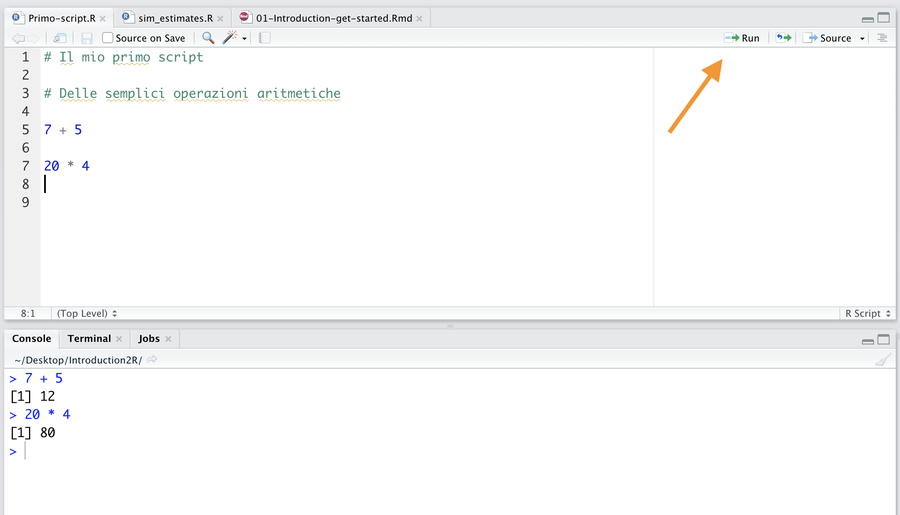
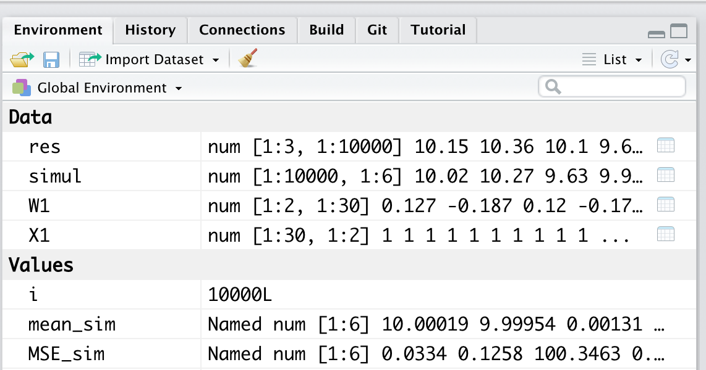
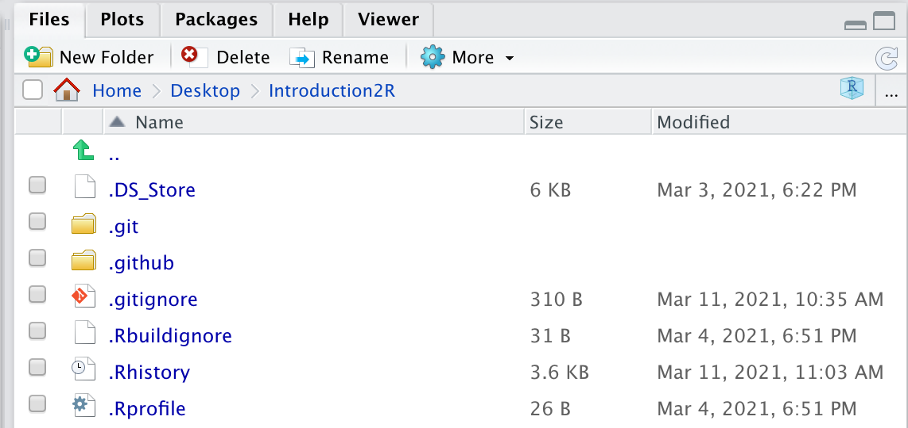
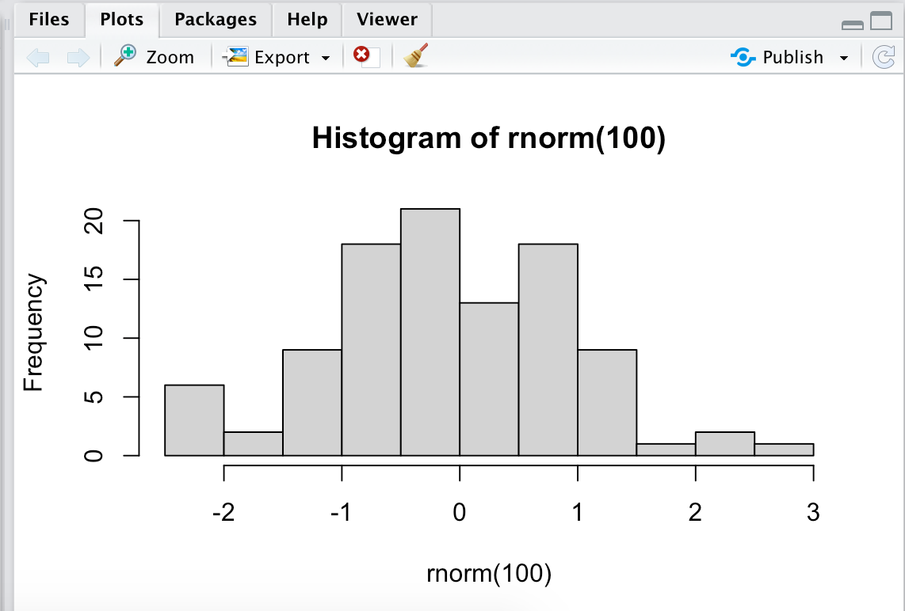
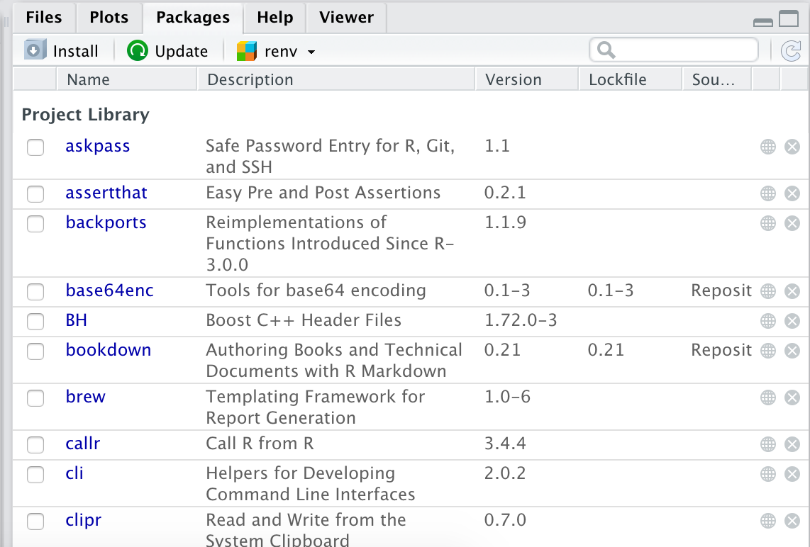
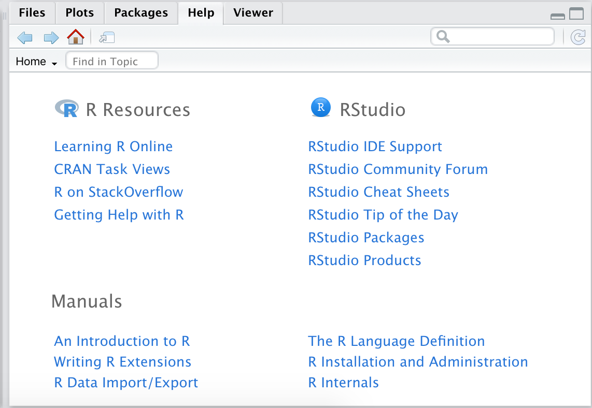

# RStudio Interface {#rstudio-gui}

```{r settings, echo = FALSE}
knitr::opts_chunk$set(
  echo = FALSE,
  fig.align="center"
)
```

In this chapter, we will introduce the RStudio user interface. Many aspects briefly introduced here will be discussed in subsequent chapters. For now, our focus is to get familiar with the interface of our primary tool, RStudio.

As we saw in Chapter \@ref(install), R is the true "computational engine" that allows us to perform calculations, statistical analyses, and various operations. However, the basic interface of R, called **Console** (see Figure \@ref(fig:r-console)), is somewhat *démodé*, or better suited for real experts.

```{r r-console, fig.cap="The R console, only for true connoisseurs", out.width="85%"}
knitr::include_graphics("images/r-console.png")
```

In general, RStudio is used for working with R (although it also supports other programming languages, including Python, Stan, C/C++, and JavaScript, among others). RStudio is an Integrated Development Environment (IDE) that includes various tools for writing and executing code into a single Graphical User Interface (GUI). The RStudio interface consists of four main panels (see Figure \@ref(fig:rstudio-gui)):

```{r rstudio-gui, fig.cap="RStudio user interface with its four panels", out.width="85%"}

```

:::{.design title="R-Basic vs RStudio" data-latex="[R-Basic vs RStudio]"}
Using R through the basic interface (Console alone) versus RStudio is not a debate between two schools of thought (or generations). Both have their advantages and disadvantages and are chosen according to different needs.

When looking for maximum optimization, using the basic interface, thanks to its simplicity, helps minimize memory usage by focusing only on the essentials. Thus, using simple R console may ensure faster computation when running large chunks of code. 

In other cases, however, the additional features and tools in RStudio allow for greater efficiency in your work.
:::


#### 1. Console: the heart R {-}

Here we find the *Console* of R, where all your code and commands are actually executed. Notice how the last line in the Console shows the `>` symbol. This is called the prompt,  indicating that R is waiting for new commands to execute.

The *Console* in R is a command-line interface. Unlike other point-and-click programs, in R, you need to type commands using the keyboard. To execute commands, you can directly type the operations into the *Console* and press `enter`. R will immediately execute the command, display the result, and on the next line, the prompt will appear again, indicating that R is ready for a new command (see Figure \@ref(fig:command-sequence)).

```{r command-sequence, fig.cap="Execution of commands directly in the console", out.width="95%"}
knitr::include_graphics("images/command-sequence.png")
```

In the case of multi-line commands, as shown in Figure \@ref(fig:multiple-line-command), the `+` symbol appears as the prompt, indicating that R is waiting for the entire command to be typed before it is executed.

```{r multiple-line-command, fig.cap="Execution of a multi-line command", out.width="95%"}

```

As you may have noticed during some testing, commands entered in the *Console* are executed immediately but not saved. To rerun a command, you can scroll through previously executed commands using the arrow keys $\uparrow\downarrow$. However, if errors occur, you will need to rewrite and rerun the commands. Since writing code is a continuous try-and-error process, working solely from the *Console* soon becomes chaotic. Therefore, we need a solution that allows us to work more comfortably with our code and save commands to be executed in the correct order when needed. The solution is *Scripts*, which we will introduce in the next section.

:::{.tip title="Interrompere un comando" data-latex="[Interrompere un comando]"}
It may happen that, due to a typo in a command or long computational times, the R *Console* becomes unresponsive. In this case, you need to interrupt the writing or execution of the command. Let's look at two common situations:

1. **The `+` prompt keeps appearing (instead of `>`)**. Especially when using parentheses and long commands, it may happen that after pressing `enter`, R does not execute any command but stays in wait, showing the + prompt (see the following figure). This is usually due to a syntax error (e.g., a mistake in parentheses or commas). To resume the session, press the `esc` key on your keyboard. When the prompt `>` reappears, it indicates that R is ready to listen for new commands, but be careful not to repeat the same mistake.

```{r my-label, out.width="95%"}
# fig.cap="Typical situation where R is waiting and the command is not executed - Press esc to resume the session"

# LaTeX do not support figure in minipage so no add label

```

2. **R is unresponsive**. Some calculations may take a very long time, or a problem may have caused your session to loop forever. In these situations, the R *Console* becomes unresponsive. If necessary, you can interrupt the processes currently running by pressing the **STOP** button, as shown in the following figure. R will stop and return to waiting for new commands (prompt `>`).

```{r console-stop, out.width="95%"}
# fig.cap="Press the stop button to interrupt the current process"

# LaTeX do not support figure in minipage so no add label
knitr::include_graphics("images/console-stop.png")
```

:::

:::{.trick title="Force Quit" data-latex="[Force Quit]"}
In extreme cases where R seems unresponsive, use the `Ctrl-C` command to force R to stop the running process.

As a last resort, remember one of the basic principles of computing: *turn-it-off-and-on-again*! (i.e., sometimes just closing and reopening RStudio will be enough)

:::

#### 2. Source: your notebook {-}

This section displays your Scripts. These are special documents (i.e., documents with the "**.R**" extension) where your code and commands are saved for future execution in R. Scripts allow you to work comfortably on your code, write commands, correct them, organize them, add comments, and, most importantly, save them.

After writing the commands, place the cursor on the same line as the command you want to execute and press `Ctrl + enter` (Windows) or `command + ender` (MacOS). The command will automatically be copied into the *Console* and executed. Alternatively, you can press the **Run** button indicated by the arrow in Figure \@ref(fig:script-run).

```{r script-run, fig.cap="Execute a command from a script by pressing Ctrl + enter (Windows) / command + enter (MacOS), or by pressing the button indicated by the arrow", out.width="95%"}

```

:::{.tip title="Commenti" data-latex="[Commenti]"}

If you looked closely at the script in Figure \@ref(fig:script-run), you may have noticed green lines of text preceded by the `#` symbol. This symbol is used to insert *comments* into the script. R will ignore any comments and only execute the code.

Using comments is very important in complex scripts because it allows us to explain and document the code being executed. In Chapter \@ref(sintax), we will further explore their usage.
:::

:::{.design title="Create and Save a Script" data-latex="[Create and Save a Script]"}
To create a new script, simply press the button in the upper left, as shown in the figure, and select *"R Script"*.

<center>
{ width=75% }
</center>
<br>

Unn nuovo script senza nome verrà creato. Per salvare lo script premere l'icona del floppy e indicare il nome. Ricorda di usare l'estensione "**.R**" per salvare gli script.

<center>
{ width=75% }
</center>
<br>

:::

#### 3. Environment and History: the workin session {-}

Here you will find a series of panels useful for evaluating information related to your working session. The main panels are *Environment* and *History* (the other panels shown in Figure \@ref(fig:environment) concern advanced functions of RStudio).

- **Environment**: lists all objects and variables currently present in the working environment. We will explore the concepts of variables and the working environment in Chapter \@ref(objects-section) and Chapter \@ref(environment), respectively.

```{r environment, fig.cap="*Environment* - List of objects and variables in the working environment", out.width="60%"}

```

- **History**: a list of all the commands previously executed in the console. Note that this is not equivalent to a script, rather, it is simply an unmodifiable list (and rarely used).

#### 4. File, Plots, Package, Help: system management{-}

This section contains a series of panels used to interface with additional system resources (e.g., files and packages) or to produce outputs such as graphs and tables.

- **Files**: a panel where you can browse through all the files on your computer.

```{r files, fig.cap="*Files* - Allows browsing through your computer's files", out.width="60%"}

```

- **Plots**: the panel where graphs are produced, and which can be exported by clicking *Export*.

```{r plots, fig.cap="*Plots* - Display graphs", out.width="60%"}

```

- **Packages**: a list of R packages (this topic will be covered in more detail in Chapter \@ref(packages)).

```{r packages, fig.cap="*Packages* - List of R packages", out.width="60%"}

```

- **Help**: used to navigate R's internal documentation (this topic will be covered in Chapter \@ref(help)).

```{r help, fig.cap="*Help* - R documentation", out.width="60%"}

```

:::{.tip title="Personalizza tema e layout" data-latex="[Personalizza tema e layout]"}
RStudio allows a high degree of customization of its graphical interface. You can change the theme, font, and panel layout according to your preferences and needs.

Try changing the editor theme to *Idle Fingers* to use a dark background that is easier on the eyes (see the following figure). Click on RStudio > Preferences > Appearance (MacOS) or Tools > Global Options > Appearance (Windows).

```{r dark-theme, out.width="90%"}
knitr::include_graphics("images/dark-theme.png")
```

:::

