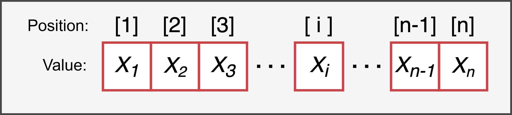

# Vectors {#vector}


```{r settings, echo = FALSE}
knitr::opts_chunk$set(
  echo = FALSE,
  collapse=TRUE,
  fig.align="center"
)

library(kableExtra)
```

Vectors are the simplest data structure in R. A vector is simply a collection of elements arranged in a specific order, and we can imagine it similarly to the representation shown in Figure \@ref(fig:vector). 

```{r, vector, fig.cap="Representation of the structure of a vector of length *n*", out.width="65%"}

```

Two important characteristics of a vector are:

- la **Length** - the number of elements that make up the vector.
- la **Type** - the type of data that makes up the vector. A vector must be composed of **elements all of the same type**; therefore, there are different types of vectors depending on the data type (numeric, integer, logical, or character values).

It's also important to emphasize that each **element** of a vector is characterized by:

- un **a value** - the value of the element, which can be anything, such as a number or a string of characters.
- un **a position index** - a positive integer that identifies its position within the vector.

Thus, vectors $x$ and $y$ defined as:
$$
x = [1, 3, 5];\ \ \ y = [3, 1, 5],
$$
though containing the same elements, are not identical because they differ in their order. This illustrates how the order of elements is crucial in evaluating a vector.

Now, let’s see how to create vectors in R and perform common operations such as selection and manipulation. We will then explore vector characteristics by examining their different types.

## Creation

We’ve already encountered vectors in previous chapters, as even variables with a single value are simply vectors of length 1. However, to create vectors with multiple elements, we use the `c()` command, meaning *"combine"*, specifying the elements in the desired order and separating them with commas. The syntax is as follows:

```{r echo = TRUE, eval = FALSE}
vector_name = c(x_1, x_2, x_3, ..., x_n)
```

Note that the elements of a vector must all be of the same type, for example, numeric or character values.

:::{.design title="Sequences - ':', seq() e rep() " data-latex="[Sequences - ':', seq() e rep() ]"}
Alternatively, any function that returns a sequence of values as a vector can be used. Some of the most commonly used functions for creating sequences are:

- `<from>:<to>` - Generates a sequence of increasing (or decreasing) numeric values from (`<from>`) to (`<to>`) in steps of 1 (o -1 ).
```{r echo = TRUE}
# increasing sequence
1:5

# decreasing sequence
2:-2

# sequence with decimal values
5.3:10
```

- `seq(from = , to = , by = , length.out = )` - Generates a regular sequence of numeric values between `from` and `to` with increments specified by `by`, or with a total length specified by `length.out` (see `?seq()` for more details).
```{r echo = TRUE}
# sequence with increments of 2
seq(from = 0, to = 10, by = 2)

# sequence with 5 elements
seq(from = 0, to = 1, length.out = 5)
```

- `rep(x, times = , each = )` - Generates a sequence by repeating the values in `x`. The values in x can be repeated multiple times in order using `times` or each value can be repeated multiple times using `each` (see `?rep()` for more details).
```{r echo = TRUE}
# repeated sequence
rep(c("foo", "bar"), times = 3)

# sequence with repeated elements
rep(1:3, each = 2)
```
:::

### Exercises {-}

Familiarize yourself with vector creation ([solutions](https://github.com/psicostat/Introduction2R/blob/master/exercises/chapter-07-vectors.R)):

1. Create the vector `x` containing the numbers 4, 6, 12, 34, 8.
2. Create the vector `y` containing all the even numbers between 1 and 25 (`?seq()`).
3. Create the vector `z` containing the first 10 multiples of 7 starting from 13 (`?seq()`).
4. Create the vector `s` where the letters `"A"`, `"B"`, and `"C"` are repeated in the same order 4 times (`?rep()`).
5. Create the vector `t` where the letters `"A"`, `"B"`, and `"C"` are each repeated 4 times (`?rep()`).
6. Generate the following output with minimal code.
```{r}
rep(rep(c("foo", "bar"), each = 2),times = 2)
```


## Selecting Elements {#vector-selection}

Once a vector is created, you may need to select one or more of its elements. In R, to select elements from a vector, **square brackets** `[]` are used after the vector name, with the **position index** of the desired elements inside the brackets:

```{r, echo = TRUE, eval = FALSE}
vector_name[<position-index>]
```

Be careful not to specify the value of the desired element, but its position index. For example:

```{r echo = TRUE}
# given the vector
my_numbers = c(2,4,6,8)

# to select the value 4, use its position index, which is 2
my_numbers[2]

# If you use its value (4), 
# you'll get the element in the 4th position
my_numbers[4]
```

To select multiple elements, list all the desired position indices within the square brackets. Note that you can't simply provide individual numbers; they must be enclosed in a vector, for example, using the `c()` function. Essentially, you use a vector of indices to select the elements from the original vector.

```{r echo = TRUE, error = TRUE}
# INCORRECT selection of multiple values
my_numbers[1,2,3]

# CORRECT selection of multiple values
my_numbers[c(1,2,3)]
my_numbers[1:3]
```

:::{.tip title="Selecting is not Modifying" data-latex="[Selecting is not Modifying]"}
Note that selecting elements does not modify the original vector. If you want to keep the changes, you need to save the result of the selection.

```{r, echo = TRUE}
my_words = c("foo", "bar", "baz", "qux")

# Selecting the first two elements
my_words[1:2]

# The original vector still has all the elements
my_words

# Save the result
my_words = my_words[1:2]
my_words
```

:::

:::{.warning title="Edge Cases in Selection" data-latex="[Edge Cases in Selection]"}
What happens if you use a position index greater than the number of elements in your vector?
```{r echo = TRUE}
# My vector
my_numbers = c(2,4,6,8)

my_numbers[10]
```
R doesn't return an error but gives the value `NA` (*Not Available*) to indicate that no value is available.

Let’s also explore other special behaviors or possible errors in element selection:

- The position index must be a numeric value, not a character.
```{r echo = TRUE, error = TRUE}
# INCORRECT selection of multiple values
my_numbers["3"]

# CORRECT selection of multiple values
my_numbers[3]
```
- Decimal numbers are ignored, not rounded.
```{r echo = TRUE,}
my_numbers[2.2]
my_numbers[2.8]
```
- Using the value 0 returns an empty vector.
```{r echo = TRUE,}
my_numbers[0]
```
:::

### Advanced Uses of Selection {#vector-selection-advanced}

Let’s now look at some advanced uses of vector element selection. Specifically, we will learn how to:

- use relational and logical operators to select elements from a vector
- change the order of elements
- create new combinations
- replace elements
- remove elements

#### Relational and Logical Operators {-}

A useful function is selecting elements from a vector that meet a certain condition. To do this, you specify the condition inside square brackets using relational and logical operators (see Chapter \@ref(operators-rel-log)). 

For example, we can select all elements greater than a certain value from a numeric vector, or select all elements equal to a specific string from a character vector.
```{r, echo = TRUE}
# Numeric vector - select elements greater than 0
my_numbers = -5:5
my_numbers[my_numbers >= 0]

# Character vector - select elements equal to "bar"
my_words = rep(c("foo", "bar"), times = 4)
my_words[my_words == "bar"]
```

To better understand this process, it’s important to note that there are two distinct steps in the same command:

- **Logical vector** (see Chapter \@ref(logical-vector)) - When a vector is evaluated in a condition, R returns a new vector containing the answer (`TRUE` or `FALSE`) for each element of the original vector.
- **Selection** - We use the resulting logical vector to select elements from the original vector. Elements associated with `TRUE` are selected, while those associated with `FALSE` are discarded.

We can make these two steps explicit in the following code:
```{r, echo = TRUE}
# Logical vector
condition = my_words=="bar"
condition

# Selection
my_words[condition]
```

#### Sorting Elements {-}

Position indices can be used to sort the elements of a vector according to your needs.

```{r, echo = TRUE}
messy_vector = c(5,1,7,3)

# Reorder the elements
messy_vector[c(4,2,3,1)]

# Sort elements in ascending order
messy_vector[c(2,4,1,3)]
```

:::{.trick title="sort() vs order()" data-latex="[sort() vs order()]"}
To sort elements in ascending or descending order (either alphabetically or numerically), you can use the `sort()` function, specifying the `decreasing` argument. See the help page of the function for more information (`?sort()`).

```{r, echo = TRUE}
# Alphabetical order
my_letters = c("cb", "bc", "ab", "ba", "cb", "ab")
sort(my_letters)

# Descending order
sort(messy_vector, decreasing = TRUE)
```

Note that there is also the `order()` function, but it is a false-friend because it does not directly provide a vector with sorted elements but instead returns the position indices for reordering the elements (`?order()`). See how to use this function in the following example:
```{r, echo = TRUE}
# Position indices for reordering elements
order(messy_vector)
# Reorder the vector using the position indices
messy_vector[order(messy_vector)]
```
:::

#### Combinations of Elements {-}

The same position indices can be used multiple times to repeat elements in the desired combinations, forming a new vector.
```{r, echo = TRUE}
my_numbers = c(5,6,7,8)
# Obtain a new vector with the desired combination
my_numbers[c(1,2,2,3,3,3,4)]
```

#### Replacing Elements {-}

An important use of indices is modifying an element in a vector. To replace an old value with a new one, you can use the *assign* function (`<-` or `=`), as in the following example:
```{r, echo = TRUE}
my_names = c("Andrea", "Bianca", "Carlo")

# Replace the name "Bianca" with "Beatrice"
my_names[2] = "Beatrice"
my_names
```

To replace a value, you specify the value to modify on the left of the *assignment* operator, and the new value on the right. Note that this operation can also be used to add new elements to the vector.

```{r, echo = TRUE}
my_names[4]

# Add the name "Daniela"
my_names[4] = "Daniela"
my_names
```


#### Removing Elements {-}

To **remove elements** from a vector, specify the position indices of the elements to remove inside square brackets, preceded by the `-` (*minus*) operator. If removing multiple elements, you can use the minus operator only before the `c()` function, for example, `x[c(-2,-4)]` becomes `x[-c(2,4)]`.

```{r, echo = TRUE}
my_words = c("foo", "bar", "baz", "qux")

# Remove "bar"
my_words[-2]

# Remove "foo" and "baz"
my_words[-c(1,3)]   # alternatively, my_words[c(-1, -3)]
```

Note that removing elements is still a selection operation. Therefore, you need to save the result if you want to keep the changes.

```{r, echo = TRUE}
# Remove  "foo" and "baz"
my_words[-c(1,3)]

# The original vector still has all elements
my_words

# Save the results
my_words = my_words[-c(1,3)]
my_words
```

#### `which()`

The `which()` function is very useful for obtaining the **position** within a vector that meets a certain logical condition. For instance, if we want to know the positions of values greater than 5 in a numeric vector, we can use the function `which(x > 5)`, where `x` is our numeric vector.

```{r}
x = rnorm(10, 5, 3)
x > 5
which(x > 5)
```

As you can see, the `which()` function essentially returns the **position** (not the value) where the tested condition is `TRUE`. It’s important to note that these two pieces of code are equivalent:

```{r}
x[x > 5]
x[which(x > 5)]
```

In fact, as we’ve seen, you can index a vector with another vector indicating the position of elements to extract, or with a **logical** vector of the same length as the original vector.

### Exercises {-}

Complete the following exercises ([solutions](https://github.com/psicostat/Introduction2R/blob/master/exercises/chapter-07-vectors.R)):

1. Select the 2nd, 3rd, and 5th elements of the vector `x`.
2. Select the values 34 and 4 from the vector `x`.
3. Given the vector `my_vector = c(2,4,6,8)`, comment on the result of the command `my_vector[my_vector]`.
4. Select all values less than 13 or greater than 19 from the vector `y`.
5. Select all values between 24 and 50 from the vector `z`.
6. Select all elements equal to "A" from the vector `s`.
7. Select all elements not equal to "B" from the vector `t`.
8. Create a new vector `u` identical to `s` but where `"A"` is replaced with `"U"`.
9. Remove the values 28 and 42 from the vector `z`.

## Functions and Operations {#vector-functions}

Let’s now look at some useful functions and common operations that can be performed on vectors (see Table \@ref(tab:table-vector-operators)).

```{r table-vector-operators}

names_function = c("Combine multiple vectors into one vector", "Evaluate the number of elements in a vector", "Sum of two vectors", "Difference between two vectors",
                    "Product of two vectors", "Division of two vectors")
formula <- sprintf("vector1 %s vector2", c("+", "-", "*", "/"))

if (knitr::is_html_output()) {
  vector_operators <- data.frame(formula = c("new_vector = c(vector1, vector2)",
                                             "length(new_vector)",formula),
                                 name = names_function)
  escape = TRUE
}
if (knitr::is_latex_output()) {
  vector_operators <- data.frame(formula = sprintf("\\texttt{%s}",
                                  c("new\\_vector <- c(vector1, vector2)",
                                    "length(name\\_vector)",formula)),
                                 name = names_function)
  escape = FALSE
}

kableExtra::kable(vector_operators, col.names = c("Function", "Description"),
                  escape = escape, caption = "Vector functions and operations") %>%
  kable_styling(bootstrap_options = c("striped", "hover", "condensed", "responsive"),
                full_width = F,
                latex_options = c("hold_position"))
```

Note that mathematical operations (e.g., `+`, `-`, `*`, `/`) can be performed either on a single value or between two vectors:

- **Single value** - The operation will be applied to each element of the vector relative to the single value.
- **Another vector** - The operation will be applied to each pair of elements from both vectors. Therefore, the two vectors must have the **same length**, meaning the same number of elements.

```{r, echo = TRUE}
x = 1:5
y = 1:5

# Add a single value
x + 10

# Sum of vectors (element-wise)
x + y
```

:::{.warning title="Vectors of Different Lengths" data-latex="[Vettori di Diversa Lunghezza]"}
If the vectors have different lengths, R will issue a warning, alerting you to the issue, but it will still execute the operation by recycling the shorter vector.
```{r, echo = TRUE, error = TRUE}
x + c(1, 2)
```

However, performing operations between vectors of different lengths (even if they are multiples) should be avoided, as it is prone to errors and misunderstandings.
:::

:::{.design title="Vectorized Operations" data-latex="[Vectorized Operations]"}
In R, most operators are *vectorized*, meaning they compute the result directly for each element in the vector. This is a significant advantage, as it allows us to write efficient and concise code.

Without vectorization, each operation between two vectors would require specifying the operation for each element of the vector. In the previous example of adding `x` and `y`, we would have needed the following code:
```{r, echo = TRUE}
z = numeric(length(x))
for(i in seq_along(x)) {
      z[i] = x[i] + y[i]
}
z
```

This also applies to **relational and logical operators**. When evaluating a condition on a vector, you get a response for each element of the vector.

```{r, echo = TRUE}
my_values = 1:8

# Values between 4 and 7
my_values >= 4 & my_values <= 7
```
:::

### Exercises {-}

Complete the following exercises ([solutions](https://github.com/psicostat/Introduction2R/blob/master/exercises/chapter-07-vectors.R)):

1. Create the vector `j` by combining the vectors `x` and `z`.
2. Remove the last three elements of the vector `j` and check that the vectors `j` and `y` have the same length.
3. Compute the sum of vectors `j` and `y`.
4. Multiply the vector z by a constant `k=3`.
5. Calculate the product of the first 10 elements of vector `y` with vector `z`.


## Data Type {#data-type}

We have seen that all elements in a vector must be of the same type. Therefore, there are different types of vectors depending on the type of data they contain.

In R, we have 4 main data types, i.e., types of values that can be used:

- `character` - *Character strings* whose alphanumeric values are enclosed in double quotes `"Hello world!"` or single quotes `'Hello world!'`.
- `double` - *Real numbers* with or without decimal places, such as `27` or `93.46`.
- `integer` - *Integer values* defined by appending the letter `L` to the desired number, for example, `58L`.
- `logical` - *Valori logici* `TRUE` and `FALSE`, used in logical operations.

We can check the type of a value using the `typeof()` function.
```{r, echo = TRUE}
typeof("foo") 

typeof(2021)

typeof(2021L) # Note the letter L

typeof(TRUE)
```

There are many other data types, such as `complex` (used to represent complex numbers of the form $x + yi$) and `Raw` (used to represent values as bytes), but these are less common or advanced uses in R and will not be covered.

:::{.design title="It’s All About Bits" data-latex="[It’s All About Bits]"}
This distinction between different data types arises from how the computer internally represents various values. We know that a computer only has bits, i.e., sequences of 0s and 1s, such as 01000011.

Without going into detail, to optimize memory usage, different values are *mapped* using bits differently depending on the data type. Therefore, in R, the value 24 will be represented differently depending on whether it is defined as a character string (`"24"`), an integer (`24L`), or a double (`24`).

#### Integer vs Double {-}

One counterintuitive aspect is the difference between `double` and `integer` values. While integers can be represented precisely by a computer, not all real values can be represented exactly within the maximum number of 64 bits. In such cases, their values are approximated, and although this is done very accurately, it can sometimes lead to unexpected results. For example, in the following case, we don’t get zero, but we observe a small error due to the approximation of `double` values.

```{r, echo = TRUE}
my_value = sqrt(2)^2 # Should return 2
my_value - 2         # Should return 0
```

It is important to keep this issue in mind when performing equality tests, where using the `==` operator may produce unexpected answers. In general, the `all.equal()` function is preferred, which allows for some tolerance (see `?all.equal()` for more details).

```{r, echo = TRUE}
my_value == 2          # Approximation issue
all.equal(my_value, 2) # Test with tolerance
```

Remember that computers also have limits concerning the maximum and minimum values they can represent, both for integer and real numbers. For more information, see <https://stat.ethz.ch/pipermail/r-help/2012-January/300250.html>.
:::

Let’s now look at the different types of vectors according to the type of data they use.

### Character

Vectors composed of character strings are defined as character vectors. To evaluate the type of an object, we can use the `class()` function, while the `typeof()` function evaluates the data type. In this case, both return `character`.

```{r, echo = TRUE}
my_words = c("Foo","Bar","foo","bar")

class(my_words) # Object type

typeof(my_words) # Data type
```

It is not possible to perform arithmetic operations on character vectors, but we can evaluate equality or inequality relationships with another string.

```{r, echo = TRUE, error = TRUE}
my_words + "foo"

my_words == "foo"
```

### Numeric

In R, unless otherwise specified, every numeric value is represented as a `double`, whether or not it has decimal places. Vectors made of double values are called numeric vectors. In R, the type of the vector is labeled as `numeric`, while the data is `double`.

```{r, echo = TRUE}
my_values = c(1,2,3,4,5)
class(my_values)  # Object type

typeof(my_values) # Data type
```

Numeric vectors are used to perform any kind of mathematical or logical-relational operations.

```{r, echo = TRUE}
my_values + 10

my_values <= 3
```

### Integer

In R, to specify that a value is an integer, the letter `L` is added immediately after the number. Vectors made up of integer values are defined as integer vectors. In R, the type of the vector is labeled as `integer`, the same as the data.

```{r, echo = TRUE}
my_integers = c(1L,2L,3L,4L,5L)
class(my_integers)  # Object type

typeof(my_integers) # Data type
```

As with numeric vectors, integer vectors can be used to perform any kind of mathematical or logical-relational operations. However, note that operations between integers and doubles will return doubles, and even in the case of operations between integers, the result may not be an integer.

```{r, echo = TRUE}
is.integer(5L * 5)   # Integer and double

is.integer(5L * 5L)  # Integer and integer

is.integer(5L / 5L)  # Integer and integer
```

### Logical {#logical-vector}

Vectors made of logical values (`TRUE` and `FALSE`) are defined as logical vectors. In R, the type of the vector is labeled as `logical`, the same as the data.

```{r, echo = TRUE}
my_logical = c(TRUE, FALSE, TRUE)
class(my_logical)  # Object type

typeof(my_logical) # Data type
```

Logical vectors can be used with logical operators.

```{r, echo = TRUE}
my_logical & c(FALSE, TRUE, TRUE)

my_logical & c(0, 1, 3)
```

Remember that `TRUE` and `FALSE` are associated with the numeric values 1 and 0, respectively (more precisely, the integer values `1L` and `0L`). Therefore, it is possible to perform mathematical operations where they will be automatically considered their respective numeric values. Obviously, the result will be a numeric value, not a logical one.

```{r, echo = TRUE}
TRUE * 10

FALSE * 10
```


:::{.trick title="sum() e mean()" data-latex="[sum() e mean()]"}
Using the `sum()` and `mean()` functions with a logical vector, we can evaluate the total number and percentage of elements that satisfy a certain logical condition.

```{r, echo = TRUE}
my_values = rnorm(50)  # Generate random numbers

sum(my_values > 0)      # Total number of positive numbers

mean(my_values > 0)      # Percentage of positive numbers
```
:::


:::{.design title="is.* adn as.* Function Families" data-latex="[is.* adn as.* Function Families]"}
There are two families of functions that allow you to test and modify the data type.

#### is.* Family {-}

To test if a certain value (or a vector of values) belongs to a specific data type, we can use one of the following functions:

- `is.vector()` - checks if an object is a generic vector of any type.
```{r, echo = TRUE, eval=FALSE}
is.vector("2021")   # TRUE
is.vector(2021)     # TRUE
is.vector(2021L)    # TRUE
is.vector(TRUE)     # TRUE
```

- `is.character()` - checks if the object is a `string`.
```{r, echo = TRUE, eval=FALSE}
is.character("2021") # TRUE
is.character(2021)   # FALSE
is.character(2021L)  # FALSE
is.character(TRUE)   # FALSE
```
- `is.numeric()` - checks if the object is a `numeric` value, whether it is a `double` or an `integer`.
```{r, echo = TRUE, eval=FALSE}
is.numeric("2021")   # FALSE
is.numeric(2021)     # TRUE
is.numeric(2021L)    # TRUE
is.numeric(TRUE)     # FALSE
```
- `is.double()` - checks if the object is a `double` value.
```{r, echo = TRUE, eval=FALSE}
is.double("2021")    # FALSE
is.double(2021)      # TRUE
is.double(2021L)     # FALSE
is.double(TRUE)      # FALSE
```
- `is.integer()` - checks if the object is an `integer` value.
```{r, echo = TRUE, eval=FALSE}
is.integer("2021")   # FALSE
is.integer(2021)     # FALSE
is.integer(2021L)    # TRUE
is.integer(TRUE)     # FALSE
```
- `is.logical()` - checks if the object is a `logical` value.
```{r, echo = TRUE, eval=FALSE}
is.logical("2021")   # FALSE
is.logical(2021)     # FALSE
is.logical(2021L)    # FALSE
is.logical(TRUE)     # TRUE
```

#### as.* Family {-}

To modify the data type of a certain value (or a vector of values), we can use one of the following functions:

- `as.character()` - transforms the object into a string.
```{r, echo = TRUE}
as.character(2021)
as.character(2021L)
as.character(TRUE)
```
- `as.numeric()` - transforms the object into a `double`
```{r, echo = TRUE}
as.numeric("foo")  # Invalid for character strings
as.numeric("2021") # Valid for numeric strings
as.numeric(2021L)
as.numeric(TRUE)
```
- `as.double()` - transforms the object into a `double`
```{r, echo = TRUE}
as.double("2021") # Valid for numeric strings
as.double(2021L)
as.double(TRUE)
```
- `as.integer()` - transforms the object into an `integer`
```{r, echo = TRUE}
as.integer("2021") # Valid for numeric strings
as.integer(2021.6) # Truncates the decimal part
as.integer(TRUE)
```
- `as.logical()` - transforms a numeric object into a logical value, with any non-zero value considered `TRUE`
```{r, echo = TRUE}
as.logical("2021") # Invalid for strings
as.logical(0)
as.logical(0.5)
as.logical(2021L)
```
:::

### Special Values

Let’s now look at some special values used in R, which have specific meanings and require particular care when handled:

- `NULL`- represents the null object, meaning the absence of an object. It is often returned by functions when their output is undefined.
- `NA` - represents missing data (*Not Available*). It is a constant value of length 1 that can be used for any data type.
- `NaN` - indicates a mathematical result that cannot be represented as a numeric value (*Not A Number*). It is a constant value of length 1 that can be used as a numeric (non-integer) value.
```{r, echo = TRUE}
0/0
sqrt(-1)
```
- `Inf` (or `-Inf`) - indicates an infinite (or negative infinite) mathematical result. It is also used to represent extremely large numbers.
```{r, echo = TRUE}
pi^650

-pi/0
```

It is important to be aware of the characteristics of these values, as they can exhibit peculiar behaviors, which, if not properly managed, can lead to errors in the code. Let’s now describe some of their most important characteristics.

#### Element Length {-}

First, note that while `NULL` is effectively a null object with no dimension, `NA` is a special value that represents the presence of missing data. Therefore, unlike `NULL`, `NA` is a value of length 1.

```{r, echo = TRUE}
# The value NULL is a null object
values_NULL = c(1:5, NULL)
length(values_NULL)
values_NULL # NULL is not present

# The value NA is an object that represents an absence
values_NA = c(1:5, NA)
length(values_NA)
values_NA   # NA is present
```

Similarly, both `NaN` and `Inf` are values of length 1, used to indicate special numeric results.
```{r, echo = TRUE}
length(c(1:5, NaN))
length(c(1:5, Inf))
```

#### Value Propagation {-}

Another important characteristic is the *propagation* of these special values. Operations that involve these special values will return the same special value. This means that these values will propagate from result to result in the code unless properly handled.

- `NULL` - If `NULL` is used in any mathematical operation, the result will be an empty numeric vector of dimension 0, which can be interpreted similarly (though not identically) to the value `NULL`.
```{r, echo = TRUE}
res_NULL = NULL * 3
length(res_NULL)
res_NULL
```
- `NA` - When `NA` is used in any mathematical operation, the result will again be `NA`.
```{r, echo = TRUE}
NA * 3
```
- `NaN` - Similarly, when `NaN` is used in any mathematical operation, the result will again be `NaN`.
```{r, echo = TRUE}
NaN * 3
```
- `Inf` (or `-Inf`) - If `Inf` (or `-Inf`) is used in a mathematical operation, the result will follow the common rules of operations involving infinity.
```{r, echo = TRUE, eval = FALSE}
Inf - 3     # Inf

Inf * -3    # - Inf

Inf + Inf   # Inf

Inf + -Inf  # NaN

Inf * -Inf  # -Inf

Inf / Inf   # NaN
```

#### Testing for Values {-}

It is important to remember that to test the presence of one of these special values, there are specific functions in the `is.*` family. You should never use the common equality operator `==`, as it does not provide the correct results.

- `is.null`
```{r, echo = TRUE, eval =  FALSE}
NULL == NULL     # logical(0)
is.null(NULL)    # TRUE
```
- `is.na` 
```{r, echo = TRUE, eval =  FALSE}
NA == NA    # NA
is.na(NA)   # TRUE
```
- `is.nan` 
```{r, echo = TRUE, eval =  FALSE}
NaN == NaN  # NA
is.nan(NaN) # TRUE
```
- `Inf`  
```{r, echo = TRUE, eval =  FALSE}
Inf == Inf       # TRUE (sign is also considered)
is.infinite(Inf) # TRUE for both Inf and -Inf
```

#### Logical Operators {-}

A particular behavior involves the results obtained with logical operators, where the *propagation* of the value does not always follow expectations. Let’s look at different cases:

- `NULL`-  as expected, we obtain an empty logical vector of dimension 0.
```{r, echo = TRUE, eval =  FALSE}
TRUE & NULL  # logical(0)
TRUE | NULL  # logical(0)

FALSE & NULL # logical(0)
FALSE | NULL # logical(0)
```
- `NA` - we do not always obtain `NA` as expected, but in some conditions, the result will be `TRUE` or `FALSE`.
```{r, echo = TRUE, eval =  FALSE}
TRUE & NA  # NA
TRUE | NA  # TRUE

FALSE & NA # FALSE
FALSE | NA # NA
```
- `NaN` - we obtain the same results as in the previous case when using the value `NA`
```{r, echo = TRUE, eval =  FALSE}
TRUE & NaN  # NA
TRUE | NaN  # TRUE

FALSE & NaN # FALSE
FALSE | NaN # NA
```
- `Inf` - since it is a non-zero numeric value, we obtain the expected results.
```{r, echo = TRUE, eval =  FALSE}
TRUE & Inf  # TRUE
TRUE | Inf  # TRUE

FALSE & Inf # FALSE
FALSE | Inf # TRUE
```

:::{.tip title="A Logical Solution" data-latex="[A Logical Solution]"}
The strange behavior regarding the use of the value `NA` with logical operators can be explained by the fact that `NA` is actually a logical value that indicates a missing response.
```{r, echo = TRUE}
is.logical(NA)
```

Thus, the propositions are evaluated according to common rules. In the case of `TRUE | NA`, the proposition is considered `TRUE` because, with the OR operator, it is sufficient for one of the parts to be true for the proposition to be true. In the case of `FALSE & NA`, the proposition is considered `FALSE` because, with the AND operator, it is sufficient for one of the parts to be false for the proposition to be false. The lack of response indicated by `NA` is irrelevant in these cases but determines the result in the remaining cases, where both parts of the proposition must be evaluated. In such cases, the operators return `NA`, as they are unable to determine the response.

As for the case of the `NaN` value, it is enough to remember that it is still a numeric value, although its exact value cannot be determined.
```{r, echo = TRUE}
is.numeric(NaN)
```

All numeric values are considered valid in logical operations, where any non-zero number is evaluated as `TRUE`. Therefore, the same reasoning applies: when it is not necessary to evaluate both parts of the proposition, a result is provided; when both parts must be evaluated, `NA` is returned, as R cannot determine the value of `NaN`.
:::

:::{.design title="The Importance of Missing Data" data-latex="[The Importance of Missing Data]"}
Working with missing data will happen in most cases. Many functions in R already have options to automatically remove any missing data, so that correct results can be obtained.
```{r, echo = TRUE}
my_sample = c(2,4,6,8, NA)
mean(my_sample)
mean(my_sample, na.rm = TRUE)
```
However, it is important not to rely automatically on these options but to carefully evaluate the presence of missing data. This allows us to investigate potential patterns related to missing data and assess their possible influence on our results and the validity of our conclusions.

Furthermore, it will be essential to always check the actual sample size used in various analyses. For example, if not carefully considered, we may not get the actual number of values used to compute the mean.
```{r echo = TRUE}
length(my_sample)    # NA included
length(my_sample[!is.na(my_sample)]) # NA excluded
```

:::

