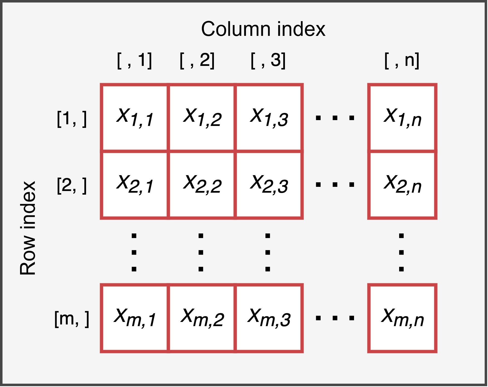

# Matrices {#matrix}


Matrices are a **two-dimensional** data structure, where elements are arranged in rows and columns. We can thus imagine a generic matrix with *m* rows and *n* columns similar to what is represented in Figure \@ref(fig:matrix).

<div class="figure" style="text-align: center">

<p class="caption">(\#fig:matrix)Representation of the structure of a matrix with *m* columns and *n* rows</p>
</div>

Two important characteristics of a matrix are:

- **dimension** - the number of **rows** and **columns** that make up the matrix
- **type** - the type of data contained in the matrix. Indeed, similar to what we observed with vectors, a matrix must be formed by **elements of the same type**. Therefore, there are different types of matrices depending on the kind of data they contain, specifically numeric, logical, and character matrices (see Chapter \@ref(matrix-types)).

It is also crucial to emphasize that each **element** of a matrix is characterized by:

- a **value** - that is, the value of the element which can be of any type, such as a number or a series of characters.
- a **position index** - that is, a **pair of values (*i*, *j*)** positive integers that indicate respectively the **row index** and the **column index**, allowing us to uniquely identify the element within the matrix.

For example, given a matrix $X$ of size $3\times4$ (i.e., 3 rows and 4 columns) defined as:
$$
 X = 
\begin{bmatrix}
3 & 12 & 7 & 20\\
16 & 5 & 9 & 13\\
10 & 1 & 14 & 19
\end{bmatrix},
$$
we have $x_{2, 3} = 9$ while $x_{3, 2} = 1$. This serves to reinforce the correct use of indices, where for a generic element $x_{i, j}$, the value *i* is the row index while *j* is the column index. **Rows are indicated first, then columns**.

Now, let’s see how to create matrices in R and how to perform common selection operations. Later, we will examine various manipulations and operations with matrices. Finally, we will briefly extend the concept of matrices to dimensions greater than two through the use of **arrays**.

## Creation

The command used to create a matrix in R is `matrix()` and it includes several arguments:


```r
nome_matrice = matrix(data, nrow = , ncol = , byrow = FALSE)
```

* `data` - a **vector of values** used to populate the matrix
* `nrow` and `ncol` - are respectively the number of rows and the number of columns of the matrix
* `byrow` - indicates whether the matrix should be populated by row or by column. The default value is `FALSE`, so matrix values are added column by column. Indicate `TRUE` to add elements row by row.

Let’s create a matrix with 3 rows and 4 columns with values from 1 to 12 as an example.

```r
# Data to populate the matrix
my_values = 1:12
my_values
##  [1]  1  2  3  4  5  6  7  8  9 10 11 12

# Matrix populated by columns
mat_bycol = matrix(my_values, nrow = 3, ncol = 4)
mat_bycol
##      [,1] [,2] [,3] [,4]
## [1,]    1    4    7   10
## [2,]    2    5    8   11
## [3,]    3    6    9   12
```

The `matrix()` function has `byrow = FALSE` by default, so base R populates matrices column by column. To populate matrices row by row, you must explicitly request it by specifying `byrow = TRUE`.


```r
# Matrix populated by rows
mat_byrow = matrix(my_values, nrow = 3, ncol = 4, byrow = TRUE)
mat_byrow
##      [,1] [,2] [,3] [,4]
## [1,]    1    2    3    4
## [2,]    5    6    7    8
## [3,]    9   10   11   12
```

It is important to note that while it is possible to specify any combination of rows and columns, the number of values provided to populate the matrix must be compatible with the dimensions of the matrix. In other words, **I cannot provide more or fewer data than the matrix can hold**.

Thus, the length of the vector passed to the `data` argument must be compatible with the `nrow` and `ncol` arguments. However, it is possible to provide a single value if you want to obtain a matrix where all values are identical. For example, let’s create an empty matrix filled with `NA` values with 3 rows and 3 columns.


```r
mat_NA = matrix(NA, nrow = 3, ncol = 3)
mat_NA
##      [,1] [,2] [,3]
## [1,]   NA   NA   NA
## [2,]   NA   NA   NA
## [3,]   NA   NA   NA
```

:::{.tip title="Cycling Values" data-latex="[Cycling Values]"}
In reality, it is possible to provide more or fewer data than the matrix can contain. If more values are provided, R simply uses the first available values, ignoring the subsequent ones.

```r
matrix(1:20, nrow = 2, ncol = 2)
## Warning in matrix(1:20, nrow = 2, ncol = 2): data length differs from size of
## matrix: [20 != 2 x 2]
##      [,1] [,2]
## [1,]    1    3
## [2,]    2    4
```
If fewer values are provided, R reuses the same values in the same order to fill the matrix, warning us of the problem.

```r
matrix(1:4, nrow = 3, ncol = 4)
##      [,1] [,2] [,3] [,4]
## [1,]    1    4    3    2
## [2,]    2    1    4    3
## [3,]    3    2    1    4
```
However, it is best to avoid this practice of *cycling* values as the results may be unclear and it is easy to make mistakes.
:::


### Matrix types {#matrix-types}

We have seen that, similar to vectors, for matrices it is also necessary that all data is of the same type. Therefore, we will have matrices that include only `character`, `double`, `integer`, or `logical` values, and the operations that can be performed (using mathematical operators or logical-relational operators) will depend on the type of data. However, unlike vectors, the object type will always remain `matrix` regardless of the data contained. Matrices are always matrices; it is the type of data that varies.

#### Character {-}

It is possible to define a matrix of characters only, although they are rarely used since clearly all mathematical operations are not possible.

```r
mat_char = matrix(letters[1:12], nrow = 3, ncol = 4, byrow = TRUE)
mat_char
##      [,1] [,2] [,3] [,4]
## [1,] "a"  "b"  "c"  "d" 
## [2,] "e"  "f"  "g"  "h" 
## [3,] "i"  "j"  "k"  "l"

class(mat_char)
## [1] "matrix" "array"
typeof(mat_char)
## [1] "character"
```

:::{.trick title="Letters" data-latex="[Letters]"}
 In R, there are two special objects `letters` and `LETTERS` that include the lowercase and uppercase letters of the English alphabet, respectively.

```r
letters[1:5]
## [1] "a" "b" "c" "d" "e"
LETTERS[6:10]
## [1] "F" "G" "H" "I" "J"
```
:::

#### Numeric {-}

Numeric value matrices, both `double` and `integer`, are undoubtedly the most common and widely used. They are often utilized to perform computationally efficient algebraic calculations.


```r
# doubles
mat_num = matrix(5, nrow = 3, ncol = 4)
class(mat_num)
## [1] "matrix" "array"
typeof(mat_num)
## [1] "double"

# integers
mat_int = matrix(5L, nrow = 3, ncol = 4)
class(mat_int)
## [1] "matrix" "array"
typeof(mat_int)
## [1] "integer"
```

#### Logical {-}

Finally, matrices can also be formed by logical values `TRUE` and `FALSE`. We will see an important use of these regarding the selection of elements from a matrix in Chapter \@ref(matrix-selection-advanced).


```r
mat_logic = matrix(c(TRUE, FALSE), nrow = 3, ncol = 4)
mat_logic
##       [,1]  [,2]  [,3]  [,4]
## [1,]  TRUE FALSE  TRUE FALSE
## [2,] FALSE  TRUE FALSE  TRUE
## [3,]  TRUE FALSE  TRUE FALSE
class(mat_logic)
## [1] "matrix" "array"
typeof(mat_logic)
## [1] "logical"
```

Remember that it is still possible to perform mathematical operations with logical values as they will be automatically converted to their respective numerical values 1 and 0.

### Exercises {-}

Complete the following exercises ([solutions](https://github.com/psicostat/Introduction2R/blob/master/exercises/chapter-09-matrices.R)):
1. Create the matrix `A` defined as: 

$$
\begin{matrix}
2 & 34 & 12 & 7\\
46 & 93 & 27 & 99\\
23  & 38 & 7 & 04
\end{matrix}
$$

2. Create the matrix `B` containing the first 12 odd numbers arranged in 4 rows and 3 columns.
3. Create the matrix `C` containing the first 12 multiples of 9 arranged in 3 rows and 4 columns.
4. Create the matrix `D` formed by 3 columns where the letters `"A"`, `"B"` and `"C"` are repeated 4 times each respectively in the first, second, and third columns.
5. Create the matrix `E` formed by 3 rows where the letters `"A"`, `"B"` and `"C"` are repeated 4 times each respectively in the first, second, and third rows.

## Element Selection {#sel-matrix}

The most important (and fun) aspect of matrices is accessing the various elements. Remember that a matrix is simply a grid of rows and columns where various values are arranged. Regardless of what the matrix contains, you can use the row and column indices to uniquely identify a given element in the matrix. Therefore, each element is associated with a pair of values (*i*, *j*) where *i* is the row index and *j* is the column index.

o illustrate this concept, the following example shows the indices for each element of a $3\times4$ matrix:


```
##      [,1]  [,2]  [,3]  [,4] 
## [1,] "1,1" "1,2" "1,3" "1,4"
## [2,] "2,1" "2,2" "2,3" "2,4"
## [3,] "3,1" "3,2" "3,3" "3,4"
```

In R, you can select an element of a matrix using its row and column index. Similar to vectors, you need to indicate within **square brackets** `[ ]` placed after the name of the matrix, the **row index** and **column index**, **separated by a comma**.


```r
nome_matrice[<row-index>, <column-index>]
```

The **order** `[<row-index>, <column-index>]` is predetermined and must be respected for the selection to occur correctly. Let’s see a simple example of how it is possible to access any element:


```r
my_matrix = matrix(1:12, nrow = 3, ncol = 4)
my_matrix
##      [,1] [,2] [,3] [,4]
## [1,]    1    4    7   10
## [2,]    2    5    8   11
## [3,]    3    6    9   12

# Select the element at row 2 and column 3
my_matrix[2,3]
## [1] 8

# Select the value 6
my_matrix[3,2]
## [1] 6
```

:::{.warning title="Subscript out of Bounds" data-latex="[Subscript out of Bounds]"}
Note how indicating indices outside the matrix dimension results in an error message.

```r
my_matrix[20,30]
## Error in my_matrix[20, 30]: subscript out of bounds
```
:::

In addition to selecting a single element, other types of selection are possible:

#### Selecting a Row or Column {-}

You can select **all** elements of a row or a column using the following syntax:


```r
# Select entire row
matrix_name[<row-index>, ]

# Select entire column
matrix_name[ , <column-index>]
```
Note that the comma is necessary, leaving the position before or after the **comma** empty to indicate to R to select all rows or all columns, respectively. 

```r
# Select row 2 and all columns
my_matrix[2, ]
## [1]  2  5  8 11

# Select all rows and column 3
my_matrix[ ,3]
## [1] 7 8 9
```
If you need to select multiple rows or columns, simply indicate all the indices of interest. Remember that these must be specified in a single vector. Within the square brackets, R expects a single comma separating row indices from column indices. You can use compact notation `1:3` to select rows or columns in succession, which is equivalent to `c(1,2,3)`.

```r
# Select rows 1 and 3
my_matrix[c(1,3), ]
##      [,1] [,2] [,3] [,4]
## [1,]    1    4    7   10
## [2,]    3    6    9   12

# Select columns 2 to 4
my_matrix[ , 2:4]
##      [,1] [,2] [,3]
## [1,]    4    7   10
## [2,]    5    8   11
## [3,]    6    9   12
```

#### Selecting Matrix Region {-}

By combining row and column indices, it is also possible to select specific regions of a matrix or select some of its values to create a new matrix.


```r
# Select a block
my_matrix[1:2, 3:4]
##      [,1] [,2]
## [1,]    7   10
## [2,]    8   11

# Select scattered values
my_matrix[c(1,3), c(2,4)]
##      [,1] [,2]
## [1,]    4   10
## [2,]    6   12
```

:::{.tip title="Selecting does not Modify" data-latex="[Selecting does not Modify]"}
Remember that, as with vectors, the selection operation does not modify the original object. Therefore, you need to save the result of the selection if you want to keep the changes.
:::

:::{.design title="Matrices and Vectors" data-latex="[Matrices and Vectors]"}

The most observant will have noticed that the selection commands do not always return the same object; sometimes we obtain a vector and other times a matrix.

It is important to clarify that **a vector is not a matrix**, and vice versa. In R, these are two different types of objects, and it is important to keep this distinction in mind.


```r
# A vector is not a matrix
my_vector = 1:5
is.vector(my_vector) # TRUE
is.matrix(my_vector) # FALSE

# A matrix is not a vector
my_matrix = matrix(1, nrow = 3, ncol = 3)
is.vector(my_matrix) # FALSE
is.matrix(my_matrix) # TRUE
```

The result we obtain from a selection could be either a vector or a matrix depending on the type of selection. In particular, when selecting a single column (or row), we get a vector, while selecting multiple columns (or rows) results in a matrix.


```r
# Select a column
is.vector(my_matrix[, 1]) # TRUE
is.matrix(my_matrix[, 1]) # FALSE

# Select multiple columns
is.vector(my_matrix[, c(1,2)]) # FALSE
is.matrix(my_matrix[, c(1,2)]) # TRUE
```

This distinction will affect the subsequent use of the object obtained from the selection.

#### Row Vector and Column Vector {-}

A particular source of misunderstandings and subsequent errors involves using a vector obtained from selecting a single row (or a single column) of a matrix as if it were a *row vector* (or a *column vector*).

In linear algebra, *row vectors* and *column vectors* are simply matrices of dimensions $1\times n$ and $m \times 1$, respectively. The dimensions ($rows \times columns$) of a matrix, and thus of a vector, play an important role in matrix operations, particularly in matrix multiplication.

In R, vectors have only one dimension, which is *length*, and thus when used with matrix operations, they are automatically converted to row vectors or column vectors as needed. However, this transformation may not always respect the actual intentions, so it is better to always use matrices rather than vectors.


```r
# Vector
my_vector = 1:4
dim(my_vector)
## NULL
length(my_vector)
## [1] 4

# 1x4 matrix (row vector)
my_row_vector = matrix(1:4, nrow = 1, ncol = 4)
dim(my_row_vector) 
## [1] 1 4
my_row_vector
##      [,1] [,2] [,3] [,4]
## [1,]    1    2    3    4

# 4x1 matrix (column vector)
my_col_vector = matrix(1:4, nrow = 4, ncol = 1)
dim(my_col_vector) 
## [1] 4 1
my_col_vector
##      [,1]
## [1,]    1
## [2,]    2
## [3,]    3
## [4,]    4
```

#### "Flattening" a Matrix {-}

We have seen that we can easily populate a matrix with a vector. Similarly, we can vectorize a matrix (in other words, "flatten" the matrix) to return to the original vector. Using the command `c(matrix)` or forcing the object type to vector with `vector(matrix)` or `as.vector(matrix)`.


```r
# From matrix to vector
my_matrix = matrix(1:12, nrow = 3, ncol = 4)
c(my_matrix)
##  [1]  1  2  3  4  5  6  7  8  9 10 11 12
as.vector(my_matrix)
##  [1]  1  2  3  4  5  6  7  8  9 10 11 12
```

:::

### Advanced Selection Uses {#matrix-selection-advanced}

Now let's explore some advanced uses of selecting elements from a matrix. In particular, we will learn to:

- use relational and logical operators to select elements of a matrix
- change the order of rows and columns
- replace elements
- delete rows or columns

Note that these operations are analogous to those seen for vectors and therefore will follow the same rules and principles.

#### Relational and Logical Operators {-}

A useful function is to select among the elements of a matrix those that meet a certain condition. For example, we can evaluate *"which elements of the matrix are greater than x?"*. To do this, we must specify within the square brackets the proposition of interest using relational and logical operators (see Chapter \@ref(operators-rel-log)).

When a matrix is evaluated within a proposition, R evaluates the truth of that proposition concerning each of its elements. As a result, we obtain a matrix of logical values with the respective answers for each element (`TRUE` or `FALSE`).

```r
my_matrix = matrix(1:23, nrow = 3, ncol = 4)
## Warning in matrix(1:23, nrow = 3, ncol = 4): data length [23] is not a
## sub-multiple or multiple of the number of rows [3]
my_matrix
##      [,1] [,2] [,3] [,4]
## [1,]    1    4    7   10
## [2,]    2    5    8   11
## [3,]    3    6    9   12

# Elements greater than 4 and less than 10
test = my_matrix >= 4 & my_matrix <=10
test
##       [,1] [,2] [,3]  [,4]
## [1,] FALSE TRUE TRUE  TRUE
## [2,] FALSE TRUE TRUE FALSE
## [3,] FALSE TRUE TRUE FALSE
```

This matrix can be used within the square brackets to select elements of the original matrix that satisfy the proposition. Elements associated with the `TRUE` value are selected, while those associated with `FALSE` are discarded.


```r
# Select the elements
my_matrix[test]
## [1]  4  5  6  7  8  9 10
```

Note that in this case no comma is necessary within the square brackets, and the result obtained is a vector.

#### Change Order of Rows and Columns {-}

Row and column indices can be used to reorder the rows and columns of a matrix as needed.


```r
my_matrix = matrix(1:6, nrow = 3, ncol = 4)
my_matrix
##      [,1] [,2] [,3] [,4]
## [1,]    1    4    1    4
## [2,]    2    5    2    5
## [3,]    3    6    3    6

# Change the order of the rows
my_matrix[c(3,2,1), ]
##      [,1] [,2] [,3] [,4]
## [1,]    3    6    3    6
## [2,]    2    5    2    5
## [3,]    1    4    1    4

# Change the order of the columns
my_matrix[ ,c(1,3,2, 4)]
##      [,1] [,2] [,3] [,4]
## [1,]    1    1    4    4
## [2,]    2    2    5    5
## [3,]    3    3    6    6
```


#### Modify Elements {-}

An important use of indices relates to modifying an element of a matrix. To replace an old value with a new value, select the old value of the matrix and use the `=` (or `<-`) operator to assign the new value.


```r
my_matrix = matrix(1:12, nrow = 3, ncol = 4)
my_matrix
##      [,1] [,2] [,3] [,4]
## [1,]    1    4    7   10
## [2,]    2    5    8   11
## [3,]    3    6    9   12

# Modify the element with the value 5
my_matrix[2,2] = 555
my_matrix
##      [,1] [,2] [,3] [,4]
## [1,]    1    4    7   10
## [2,]    2  555    8   11
## [3,]    3    6    9   12
```

It is also possible to replace all values in an entire row or column that has been appropriately selected. In this case, you must provide the correct number of new values to use.

```r
# Modify the 2nd column
my_matrix[ ,2] = c(444, 555, 666)
my_matrix
##      [,1] [,2] [,3] [,4]
## [1,]    1  444    7   10
## [2,]    2  555    8   11
## [3,]    3  666    9   12

# Modify the 3rd row
my_matrix[3, ] = c(111, 666, 999, 122)
my_matrix
##      [,1] [,2] [,3] [,4]
## [1,]    1  444    7   10
## [2,]    2  555    8   11
## [3,]  111  666  999  122
```

Note that, unlike vectors, it is not possible to add a new row or column through this operation; a different procedure must be used instead (see Chapter \@ref(matrix-bind)).


```r
# Attempt to add a new column [index selection error]
my_matrix[, 5] = c(27, 27, 27)
## Error in `[<-`(`*tmp*`, , 5, value = c(27, 27, 27)): subscript out of bounds
```

#### Deleting Rows or Columns {-}

To **delete** rows (or columns) from a matrix, you need to specify the row (or column) indices you want to remove inside the square brackets, preceded by the `-` (*minus*) operator. In the case of multiple rows (or columns), you can only indicate the minus sign before the `c()` command, similar to what is done with vectors.


```r
my_matrix = matrix(1:12, nrow = 3, ncol = 4)

# Delete the 2nd row
my_matrix[-2, ]
##      [,1] [,2] [,3] [,4]
## [1,]    1    4    7   10
## [2,]    3    6    9   12

# Delete the 2nd row and the 2nd and 3rd columns
my_matrix[-2, -c(2,3)]
##      [,1] [,2]
## [1,]    1   10
## [2,]    3   12
```

Note that the deletion operation is still a selection operation. Therefore, you need to save the resulting matrix if you want to keep the changes.


### Exercises {-}

Using the matrices created in the previous exercises, complete the following tasks ([solutions](https://github.com/psicostat/Introduction2R/blob/master/exercises/chapter-09-matrices.R)):

1. Using the row and column indices, select the number 27 from matrix `A`.
2. Select the elements between the second and fourth rows and the second and third columns of matrix `B`.
3. Select only the even elements of matrix `A` (Note: use the modulus operation `%%`).
4. Remove the third row and the third column from matrix `C`.
5. Select all elements from the second and third rows of matrix `B`.
6. Select all elements other than “`B`” from matrix `D`.

## Functions and Operations

Now let’s look at some frequently used functions and common operations performed with matrices (see Table \@ref(tab:table-matrix-operators)).

<table class="table table-striped table-hover table-condensed table-responsive" style="width: auto !important; margin-left: auto; margin-right: auto;">
<caption>(\#tab:table-matrix-operators)(\#tab:table-matrix-operators)Functions and operations with matrices</caption>
 <thead>
  <tr>
   <th style="text-align:left;"> Function </th>
   <th style="text-align:left;"> Description </th>
  </tr>
 </thead>
<tbody>
  <tr>
   <td style="text-align:left;"> new_matrix = &lt;- cbind(matrix1, matrix2) </td>
   <td style="text-align:left;"> Combine two matrices creating new columns (the matrices must have the same number of rows) </td>
  </tr>
  <tr>
   <td style="text-align:left;"> new_matrix = &lt;- rbind(matrix1, matrix2) </td>
   <td style="text-align:left;"> Combine two matrices creating new rows (the matrices must have the same number of columns) </td>
  </tr>
  <tr>
   <td style="text-align:left;"> nrow(matrix_name) </td>
   <td style="text-align:left;"> Number of rows in the matrix </td>
  </tr>
  <tr>
   <td style="text-align:left;"> ncol(matrix_name) </td>
   <td style="text-align:left;"> Number of columns in the matrix </td>
  </tr>
  <tr>
   <td style="text-align:left;"> dim(matrix_name) </td>
   <td style="text-align:left;"> Dimensions of the matrix (rows and columns) </td>
  </tr>
  <tr>
   <td style="text-align:left;"> colnames(matrix_name) </td>
   <td style="text-align:left;"> Names of the matrix columns </td>
  </tr>
  <tr>
   <td style="text-align:left;"> rownames(matrix_name) </td>
   <td style="text-align:left;"> Names of the matrix rows </td>
  </tr>
  <tr>
   <td style="text-align:left;"> dimnames(matrix_name) </td>
   <td style="text-align:left;"> Names of the rows and columns </td>
  </tr>
  <tr>
   <td style="text-align:left;"> t(matrix_name) </td>
   <td style="text-align:left;"> Transpose of the matrix </td>
  </tr>
  <tr>
   <td style="text-align:left;"> diag(matrix_name) </td>
   <td style="text-align:left;"> Vector with the elements of the matrix diagonal </td>
  </tr>
  <tr>
   <td style="text-align:left;"> det(matrix_name) </td>
   <td style="text-align:left;"> Determinant of the matrix (the matrix must be square) </td>
  </tr>
  <tr>
   <td style="text-align:left;"> solve(matrix_name) </td>
   <td style="text-align:left;"> Inverse of the matrix </td>
  </tr>
  <tr>
   <td style="text-align:left;"> matrix1 + matrix2 </td>
   <td style="text-align:left;"> Element-wise sum of two matrices </td>
  </tr>
  <tr>
   <td style="text-align:left;"> matrix1 - matrix2 </td>
   <td style="text-align:left;"> Element-wise difference between two matrices </td>
  </tr>
  <tr>
   <td style="text-align:left;"> matrix1 * matrix2 </td>
   <td style="text-align:left;"> Element-wise product of two matrices </td>
  </tr>
  <tr>
   <td style="text-align:left;"> matrix1 / matrix2 </td>
   <td style="text-align:left;"> Element-wise division between two matrices </td>
  </tr>
  <tr>
   <td style="text-align:left;"> matrix1 %*% matrix2 </td>
   <td style="text-align:left;"> Matrix product </td>
  </tr>
</tbody>
</table>


Let’s now describe some specific uses in detail.

### Attributes of a Matrix {#mat-prop}

We have seen in Chapter \@ref(attributes) that objects in R have what are called *attributes*, which are useful information regarding the object itself, a sort of *metadata*. Now let’s look at some attributes particularly relevant in the case of matrices, namely the dimensions (`dim`) and the names of the rows and columns (`names`).

#### Dimensions {-}

Recall that a matrix is a **two-dimensional** object made up of rows and columns. These form the dimensions of a matrix. To obtain the number of rows and columns in a matrix, we can use the commands `nrow()` and `ncol()`, respectively.


```r
my_matrix = matrix(1:12, ncol = 3, nrow = 4)

# Number of rows
nrow(my_matrix)
## [1] 4

# Number of columns
ncol(my_matrix)
## [1] 3
```

Alternatively, to find out the dimensions of a matrix, you can use the `dim()` function. This will return a vector with two values where the first represents the number of rows and the second the number of columns.


```r
dim(my_matrix)
## [1] 4 3
```

#### Row and Column Names {-}

As you may have noticed, by default, the dimensions of a matrix (that is, rows and columns) are identified by their numerical indices. However, in R, it is also possible to assign names to the rows and columns of a matrix.

With the commands `rownames()` and `colnames()`, we can access the names of the rows and columns, respectively.


```r
my_matrix = matrix(1:12, nrow = 3, ncol = 4)

# Names of rows
rownames(mat)
## NULL

# Names of columns
colnames(mat)
## NULL
```

Since they are not set initially, we get `NULL` as the output. To set the names of rows and/or columns, you will need to assign to `rownames(matrix_name)` and `colnames(matrix_name)` a character vector of the same length as the dimension you are renaming. If you set a single character, all rows/columns will have the same value. This tells us that if we want to set names, R requires this to be done for all rows/columns.


```r
# Assign names to the rows
rownames(my_matrix) = LETTERS[1:3]
my_matrix
##   [,1] [,2] [,3] [,4]
## A    1    4    7   10
## B    2    5    8   11
## C    3    6    9   12

# Assign names to the columns
colnames(my_matrix) = LETTERS[4:7]
my_matrix
##   D E F  G
## A 1 4 7 10
## B 2 5 8 11
## C 3 6 9 12
```

Alternatively, you can use `dimnames()` to access both row and column names simultaneously. The output will be a list (see Chapter \@ref(list)) where the row names are indicated first, followed by the column names.


```r
dimnames(my_matrix)
## [[1]]
## [1] "A" "B" "C"
## 
## [[2]]
## [1] "D" "E" "F" "G"
```

:::{.design title="Selection by Names" data-latex="[Selection by Names]"}
When we explored different ways to select elements of a matrix in Chapter \@ref(sel-matrix), we always used numerical row and column indices. However, when dimension names are available, it is possible to index a matrix based on the names of the rows and/or columns.

We can select the first column both by its numerical index `matrix_name[ , 1]` and by its assigned name `matrix_name[ ,"column_name"]`. These operations are not particularly useful with matrices but will be essential in the case of **dataframes** (see Chapter \@ref(dataframe)).


```r
# Select column "F"
my_matrix[ , "F"]
## A B C 
## 7 8 9

# Select rows "A" and "C"
my_matrix[c("A", "C"), ]
##   D E F  G
## A 1 4 7 10
## C 3 6 9 12
```
:::

### Combining Matrices {#matrix-bind}

We have seen in Chapter \@ref(vector-functions) how to combine different vectors using the `c()` function. It is also possible to combine different matrices, but some rules must be followed:

* `rbind()` - I can combine matrices **by row**, adding one or more rows to a matrix; in this case, the matrices must have the same number of columns.
* `cbind()` - I can combine matrices **by column**, adding one or more columns to a matrix; in this case, the matrices must have the same number of rows.
* The matrices being combined must be of the **same type** (numbers or characters).

So, given a matrix `my_matrix` of size $m \times n$, if we want to add the rows of a second matrix `row_matrix`, we can use the command `rbind(my_matrix, row_matrix)` provided they have the same number of columns ($n$). If we want to add the columns of a new matrix `col_matrix`, we can use the command `cbind(my_matrix, col_matrix)` provided they have the same number of rows ($m$). It is useful to think of the combination as a collage of matrices. In Figure \@ref(fig:mat-comb), there is a diagram that helps to visually understand this concept, where the matrices colored in green can be correctly combined, while those in red do not have the correct dimensionality.

<div class="figure" style="text-align: center">

<p class="caption">(\#fig:mat-comb)Scheme for Matrix Combination</p>
</div>

Let’s see an example in R:


```r
# Starting matrix
my_matrix = matrix(1:12, nrow = 3, ncol = 4)
my_matrix
##      [,1] [,2] [,3] [,4]
## [1,]    1    4    7   10
## [2,]    2    5    8   11
## [3,]    3    6    9   12

# Matrix with the same number of columns
row_matrix = matrix(77, nrow = 2, ncol = 4)
row_matrix
##      [,1] [,2] [,3] [,4]
## [1,]   77   77   77   77
## [2,]   77   77   77   77

# Combine by row
rbind(my_matrix, row_matrix)
##      [,1] [,2] [,3] [,4]
## [1,]    1    4    7   10
## [2,]    2    5    8   11
## [3,]    3    6    9   12
## [4,]   77   77   77   77
## [5,]   77   77   77   77

# Matrix with the same number of rows
col_matrix = matrix(99, nrow = 3, ncol = 2)
col_matrix
##      [,1] [,2]
## [1,]   99   99
## [2,]   99   99
## [3,]   99   99

# Combine by column
cbind(my_matrix, col_matrix)
##      [,1] [,2] [,3] [,4] [,5] [,6]
## [1,]    1    4    7   10   99   99
## [2,]    2    5    8   11   99   99
## [3,]    3    6    9   12   99   99
```

An additional useful aspect is the extension of the `cbind()` and `rbind()` commands. Until now, we have used them with just two elements: the starting matrix and the matrix to add. However, it is possible to indicate multiple matrices to combine, separating them with a comma. If we want to combine $n$ matrices, we can use the command `cbind(mat1, mat2, mat3, ...)` or `rbind(mat1, mat2, mat3, ...)`. In this case, the final result will be the combination of the matrices in the order used to define the arguments, with `mat1` first, then `mat2`, and so on.

:::{.warning title='"Matrices Must Match"' data-latex='["Matrices Must Match"]'}
We have seen that we can combine matrices by row/column only if the number of columns/rows of the two matrices matches. We get an error instead when trying to combine matrices of different dimensions: *"number of columns/rows of matrices must match"*.


```r
my_matrix = matrix(1:12, nrow = 3, ncol = 4)

# Matrix with incorrect number of columns
wrong_matrix = matrix(77, nrow = 2, ncol = 7)
rbind(my_matrix, wrong_matrix)
## Error in rbind(my_matrix, wrong_matrix): number of columns of matrices must match (see arg 2)
```
:::

### Mathematical Operators

Mathematical operators (e.g., `+`, `-`, `*`, `/`) perform operations between a matrix and a single value, between a matrix and a vector, or between two matrices.

#### Operation between Matrix and Single Value {-}

In the case of a single value, the same operation is simply performed on all elements of the matrix. For example, we can add 100 to all elements of a matrix.


```r
my_matrix = matrix(1:12, nrow = 3, ncol = 4)
my_matrix
##      [,1] [,2] [,3] [,4]
## [1,]    1    4    7   10
## [2,]    2    5    8   11
## [3,]    3    6    9   12

# Add 100
my_matrix + 100
##      [,1] [,2] [,3] [,4]
## [1,]  101  104  107  110
## [2,]  102  105  108  111
## [3,]  103  106  109  112
```

#### Operation between Matrix and Vector {-}

In the case of a vector, the operation is performed **element by element**, cycling the values of the vector if its length is insufficient. For example, we can add the vector of values `c(100, 200, 300, 400)` to all elements of a matrix.


```r
# Add a vector of values
my_matrix + c(100, 200, 300, 400)
##      [,1] [,2] [,3] [,4]
## [1,]  101  404  307  210
## [2,]  202  105  408  311
## [3,]  303  206  109  412
```

As can be easily understood, this operation is not advisable since it can easily lead to errors and misunderstandings.

#### Operation between Matrices {-}

In the case of operations between matrices, the operation is performed **element by element**, so it is important that the matrices have the **same dimensions**. For example, we can add to all elements of a matrix where the rows contain the values 100, 200, 300, and 400.


```r
sum_matrix = matrix(rep(c(100, 200, 300, 400), each = 3), nrow = 3, ncol = 4)
sum_matrix
##      [,1] [,2] [,3] [,4]
## [1,]  100  200  300  400
## [2,]  100  200  300  400
## [3,]  100  200  300  400

# Sum two matrices
my_matrix + sum_matrix
##      [,1] [,2] [,3] [,4]
## [1,]  101  204  307  410
## [2,]  102  205  308  411
## [3,]  103  206  309  412
```

:::{.tip title="Matrix Multiplication" data-latex="[Matrix Multiplication]"}
Note that in R, the `*` operator indicates simple element-wise multiplication, while to obtain the matrix product, the operator `%*%` must be used.

Matrix multiplication follows specific rules and properties. In particular, the number of columns in the first matrix must equal the number of rows in the second matrix. For more information, see <https://en.wikipedia.org/wiki/Matrix_multiplication>.
:::

#### Linear Algebra {-}

Other aspects concerning matrix operations are not discussed here but interested readers can refer to the following pages:

- For the meaning of the **determinant** of a matrix, see <https://en.wikipedia.org/wiki/Determinant>
- For the meaning of the inverse matrix see <https://en.wikipedia.org/wiki/Invertible_matrix>

#### Diagonal {-}

Now let’s look at some useful functions related to the diagonal of a matrix. The diagonal of a matrix is formed by the elements whose row and column indices are equal, that is, the set of elements associated with the same row and column index ($x_{i,i}$).

The command `diag(matrix_name)` allows you to extract the diagonal of a matrix and treat it as a simple vector:


```r
# Square matrix
square_matrix = matrix(1:16, nrow = 4, ncol = 4)
square_matrix
##      [,1] [,2] [,3] [,4]
## [1,]    1    5    9   13
## [2,]    2    6   10   14
## [3,]    3    7   11   15
## [4,]    4    8   12   16

diag(square_matrix)
## [1]  1  6 11 16

# Non-square matrix
my_matrix = matrix(1:12, nrow = 3, ncol = 4)
my_matrix
##      [,1] [,2] [,3] [,4]
## [1,]    1    4    7   10
## [2,]    2    5    8   11
## [3,]    3    6    9   12

diag(my_matrix)
## [1] 1 5 9
```

The `diag()` function can also be used to easily replace elements on the diagonal of a matrix or to create a diagonal matrix where all other values are zero, such as the identity matrix.


```r
# Replace the diagonal elements
diag(my_matrix) = 999
my_matrix
##      [,1] [,2] [,3] [,4]
## [1,]  999    4    7   10
## [2,]    2  999    8   11
## [3,]    3    6  999   12

# Create a diagonal matrix
diag(4, nrow = 3, ncol = 4)
##      [,1] [,2] [,3] [,4]
## [1,]    4    0    0    0
## [2,]    0    4    0    0
## [3,]    0    0    4    0

# Create a 4x4 identity matrix
diag(4)
##      [,1] [,2] [,3] [,4]
## [1,]    1    0    0    0
## [2,]    0    1    0    0
## [3,]    0    0    1    0
## [4,]    0    0    0    1
```
:::

### Exercises {-}

Using the matrices created in previous exercises, complete the following tasks ([solutions](https://github.com/psicostat/Introduction2R/blob/master/exercises/chapter-09-matrices.R)):

1. Create matrix `G` by combining matrix `A` with the first two columns of matrix `C`.
2. Create matrix `H` by combining matrix `C` with the first two rows of the transpose of matrix `B`.
3. Redefine matrix `A` by removing the second column. Redefine matrix `B` by removing the first row. Check that the resulting matrices have the same dimensions.
4. Comment on the different results obtained from the operations `A*B`, `B*A`, `A%*%B`, and `B%*%A`.
5. Assign the following names to the columns and rows of matrix `C`: `"col_1"`, `"col_2"`, `"col_3"`, `"col_4"`, `"row_1"`, `"row_2"`, `"row_3"`.

## Arrays

We have seen that matrices are a *two-dimensional* object, but it is also possible to create objects that have 3, 4, or any number (*n*) of dimensions. These objects are called **arrays** and can be created using the `array()` command, specifying the vector of values used to populate the object and the size of each of its dimensions.


```r
array(data = , dim = )
```

For example, to create a cube of side 3 containing integer values from 1 to 27, we can execute the following command.


```r
my_cube = array(1:27, dim = c(3,3,3))
my_cube
## , , 1
## 
##      [,1] [,2] [,3]
## [1,]    1    4    7
## [2,]    2    5    8
## [3,]    3    6    9
## 
## , , 2
## 
##      [,1] [,2] [,3]
## [1,]   10   13   16
## [2,]   11   14   17
## [3,]   12   15   18
## 
## , , 3
## 
##      [,1] [,2] [,3]
## [1,]   19   22   25
## [2,]   20   23   26
## [3,]   21   24   27
```

All the main functions and selection operations we have seen for matrices and vectors can also be performed similarly with arrays. The general functioning of selecting elements using square brackets will now be clearer. For each dimension, the desired position indices are indicated. The order within the square brackets determines which specific dimension is being referred to, and commas are used to separate indices of different dimensions.


```r
my_hypercube[<dim-1>, <dim-2>, <dim-3>, ..., <dim-n>]
```

Let’s now see some simple examples of selection.


```
## [1] 1
## [1] 1 2 3
##      [,1] [,2] [,3]
## [1,]    1    4    7
## [2,]    2    5    8
## [3,]    3    6    9
## , , 1
## 
##      [,1] [,2]
## [1,]    1    4
## [2,]    2    5
## 
## , , 2
## 
##      [,1] [,2]
## [1,]   10   13
## [2,]   11   14
```


:::{.tip title="Array Mother of All Matrix" data-latex="[Array Mother of All Matrix]"}
It is easy to see that matrices are simply a special case of arrays with 2 dimensions. In fact, the observant will have noticed that the value `"array"` appeared alongside `"matrix"` when evaluating the type of the object.


```r
my_matrix = matrix(1:12, nrow = 2, ncol = 2)
## Warning in matrix(1:12, nrow = 2, ncol = 2): data length differs from size of
## matrix: [12 != 2 x 2]
is.array(my_matrix)
## [1] TRUE
class(my_matrix)
## [1] "matrix" "array"
```

However, note that a simple vector is not an array. Recall that a vector does not possess a dimension (`dim`) but simply a length (`length`).

```r
my_vector = 1:12
is.array(my_vector)
## [1] FALSE
dim(my_vector)
## NULL
```
:::
