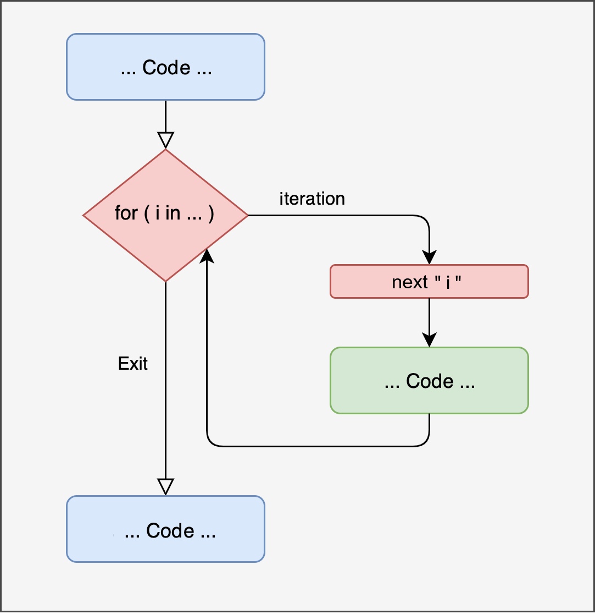

# Iterative Programming {#loop}


The essence of most operations in various programming languages is the concept of **iteration**. Iteration means repeating a portion of code a certain number of times or until a condition is met.

Many of the functions we've used so far, such as the `sum()` or `mean()` functions, rely on iterative operations. In R, for better or worse, you will rarely use iterations via loops directly, even though they are present in most functions. In fact, many of the functions implemented in R are only available through external packages or must be manually written by implementing iterative structures.

## Loops

### For

The first type of iterative structure is called a `for` loop. The idea is to repeat a series of instructions a **predetermined** number of times. Figure \@ref(fig:plot-for-loop) represents the concept of a for loop. Similar to the conditional structures discussed in the previous chapter, when we write a loop, we temporarily enter a part of the code, execute the required operations, and then continue with the rest of the code. What is referred to as `i` in the image is a conventional way of indicating the counting of operations. If we want to repeat an operation 1000 times, `i` starts at 1 and goes up to 1000.


```r

```

<div class="figure" style="text-align: center">

<p class="caption">(\#fig:plot-for-loop)Representation of 'for' loop</p>
</div>

#### 'For' Loop Structure {-}

In R, the syntax for writing a `for` loop is as follows:


```r
for (i in c(...)) {
    <code-to-execute>
}
```

- `i` is a generic name for the counter variable we introduced earlier. It can be any character, but usually, for a generic loop, single letters like `i` or `j` are used, probably due to a similarity with mathematical notation, where these letters are often used to indicate a series of elements.
- `in` is the operator that indicates that `i` varies according to the values specified after it.
- `c(...)` is the range of values that `i` will take for each iteration.

We can rephrase the code as:

> Repeat the operations enclosed in `{ }` a number of times equal to the length of `c(...)`, and in this loop, `i` will take, one by one, the values contained in `c(...)`.

Informally, there are two types of loops: one that uses a generic counter assigned to `i` and another that directly uses values of interest.

#### Example {-}

- Loop with directly the values of interest:


```r
# numeric
# characters
for (name in c("Alessio", "Beatrice", "Carlo")){
  print(paste0("Hello ", name))
}
## [1] "Hello Alessio"
## [1] "Hello Beatrice"
## [1] "Hello Carlo"
```

Loop that uses a generic counter to index the elements:


```r
my_vector = c(93, 27, 46, 99)

# i in 1:length(my_vector)
for (i in seq_along(my_vector)){
  print(my_vector[i])
}
## [1] 93
## [1] 27
## [1] 46
## [1] 99
```

This distinction is very useful and often a source of errors. If you use the vector directly and your counter takes the values of the vector, you "lose" a position index. In the example of the loop with names, if we wanted to know and print the position that Alessio occupies, we would need to modify the approach by using a generic counter as well. We can create it outside the loop and update it manually:


```r
i = 1
for (name in c("Alessio", "Beatrice", "Carlo")){
  print(paste0(name, " is number ", i))
  i = i + 1
}
## [1] "Alessio is number 1"
## [1] "Beatrice is number 2"
## [1] "Carlo is number 3"
```

In general, the best approach is always to use a loop with indices and not the actual values, so you can access both pieces of information.


```r
names = c("Alessio", "Beatrice", "Carlo")

for (i in seq_along(names)){
  print(paste0(names[i], " is number ", i))
}
## [1] "Alessio is number 1"
## [1] "Beatrice is number 2"
## [1] "Carlo is number 3"
```


:::{.trick title="seq_along() " data-latex="[Next and Break]"}


```r
my_vector = c(93, 27, 46, 99)
my_NULL = NULL

1:length(my_vector)
## [1] 1 2 3 4
1:length(my_NULL)
## [1] 1 0

seq_along(my_vector)
## [1] 1 2 3 4
seq_along(my_NULL)
## integer(0)

seq_len(length(my_vector))
## [1] 1 2 3 4
seq_len(length(my_NULL))
## integer(0)
```

:::


#### Example: The Sum Function {-}

As introduced at the beginning of this chapter, many of the available functions in R are derived from iterative structures. If we think about the `sum()` function, we know that we can calculate the sum of a vector simply with `sum(x)`. To fully understand loops, it's interesting to think about and implement common functions.

If we had to sum `n` numbers manually, the structure would be as follows:

- Take the first number $x_1$ and add it to the second $x_2$
- You get a new number `x_{1+2}`
- Take the third number $x_3$ and add it to `x_{1+2}`
- You get $x_{1+2+3}$
- Repeat this operation until the last element of $x_n$

As you can see, this is an iterative structure, counting from 1 to the length of $x$, and in each iteration, adding the next number to the sum of the previous ones. In R:


```r
my_values = c(2,4,6,8)

# Calculate sum of values
my_sum = 0      # initialize value
for (i in seq_along(my_values)){
  my_sum = my_sum + my_values[i]
}

my_sum
## [1] 20
```

The structure is the same as our reasoning above. I create a "starting" variable that holds the value 0, and in each iteration, I add the respective indexed element.

#### Example: Creating a Vector {-}

Since we use an index that takes a range of values, we can not only access a vector using our index but also progressively create or replace a vector.


```r
# Calculate column sum
my_matrix = matrix(1:24, nrow = 4, ncol = 6)

# Inefficient method (appending values)
sum_cols = c()
for( i in seq_len(ncol(my_matrix))){
  sum_col = sum(my_matrix[, i])   # calculate i-th column
  sum_cols = c(sum_cols, sum_col) # append the result
}

sum_cols
## [1] 10 26 42 58 74 90

# Efficient method (updating values)
sum_cols = vector(mode = "double", length = ncol(my_matrix))
for( i in seq_along(sum_cols)){
  sum_col = sum(my_matrix[, i])   # calculate i-th column
  sum_cols[i] = sum_col # update the result
}

sum_cols
## [1] 10 26 42 58 74 90
```

### While

The `while` loop can be considered a generalization of the `for` loop. In other words, the `for` loop is a particular type of `while` loop.


```r
knitr::include_graphics("images/while_loop.png")
```

<div class="figure" style="text-align: center">

<p class="caption">(\#fig:plot-while-loop)Representation of 'while' loop</p>
</div>

#### While Loop Structure {-}

The syntax is more concise than the `for` loop because we don't define any counter, placeholder, or a vector of values. The only thing driving a `while` loop is a logical condition (therefore with `TRUE` or `FALSE` values). Again, paraphrasing:

> Repeat the operations enclosed in `{ }` as long as the `<test>` condition is `TRUE`.

In other words, at each iteration, the `<test>` condition is evaluated. If it is true, the operation is executed; otherwise, the loop stops.


```r
while (<test>) {
    <code-to-execute>
}
```

#### Example {-}

If we want to perform a **countdown**:


```r
count = 5

while(count >= 0){
  print(count)
  count = count - 1 # update variable
  Sys.sleep(0.5) # wait half a second before proceeding, just for the suspense :-)
}
## [1] 5
## [1] 4
## [1] 3
## [1] 2
## [1] 1
## [1] 0
```

When writing a `while` loop, it's important to ensure two things:

- That the condition is `TRUE` initially; otherwise, the loop won't even start.
-  That at some point the condition becomes `FALSE` (because we have achieved the result or too much time or too many iterations have passed).

If the second condition is not met, we end up with what is called an `endless loop`, like this:


```r
count = 5

# Warning: infinite loop
while(count >= 0){
  print(count)
}
```

#### While and For

We previously introduced that `for` is a particular type of `while`. Conceptually, we can think of a `for` loop as a `while` loop where our counter `i` increments until it reaches the length of the vector we are iterating over. In other words, we can write a `for` loop in the following way:


```r
names = c("Alessio", "Beatrice", "Carlo")
i = 1 # counter

while(i <= length(names)){ # condition
  print(paste0(names[i], " is number ", i))
  i = i + 1
}
## [1] "Alessio is number 1"
## [1] "Beatrice is number 2"
## [1] "Carlo is number 3"
```

### Next and Break

Within an iterative structure, we can execute any type of operation, including conditional structures. Sometimes, it may be useful to skip a particular iteration or stop the iterative loop entirely. In R, such operations can be performed with the `next` and `break` commands, respectively.

- `next` - skips to the next iteration. 
- `break` - stops the execution of the loop. 

#### Example {-}

- with a `for` loop:

```r
my_vector = 1:6

for (i in seq_along(my_vector)){
  if (my_vector[i] == 3) next
  
  if (my_vector[i] == 5) break
  print(my_vector[i])
}
## [1] 1
## [1] 2
## [1] 4
```

- with a `while` loop:

```r
count = 7

while(count >= 0){
  count = count - 1
  if (count == 5) next
  
  if (count == 2) break
  
  print(count)
}
## [1] 6
## [1] 4
## [1] 3
```

## Nested Loops

Once you understand the iterative structure, it's easy to expand its potential by nesting one loop inside another. You can have as many *nested* loops as necessary, but this increases not only the complexity but also the execution time. To better understand what happens inside a nested loop, it's helpful to visualize the indices:


```r
for(i in 1:3){ # level 1
  for(j in 1:3){ # level 2
    for(l in 1:3){ # level 3
      print(paste(i, j, l))
    }
  }
}
## [1] "1 1 1"
## [1] "1 1 2"
## [1] "1 1 3"
## [1] "1 2 1"
## [1] "1 2 2"
## [1] "1 2 3"
## [1] "1 3 1"
## [1] "1 3 2"
## [1] "1 3 3"
## [1] "2 1 1"
## [1] "2 1 2"
## [1] "2 1 3"
## [1] "2 2 1"
## [1] "2 2 2"
## [1] "2 2 3"
## [1] "2 3 1"
## [1] "2 3 2"
## [1] "2 3 3"
## [1] "3 1 1"
## [1] "3 1 2"
## [1] "3 1 3"
## [1] "3 2 1"
## [1] "3 2 2"
## [1] "3 2 3"
## [1] "3 3 1"
## [1] "3 3 2"
## [1] "3 3 3"
```

Looking at the indices, it's clear that the innermost loop completes first before moving outward. The logic is as follows:

- In the first iteration, we enter the outermost loop `i = 1`, then into the inner loop `j = 1`, and into the innermost loop `l = 1`.
- In the second iteration, we are locked in the inner loop, so both `i` and `j` remain 1, while `l` becomes 2.
- When the innermost loop `l` finishes, `i` will still be 1, but `j` will move to 2, and so on.

An important aspect is the use of different indices; indeed, `i`, `j`, and `l` take different values at each iteration, and if we used the same index, we wouldn't get the desired result.

### Exercises {-}

1. Write a function that calculates the average of a numeric vector using a `for` loop.
2. Write a function that, given a numeric vector, returns the maximum and minimum values using a `for` loop (pay attention to the initialization value).
3. Write a function that, for each iteration, generates $n$ observations from a normal distribution (`rnorm()` function) with mean $mu$ and standard deviation $sigma$, and saves the mean of each sample. The function parameters will be $n$, $mu$, $sigma$, and $iter$ (number of iterations).

## Apply Family

There is a family of extremely powerful and versatile functions in R called `*apply`. The asterisk suggests a range of variants available in R that, despite their common structure and function, have different objectives:

- `apply`: given a dataframe (or matrix), applies the same function to each row or column.
- `tapply`: given a vector of values, applies the same function to each group that has been defined.
- `lapply`: applies the same function to each element of a list. Returns a list.
- `sapply`: applies the same function to each element of a list. If possible, it returns a simplified object (a vector, matrix, or array).
- `vapply`: similar to `sapply`, but requires you to define the type of data to be returned.
- `mapply`: the multivariate version. Allows you to apply a function to multiple lists of elements.

Before illustrating the various functions, it’s helpful to understand the general structure. Generally, these functions accept a **list** object (a collection of elements) and a **function**. The idea is to have a function that takes other functions as arguments and applies the argument-function to each input element. These functions, especially in R, are often preferred over using `for` loops due to their speed, compactness, and versatility.

Hadley Wickam[^talk-map] provides a great example to understand the difference between `loop` and `*apply`. Imagine you have a series of vectors and want to apply some functions to each vector; we could set up a simple loop in this way:


```r
list_vect = list(
  vect1 = rnorm(100),
  vect2 = rnorm(100),
  vect3 = rnorm(100),
  vect4 = rnorm(100),
  vect5 = rnorm(100)
)

means = vector(mode = "numeric", length = length(list_vect))
medians = vector(mode = "numeric", length = length(list_vect))
st_devs = vector(mode = "numeric", length = length(list_vect))

for(i in seq_along(list_vect)){
  means[i] = mean(list_vect[[i]])
  medians[i] = median(list_vect[[i]])
  st_devs[i] = sd(list_vect[[i]])
}
```

Although it is perfectly correct, this writing has several problems:

- It is very redundant. Between calculating the mean, median, and standard deviation, the only thing that changes is the function being applied, while for each, we must pre-allocate a variable, set up indexing based on the iteration to select the list element, and store the result. To improve this, we can wrap the entire structure (pre-allocation, indexing, and storing) into a function and use this function with the list as input and the function to apply. Using the `sapply` function:


```r
means = lapply(list_vect, mean)
means
## $vect1
## [1] -0.1744844
## 
## $vect2
## [1] -0.001581971
## 
## $vect3
## [1] 0.003746107
## 
## $vect4
## [1] -0.1040844
## 
## $vect5
## [1] 0.2978849
medians = lapply(list_vect, median)
medians
## $vect1
## [1] -0.1336871
## 
## $vect2
## [1] 0.08244486
## 
## $vect3
## [1] 0.002455108
## 
## $vect4
## [1] -0.00886783
## 
## $vect5
## [1] 0.2095848
st_devs = lapply(list_vect, sd)
st_devs
## $vect1
## [1] 1.028626
## 
## $vect2
## [1] 1.056527
## 
## $vect3
## [1] 1.027976
## 
## $vect4
## [1] 0.9351077
## 
## $vect5
## [1] 1.04055
```

As you can see, the code becomes extremely compact, clean, and easy to read.

### Which Functions to Apply?

Before detailing each `*apply` function, it’s important to understand what types of functions can be used within this family. In general, any function can be applied, but for convenience, we can distinguish them into:

- Functions already available in R.
- Custom functions (created and saved in the main environment). 
- **Anonymous** functions.

In the previous example, we used the `mean` function simply by writing `lapply(list_vec, mean)`. This is possible because `mean` requires only one argument. However, if we wanted to apply more complex functions or add arguments, we could use the more general syntax:


```r
means = lapply(list_vect, function(x) mean(x))
means
## $vect1
## [1] -0.1744844
## 
## $vect2
## [1] -0.001581971
## 
## $vect3
## [1] 0.003746107
## 
## $vect4
## [1] -0.1040844
## 
## $vect5
## [1] 0.2978849
```

The only difference here is that we defined an **anonymous** function with the syntax `function(x) ...`. This is interpreted as *"for each element of `list_vect`, treat it as `x` and apply the `mean()` function to each element of `list_vect`."* Anonymous functions allow us to write functions that aren't saved or available in R and apply them directly to a series of elements. We can also use more complex functions, such as centering each element of `list_vect`:


```r
centered_list = lapply(list_vect, function(x) x - mean(x))
centered_list
## $vect1
##   [1]  0.052024420  0.726941033  0.523133907  0.534116649  1.072538094
##   [6] -1.748085116  0.436228769  1.090050776  0.188256343  1.904447568
##  [11] -0.907720449 -0.098340775  0.356479804  1.683026192  1.778954510
##  [16] -1.666991209  1.797794611  0.305873422  1.655606875  1.687802692
##  [21] -0.767958869 -0.011200606 -0.926640234  1.382599658 -1.450454139
##  [26]  0.279862739 -1.280958942 -0.179531732  0.080784364  1.275153032
##  [31] -1.789340704 -1.273459981  1.193927825 -1.246932674 -0.430047712
##  [36] -1.408989494 -1.111447945 -1.280200478  0.087413286  0.679220848
##  [41]  0.290873113  1.934698137 -0.170632058  2.294484562  0.140106914
##  [46] -0.617669647  1.649999618 -0.551072804  0.486863447  0.866448514
##  [51] -0.325806393 -2.081384947  0.218225732 -0.194333682 -0.785738000
##  [56]  0.278250713  0.601773540  0.004002865 -1.374655893 -1.331115539
##  [61]  0.190527940 -0.010879909  0.566417661 -0.582226517  0.405902013
##  [66] -0.809129005  0.739565224  1.791236297 -0.077479735 -0.881394205
##  [71] -0.173747353  0.131494431 -1.223069551  1.664700735 -0.864902716
##  [76] -0.062460642 -0.824657046 -1.218058185  1.156489655  0.535425340
##  [81] -0.163024811 -0.468903190 -1.992400872  0.807773400  0.029570256
##  [86] -1.065542698  0.708443728 -1.413780392 -0.816480128  0.657745237
##  [91]  0.985102777 -0.119180161  0.121026086  0.909668900  0.189469398
##  [96]  0.052482555 -0.472289289 -0.693373923 -0.334215899 -1.903099951
## 
## $vect2
##   [1] -0.25875450  0.45192195 -0.14129965 -0.48513950 -1.19419119  0.04852296
##   [7] -0.12494971 -2.69913307 -0.56923136  0.59317969  0.48855867 -0.12521792
##  [13] -1.25761789  0.20287395 -1.91532248  1.67432109  0.47237159  1.41569682
##  [19]  0.08588055 -1.80072157  0.75532561 -0.31036112 -1.73097833 -2.13698056
##  [25]  2.36738038  0.48633857  1.09481961  0.30449038  1.01688141  2.45517490
##  [31] -0.24403885  0.54310131  0.19845858 -2.06958035  0.51416551 -0.40417991
##  [37]  0.35777998 -0.32998890  0.08217311 -0.25995052 -0.87586827  0.74289078
##  [43] -2.68138122 -0.94789651  0.44784397 -1.28724749 -0.15622349  0.34939757
##  [49] -0.05804050  1.47831075 -0.65258270 -0.25523286 -1.25245596  0.77262514
##  [55] -0.90976997 -0.69172340 -0.61608640  0.76370516 -1.08557639 -0.39821755
##  [61]  0.82937843  0.35700165  0.16072076  0.95697716 -0.33806032 -0.72579950
##  [67] -1.69622426  1.95572036  2.66831987  2.06496139  0.82036535 -0.07806814
##  [73] -0.48786746  0.84930072 -0.95746280  0.93026931  0.38254698  1.49618576
##  [79] -0.46612240  0.26273926 -0.99102667 -1.06179903  0.27586663  0.94692452
##  [85]  0.72777105 -0.25293070  1.48676214  0.23186813  0.27958462  0.14862272
##  [91] -1.19470741  0.09171824  1.22085175 -0.55991059  0.33846373 -1.53521819
##  [97] -0.23854774  0.51644745 -0.23727325  0.58340054
## 
## $vect3
##   [1]  0.2664491638 -1.3469963272 -0.8526350420 -0.4113540385 -0.6698965617
##   [6] -0.1069834877 -0.9277972315  0.4348533514 -0.0158461161 -0.6496568470
##  [11]  1.3404006827  0.3308553677 -0.0008524137  1.0932070221  1.1595245506
##  [16]  0.0970402348 -0.3954985959 -0.4148154462 -0.9173273893 -0.5441391984
##  [21]  0.1176161927  1.7239915983 -0.0479376631  0.5410962859  1.9136056395
##  [26] -0.2403162233  1.5678772409  0.4771039676  0.0388510442  0.4360775197
##  [31] -1.8843109374 -1.7278160519  1.8794222142 -0.0350334621  0.9952978517
##  [36]  0.2965731726 -0.0089397169 -0.2440504016 -1.7747293817 -0.1599453739
##  [41]  1.9116204426  1.1063735070 -1.9894549474  0.8106197600  1.0945052782
##  [46] -1.4444401450  1.2114915468 -0.7866311249 -2.0708321586  0.3306083127
##  [51]  0.2571921978 -0.4380882424 -1.8767536475 -0.8067906332  0.3285759849
##  [56]  0.0083665339  0.8463602573 -1.5346139219 -0.0353043768  1.4238938000
##  [61] -0.9307764997  1.0018625824 -0.0897035610  0.9342787542 -0.5220418242
##  [66] -0.9382625616  1.2278393538 -0.2433379966  0.2694431409  1.4270790033
##  [71] -1.1447635626  0.8922605510  0.0790918016  0.3463267640 -1.2620371186
##  [76]  0.8359400483 -1.2621666167  0.1493675938 -0.4874471285  2.2071080499
##  [81]  0.0770783378  0.7123603570  1.0507096270  0.2724235769 -0.4240092719
##  [86]  2.5187562528 -0.0017295860 -1.5659889251 -1.9915300574 -1.4957999457
##  [91]  0.2514953082 -0.8182432673  0.8301238234 -1.1562445178 -0.1441958015
##  [96]  1.1723315781  0.1831991812 -0.6985203200 -0.4631891217 -0.4787516183
## 
## $vect4
##   [1]  1.31014158  1.09819466  1.64324210  0.39593137  0.61463274 -0.43683054
##   [7] -0.56982943  0.78423560  0.29079922 -1.28144712 -0.95320981  0.47832305
##  [13] -0.89843251  0.06142016  0.09834140 -0.93750994 -0.22114701 -0.50447853
##  [19]  1.62135004  0.40054994  0.50377989  0.85258426  0.01601205 -0.98150469
##  [25]  0.01879710  0.56958632  0.10405552  0.72039850 -0.54796577  0.55132606
##  [31] -0.07849753 -0.70235630 -1.70546632 -0.67537030 -1.88424294  1.10131999
##  [37] -0.93803709  0.30884776  0.38639004  0.26406936 -1.48220109  0.64941069
##  [43] -1.26245228 -1.01196361  0.26655677  1.61573387 -0.24499703 -1.86615753
##  [49] -0.74331502 -1.66625739  1.19375590 -1.29834857  1.03931548  0.09209179
##  [55]  0.36417167  1.25497932  1.27163836 -1.08423536  0.32463046  1.23838613
##  [61]  0.61505477 -1.39306979 -1.01347083 -0.65377057 -0.67234873 -0.15951329
##  [67] -1.09475421 -1.24828431  0.44936851 -0.81031734  0.48577901 -0.44783374
##  [73]  0.13878656 -0.42861642  1.05753379  0.80005894 -0.56816795  1.42707901
##  [79] -0.24334500 -0.42674961  0.83810754  0.25860309  0.76271285 -0.83189895
##  [85] -1.83769866  0.13777046 -0.34121388  1.28152635  0.02692627  0.65523055
##  [91] -0.34789338 -1.27102060  0.10899483  1.00604579 -0.82845156  0.66493483
##  [97]  0.41550756  1.49611518  2.54392757 -0.08039012
## 
## $vect5
##   [1] -0.97244116 -0.05975831  0.24720098 -0.74673643  0.67336181 -1.84504878
##   [7] -0.10088763  0.54085362  0.19802171 -0.21846188 -1.35504038 -1.00568442
##  [13] -1.66143029  0.32770743 -0.87494585  1.42240563  1.33871389 -0.49724504
##  [19]  0.23183020 -1.28236562  0.94682403  0.15097940 -0.08996773 -1.87922549
##  [25]  0.56434072  1.01141751  0.59054641  0.90708246  1.81054234  1.52125463
##  [31]  1.59879629  0.65703478 -1.36100263  1.52636999 -0.67568978  1.18846185
##  [37] -0.71371197 -0.62705645 -0.34696123  1.81946720 -0.14410534  0.77391802
##  [43] -1.40734286 -0.22652747 -0.08663243  0.24917797  0.10482833  0.40064474
##  [49] -0.11465530  1.67669566  0.89489601 -1.18726409 -0.69802085 -0.34089280
##  [55] -0.31607492 -1.19132141 -1.34752712  0.06417591  0.57868314  1.93393514
##  [61]  1.29099212  0.28454888 -1.05159708 -0.12011029 -1.39846790 -0.34956404
##  [67]  1.15216589  0.47442520  0.42866114  1.24934339 -0.17264100 -0.18756486
##  [73]  1.52868692 -0.50630793 -0.52108509 -2.27123722  0.10655986 -1.07339635
##  [79] -0.53370249  1.60949570 -0.08346146 -1.11549234 -1.60046934 -0.70496768
##  [85]  2.72371679 -0.15590380 -1.05128938  0.86727635  0.28486870 -1.34945579
##  [91] -0.81570377 -1.37540652  0.69447464 -0.31187353 -2.04954616  0.56538309
##  [97]  0.55236386  1.42950364  1.15527183 -0.17463612
```

In this case, it’s clear that `x` is a placeholder for each element of the `list_vect`.

The use of anonymous functions is extremely useful and clear once you understand the notation. However, for more complex functions, it’s often more convenient to save the function in an object and then apply it, as with `mean`. Using the example of centering a variable:


```r
center_vect = function(x){
  return(x - mean(x))
}

centered_list = lapply(list_vect, center_vect)
```

We can also apply complex functions as **anonymous** by using curly braces, just as if we were declaring a function:


```r
center_vect = function(x){
  return(x - mean(x))
}

centered_list = lapply(list_vect, function(x){
  res = x - mean(x)
  return(res)
})
```

One last point concerns the parallelism between `x` in our examples and `i` in the `for` loops we discussed earlier. Just like `i`, `x` is a simple convention, and you can use any name to define the generic argument. Moreover, it’s useful to think of `x` in the same role as `i`: in the previous function, `x` took on the value of each element in `list_vect` just as the `for` loop uses the values of the vector we are iterating over. Sometimes, it can be useful to apply an **indexing** principle with the `*apply` family as well:


```r
means = lapply(seq_along(list_vect), function(i) mean(list_vect[[i]]))
means
## [[1]]
## [1] -0.1744844
## 
## [[2]]
## [1] -0.001581971
## 
## [[3]]
## [1] 0.003746107
## 
## [[4]]
## [1] -0.1040844
## 
## [[5]]
## [1] 0.2978849
```

In this case, the argument is no longer the list but a vector of numbers from 1 to the length of the list (just like in a `for` loop). The anonymous function then takes `i` as its argument (which, as we know, can be any name) and uses `i` to index and apply the function. This may not be extremely useful here, but with this syntax, we have reproduced the exact logic of the `for` loop in a very compact way.

### apply

The `apply` function is used on **matrices** and **dataframes** to apply a function to each dimension (row or column). The structure of the function is as follows:


```r
apply(X = , MARGIN = , FUN = , ...)
```

Where:

- `X` is the dataframe or matrix.
- `MARGIN` is the dimension on which to apply the function: `1` = row, `2` = column.
- `FUN` is the function to apply.

#### Examples {-}

- Simple functions:


```r
my_matrix = matrix(1:24, nrow = 4, ncol = 6)

# For rows
apply(my_matrix, MARGIN = 1, FUN = sum)
## [1] 66 72 78 84

# For columns
apply(my_matrix, MARGIN = 2, FUN = sum)
## [1] 10 26 42 58 74 90
```

- Complex functions:


```r
# Coefficient of Variation
apply(my_matrix, MARGIN = 2, FUN = 
        function(x){
            mean = mean(x)
            sd = sd(x)
            return(round(sd/mean,2))
        }
)
## [1] 0.52 0.20 0.12 0.09 0.07 0.06
```

### tapply

`tapply` is useful when you want to apply a function to an element that is **grouped** by another variable. The syntax is as follows:


```r
tapply(X = , INDEX = , FUN = , ...)
```

Where:

- `X` is the primary variable. 
- `INDEX` is the variable by which `X` is divided. 
- `FUN` is the function to apply. 

#### Examples {-}


```r
my_data = data.frame(
  y = sample(c(2,4,6,8,10), size = 32, replace = TRUE),
  gender = factor(rep(c("F", "M"), each = 16)),
  class = factor(rep(c("3", "5"), times = 16))
)

head(my_data, n = 4)
##    y gender class
## 1  8      F     3
## 2 10      F     5
## 3  2      F     3
## 4  4      F     5

# Mean y by class
tapply(my_data$y, INDEX = my_data$class, FUN = mean)
##     3     5 
## 5.875 6.625

# Mean y by class and gender
tapply(my_data$y, INDEX = list(my_data$class, my_data$gender), FUN = mean)
##      F    M
## 3 6.50 5.25
## 5 5.75 7.50
```

### lapply

This is perhaps the most commonly used and general function. It can be applied to any type of data, whether a list of elements or a vector. The key characteristic is that it always returns a list as the result, regardless of the input type. The syntax is as follows:


```r
lapply(X = , FUN = , ...)
```

Where:

- `X` is the vector or list. 
- `FUN` is the function to apply. 

#### Examples {-}


```r
my_list = list(
  sample_norm = rnorm(10, mean = 0, sd = 1),
  sample_unif = runif(15, min = 0, max = 1),
  sample_pois = rpois(20, lambda = 5)
)

str(my_list)
## List of 3
##  $ sample_norm: num [1:10] 0.343 1.371 0.26 0.482 0.309 ...
##  $ sample_unif: num [1:15] 0.031 0.011 0.882 0.113 0.323 ...
##  $ sample_pois: int [1:20] 2 3 7 9 5 3 3 5 2 4 ...

# Mean 
lapply(my_list, FUN = mean)
## $sample_norm
## [1] 0.5029392
## 
## $sample_unif
## [1] 0.3935366
## 
## $sample_pois
## [1] 4.25
```

### sapply

`sapply` has the same functionality as `lapply` but also has the ability to return a simplified version (if possible) of the output.


```r
sapply(X = , FUN = , ... )
```

#### Examples {-}


```r
# Mean  
sapply(my_list, FUN = mean)
## sample_norm sample_unif sample_pois 
##   0.5029392   0.3935366   4.2500000
```

To understand the difference, let’s apply both `lapply` and `sapply` with the previous examples:


```r
sapply(list_vect, mean)
##        vect1        vect2        vect3        vect4        vect5 
## -0.174484405 -0.001581971  0.003746107 -0.104084425  0.297884925
lapply(list_vect, mean)
## $vect1
## [1] -0.1744844
## 
## $vect2
## [1] -0.001581971
## 
## $vect3
## [1] 0.003746107
## 
## $vect4
## [1] -0.1040844
## 
## $vect5
## [1] 0.2978849
sapply(list_vect, mean, simplify = FALSE)
## $vect1
## [1] -0.1744844
## 
## $vect2
## [1] -0.001581971
## 
## $vect3
## [1] 0.003746107
## 
## $vect4
## [1] -0.1040844
## 
## $vect5
## [1] 0.2978849
```

As you can see, the result of these operations corresponds to one value per element of `list_vect`. `lapply` returns a list with the results, while `sapply` returns a vector. In cases like this, where there are single results for each element, `sapply` is convenient, while keeping the list structure with `lapply` might be better in other cases. We can also prevent `sapply` from simplifying the output by using the argument `simplify = FALSE`.

### vapply


```r
vapply(X = , FUN = , FUN.VALUE =  ,... )
```

#### Examples {-}

`vapply `is similar to both `lapply` and `sapply`. However, it requires the type of output to be specified in advance. For this reason, it’s considered a more *robust* version of the previous functions because it provides more control over what happens.


```r
# Mean 
vapply(my_list, FUN = mean, FUN.VALUE = numeric(length = 1L))
## sample_norm sample_unif sample_pois 
##   0.5029392   0.3935366   4.2500000
```

In this case, as before, we define the list on which to apply the function. However, the argument `FUN.VALUE = numeric(length = 1L)` specifies that each result must be a `numeric` value of length 1. Since we are applying the mean, we obtain a single value for each iteration, and that value must be numeric.

:::{.warning title="sapply() vs vapply()" data-latex="[sapply() vs vapply()]"}

`sapply()` does not always return the same type of object, while `vapply()` requires you to specify the output type for each iteration.


```r
x1 = list(
  sample_unif = c(-1, runif(15, min = 0, max = 1)),
  sample_norm = rnorm(5, mean = 0, sd = 1),
  sample_pois = rpois(20, lambda = 5)
)
x2 = list(
  sample_gamma = c(-1, rgamma(10, shape = 1)),
  sample_unif = c(-2, runif(15, min = 0, max = 1)),
  sample_pois = c(-3, rpois(20, lambda = 5))
)

negative_values = function(x) x[x < 0]
sapply(x1, negative_values) 
## $sample_unif
## [1] -1
## 
## $sample_norm
## [1] -0.95907200 -0.08395547
## 
## $sample_pois
## integer(0)
sapply(x2, negative_values) 
## sample_gamma  sample_unif  sample_pois 
##           -1           -2           -3

vapply(x1, negative_values, FUN.VALUE = numeric(1))
## Error in vapply(x1, negative_values, FUN.VALUE = numeric(1)): values must be length 1,
##  but FUN(X[[2]]) result is length 2
vapply(x2, negative_values, FUN.VALUE = numeric(1)) 
## sample_gamma  sample_unif  sample_pois 
##           -1           -2           -3
```

:::

### List of Functions Applied to a List of Objects

Advanced users may employ the `*apply` family to extend the *"apply a function to a list of objects"* formula by applying different functions in a highly compact way. Functions in R are objects like any others and can be stored in lists:


```r
list_funs = list(
  "mean" = mean,
  "median" = median,
  "sd" = sd
)

lapply(list_funs, FUN = function(f){
                      sapply(list_vect, FUN = function(x){ f(x) })
                  }
)
## $mean
##        vect1        vect2        vect3        vect4        vect5 
## -0.174484405 -0.001581971  0.003746107 -0.104084425  0.297884925 
## 
## $median
##        vect1        vect2        vect3        vect4        vect5 
## -0.133687067  0.082444857  0.002455108 -0.008867830  0.209584846 
## 
## $sd
##     vect1     vect2     vect3     vect4     vect5 
## 1.0286259 1.0565268 1.0279756 0.9351077 1.0405497
```

What we did here is create a list of functions and then write two `lapply` and `sapply` calls in a *nested* way. Just like when writing two nested loops, the same function is applied to all elements, and then the next function is applied. The result is a list where each element contains the results of applying each function. While this kind of writing is less common, it is useful to understand the logic and power of this approach.

:::

### mapply

`mapply` is the most complex version of the apply functions because it extends the number of lists we want to use to *n*. The syntax is as follows:


```r
mapply(FUN, ...)
```

Where:

- `FUN` is the function to apply.
- `...` are the lists of elements to which the function is applied. It's important that all elements have the same length.

Let's try generating some vectors from a normal distribution using the `rnorm()` function with different values of sample size, mean, and standard deviation:


```r
ns = c(10, 3, 5)
means = c(10, 20, 30)
sds = c(2, 5, 7)

mapply(function(x, y, z) rnorm(x, y, z), # function
       ns, means, sds) # arguments
## [[1]]
##  [1]  6.953099  6.854824  9.080728 11.687548  7.215676  7.706871 11.480102
##  [8]  7.142393  8.784290 13.292173
## 
## [[2]]
## [1] 21.99553 14.81288 18.84860
## 
## [[3]]
## [1] 33.26673 22.67479 26.38153 26.86117 25.80392
```

The syntax is certainly less clear compared to the previous examples, but the idea is as follows:

- The **anonymous** function has not just one argument but *n* arguments.
- The arguments are specified in order, so in our example `x = ns, y = means, and z = sds`.
- At each iteration, the `rnorm` function gets different sample sizes, means, and standard deviations as arguments.

## Replicate

`replicate` is a slightly different but extremely useful function. It allows you to repeat a series of operations a specified number of times.


```r
replicate(n = , expr = )
```

Where:

- `n` is the number of repetitions. 
- `expr` is the code to repeat. 

#### Examples {-}

- Simple: 

```r
sample_info = replicate(n = 1000,{
  my_sample = rnorm(n = 20, mean = 0, sd = 1)
  my_mean = mean(my_sample)
  
  return(my_mean)
})

str(sample_info)
##  num [1:1000] 0.395 -0.057 0.252 0.225 0.286 ...
```

- Complex: 

```r
sample_info = replicate(n = 1000, {
  my_sample = rnorm(n = 20, mean = 0, sd = 1)
  my_mean = mean(my_sample)
  my_sd = sd(my_sample)
  
  return(data.frame(mean = my_mean, 
                    sd = my_sd))
}, simplify = FALSE)

sample_info = do.call("rbind", sample_info)

str(sample_info)
## 'data.frame':	1000 obs. of  2 variables:
##  $ mean: num  0.0966 -0.2776 0.1665 0.166 -0.1766 ...
##  $ sd  : num  1.093 1.059 1.105 1.109 0.954 ...
head(sample_info)
##          mean        sd
## 1  0.09660155 1.0926324
## 2 -0.27757342 1.0591981
## 3  0.16649003 1.1050091
## 4  0.16595363 1.1089836
## 5 -0.17656075 0.9537385
## 6 -0.18156384 0.9634895
```

It's important to emphasize that repetition is the foundation of any iterative structure we've seen so far. In fact, the same result (in terms of readability, speed, and versatility) can be obtained indistinguishably with a `for` loop, `lapply`, or `replicate`. Reusing the previous example:


```r

## replicate

set.seed(0) # set seed for reproducibility

sample_info = replicate(n = 1000, expr = {
  my_sample = rnorm(n = 20, mean = 0, sd = 1)
  my_mean = mean(my_sample)
  return(my_mean)
} )

str(sample_info)
##  num [1:1000] -0.00178 0.11165 -0.1156 -0.15386 0.27293 ...

## *apply

set.seed(0) # set seed for reproducibility

sample_info = sapply(X = 1:1000, FUN = function(x) {
  my_sample = rnorm(n = 20, mean = 0, sd = 1)
  my_mean = mean(my_sample)
})

str(sample_info)
##  num [1:1000] -0.00178 0.11165 -0.1156 -0.15386 0.27293 ...

## for loop

set.seed(0) # set seed for reproducibility

sample_info = rep(NA, 1000) # initialize before 'for' loop

for(i in 1:1000) {
  my_sample = rnorm(n = 20, mean = 0, sd = 1)
  sample_info[i] = mean(my_sample)
}

str(sample_info)
##  num [1:1000] -0.00178 0.11165 -0.1156 -0.15386 0.27293 ...
```
