# Installing R and RStudio {#install}

R and RStudio are two distinct pieces of software. R is a programming language, primarily used in fields such as statistics. RStudio, on the other hand, is a user-friendly interface and an Integrated Development Environment (IDE) specifically designed for R programming language (i.e., to facilitate the use of R). While R can be used on its own (i.e., with a Console alone), it is generally recommended to work with it through RStudio. Both need to be installed separately, and the installation process varies depending on the operating system (Windows, macOS, or Linux). We provide instructions only for Windows, macOS, and Linux (Ubuntu). Of course, R is available for all major Linux distributions. The instructions provided for Ubuntu (the most popular distribution) are also applicable to its derivative distributions.

## Installing R {#install-r}

1. Go to the website: <a href="https://www.r-project.org" target="_blank">https://www.r-project.org</a>
2. Select **CRAN** (Comprehensive R Archive Network) from the left-hand menu under **Download**

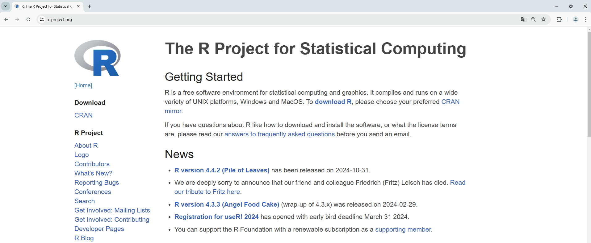{ width=95% }

 

3. Select the first link: <a href="https://cloud.r-project.org" target="_blank">https://cloud.r-project.org/</a>

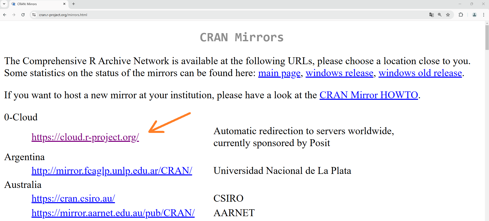{ width=95% }

 
    
4. Select your operating system

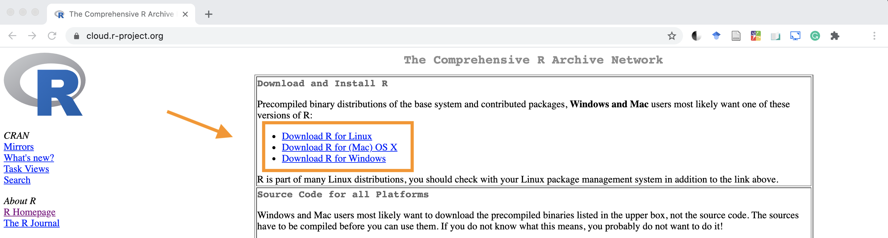{ width=95% }

 

### R Windows

1. Select **base**

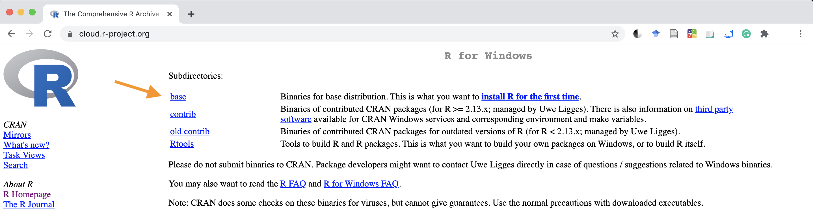{ width=95% }

 
  
2. Select **Download** for the latest available version of R

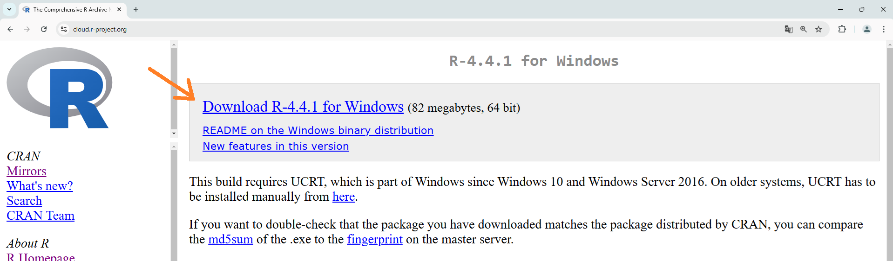{ width=95% }

 

3. Once the download is complete, run the file and follow the instructions until the installation is finished

### R MacOS

1. Select the latest available version of R

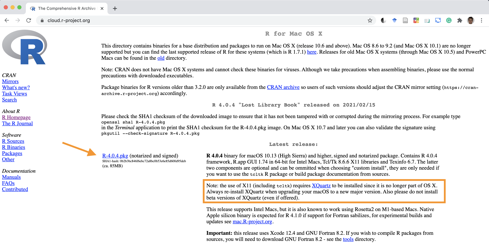{ width=95% }

 

2. Once the download is complete, run the file and follow the instructions to complete the installation of R
3. Next, you will also need to install an additional component **XQuartz** by clicking the link within the orange box shown in the previous figure
4. Select Download

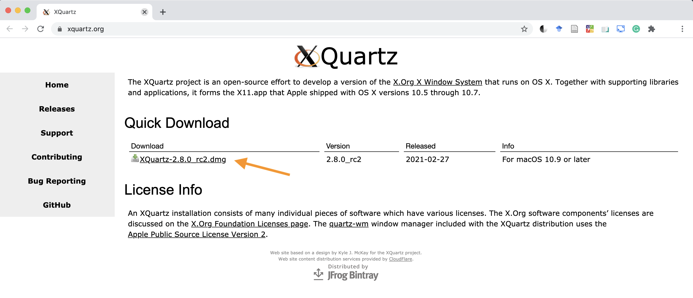{ width=95% }

 

5. Once the download is complete, run the file and follow the instructions to finish the installation

### R Linux

Despite the ease of installing packages on Linux, R can sometimes be more complicated to install due to the variety of distributions, repositories, and keys required to recognize the repository as secure.

On **CRAN** there is an official guide with all the `apt` commands to run from the terminal. By following these steps, there should be no issues.

1. Go to [CRAN](https://cran.r-project.org/){target="_blank"}
2. Click `Download R for Linux`
3. Select your distribution (Ubuntu in this case)
4. Follow the instructions, mainly running the suggested terminal commands

For any difficulties or errors, especially in the Linux environment, an online search usually resolves the issue.

 

:::{.design title="R Tools" data-latex="[R Tools]"}
Advanced uses of R require the installation of additional software known as **R tools**.

#### Windows{-}

Select **Rtools** and follow the instructions to complete the installation.
 

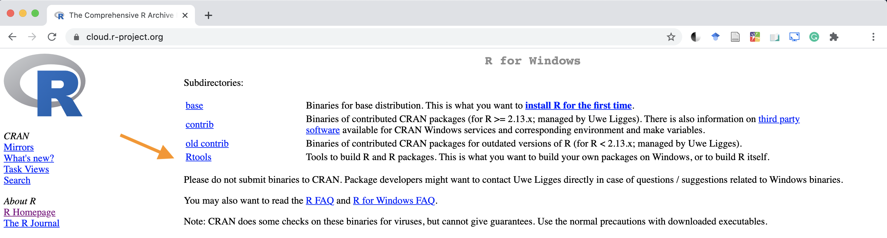{ width=95% }

 
Note that some configuration steps are also required to ensure everything works correctly.

#### MacOS{-}

Select **tools** and follow the provided instructions.

 

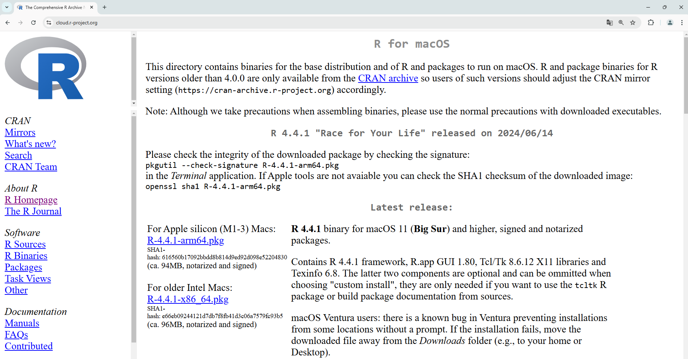{ width=95% }

 
Note in particular that with R 4.0, the following instructions are provided.

 

{ width=95% }

:::

## Installing R Studio

1. Go to the website: https://rstudio.com
2. Select **DOWNLOAD IT NOW**

{ width=95% }

 

3. Select the free version of RStudio Desktop

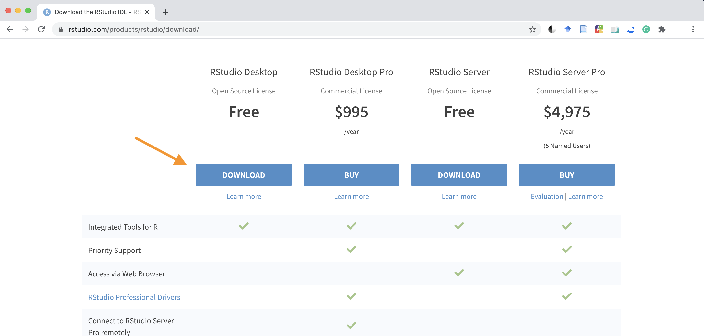{ width=95% }

 

4. Select the correct version depending on your operating system

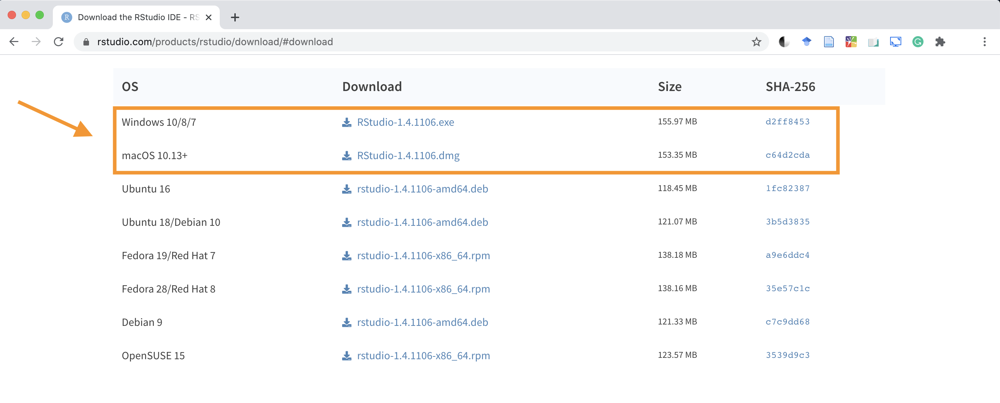{ width=95% }

 

5. Once the download is complete, run the file and follow the instructions to finish the installation

### R Studio on Linux

In this case, as with Windows and macOS, the installation consists of downloading and running the correct file, depending on the distribution (for example, `.deb` for Ubuntu and derivatives). Importantly, in the case of Ubuntu (but this should apply to other distributions as well), even versions later than the one indicated (e.g., Ubuntu 16) are fully compatible.
