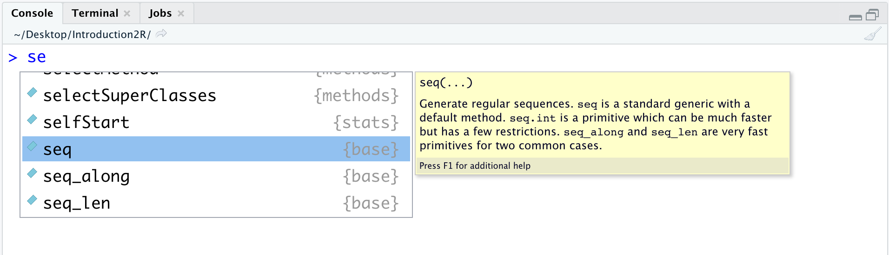

# Two Inseparable Companions {#objects-functions}


In this chapter, we will introduce the concepts of objects and functions, two fundamental elements of R (and any programming language). We can think of objects in R as variables that allow us to store values in memory (e.g., the results of our calculations or our data). Functions in R, on the other hand, are analogous to mathematical functions that, given objects as input, perform actions and return new objects as output.

This is a hyper-simplification (and technically incorrect), but it helps us understand how, starting with our initial data or values, we can manipulate them by applying functions to obtain, through different steps, the desired results (e.g., statistical analyses, graphs, or tables).

Here, we will explore the fundamental aspects of using objects and functions, which will be further detailed in the [Second Section](#second-section) and the [Third Section](#third-section) of the book.

## Objects {#objects-section}

When we execute a command in R, the result is immediately displayed in the *Console*. However, this result is not saved in memory, meaning it cannot be reused in any future operations. Conducting analyses in this way would be extremely complicated and inefficient. The most obvious solution is to save our intermediate results in memory so that they can be reused during our analyses. This process is referred to as *assigning* a value to an object.

### Assigning and Calling an Object {#assign}

To assign the numeric value 5 to the object `x`, the following command must be executed:


```r
x = 5
```

The `=` operator allows us to assign the values on its right to the object whose name is defined on the left. Therefore, we have the following pattern: `<object-name> = <assigned-value>`. Notice how in the *Console*, only the command just executed appears, but no output is shown.

To use the value contained in the object, it is sufficient to call the desired object's name in the code.


```r
x + 3
## [1] 8
```

It is also possible to "update" or "replace" the value contained in an object. For example:


```r
# Update the value of an object
x = x*10
x
## [1] 50

# Replace the value of an object
x = "Hello World!"
x
## [1] "Hello World!"
```

In the first case, we used the old value contained in `x` to calculate the new result, which was assigned to `x` itself. In the second case, we replaced the old value of `x` with a new value (in this example, a character string; note that in this second case, the *type* of the object `x` is also changed from numeric to character).

:::{.design title="Assigning values '=' vs '<-'" data-latex="[Assigning values '=' vs '<-']"}

There are two main operators used to assign a value to an object: the `=` operator and the `<-` operator. Both are valid, and in most cases the choice between them just comes down to personal style. Note that `<-` is very specific to R, while `=` is more commonly used across different programming languages.


```r
# Demonstration that `=` and `<-` work equally for assigning a value and lead to the same result 
x_1 = 45
x_2 <- 45

# are they equal?
x_1 == x_2 
## [1] TRUE
```

In fact, there may be some good reasons to prefer the use of `<-` over `=` (be careful not to confuse the latter with the relational operator `==`). The assignment operation implies directionality, which is made explicit by the `<-` symbol (i.e., what is on the right is assigned to what is on the left), while the `=` symbol does not explicitly highlight this aspect and even evokes the idea of equality in mathematics, thus potentially generating confusion in the reader.

The decision on which operator to adopt is free, but remember that a good programming practice is *consistency*: once a decision is made, it's best to stick with it to facilitate understanding of the code.
:::

### Object Names {#objects-names}

Choosing object names may seem like a minor aspect, but it is actually very important for ensuring code clarity and comprehension.

There are some rules that distinguish valid names from invalid ones. The name of an object:

- must start with a letter, and can contain letters, numbers, underscores (`_`), or periods (`.`);
- could also start with a period (`.`), but in that case, it cannot be followed by a number;
- must not contain special characters like `#`, `&`, `$`, `?`, etc.;
- must not be a reserved word, meaning words used by R with special meanings (e.g., `TRUE`, `FALSE`, etc.; type `?reserved` in the *Console* and press `enter` for seeing a list of all reserved words in R in the *Help* panel).

:::{.warning title="CaSe-SeNsItIvE" data-latex="[CaSe-SeNsItIvE]"}

Note that R is a **Case-Sensitive** language, meaning it distinguishes between lowercase and uppercase letters. In the following example, the two names are considered different, so no overwriting occurs, and two different objects are created:


```r
My_name = "Monty"
my_name = "Python"

# are they equal?
My_name == my_name
## [1] FALSE
```

:::

Moreover, the ideal name for an object should be:

- **self-descriptive**: From the name alone, it should be possible to infer the content of the object. A generic name like `x` or `y` would be of little help since they could contain any information. Instead, a name like `weight` or `gender` would clearly suggest the content of the object (e.g., the weight or gender of the participants in our study).
- **of the right length**: It should not be too short (avoiding incomprehensible abbreviations) but not too long either. The correct length allows the name to be sufficiently informative without adding unnecessary details. Typically, 2 or 3 words are enough.

:::{.design title="CamelCase vs snake_case" data-latex="[CamelCase vs snake\\_case]"}
Often, more than one word is used to create a sufficiently clear name. However, since spaces cannot be included in a name, the issue arises of how to combine multiple words without making the name incomprehensible, such as `mediatestcontrol`.

There are several conventions, including:

- **CamelCase**. The start of a new word is indicated by using an uppercase letter. For example, `mediaTestControl`.
- **snake_case**. The start of a new word is indicated by using the `_` character. For example, `media_test_control`.
- a variation of the classic **snake_case** involves using `.`, for example, `media.test.control`. This latter approach is not recommended, however, because in many programming languages (including R itself under certain conditions), the `.` character is a special character.

Generally, it is recommended to follow the **snake_case** convention. However, the decision on which convention to adopt is free, but remember again that a good programming practice is *consistency*: once a decision is made, it's best to stick with it to facilitate understanding of the code.
:::


### Data Types and Data Structures

To work optimally in R, it is essential to be well-acquainted with and clearly distinguish between the different data types and structures used.

In R, we have four main data types, which are types of values that can be used:

- `character` - *Character strings* whose alphanumeric values are enclosed in double quotes like `"Hello world!"` or single quotes like `'Hello world!'`.
- `double` - *Real numerical values* with or without decimal points, such as `27` or `93.46`.
- `integer` - *Integer numerical values* defined by appending the letter `L` to the desired number, such as `58L`.
- `logical` - *Logical values* `TRUE` and `FALSE` used in logical operations. 

If you want to know the data type of a value or variable you can use the `typeof()` function as follows:

```r
typeof("Psicostat")
## [1] "character"
typeof(24.04)
## [1] "double"
typeof(1993L)
## [1] "integer"
typeof(TRUE)
## [1] "logical"
```

In R, we also have different types of objects, or structures in which data can be organized:

- **Vectors**
- **Matrices**
- **Dataframes**
- **Lists**

We will explore their definition, characteristics, and usage in more detail throughout the [Second Section](#second-section) of this book.

## Functions {#functions-def}                                                   

We can think of functions in R as being similar to classic mathematical functions. Given input values, functions perform specific calculations and return the obtained result as output.

<center>
{ width=95% }
</center>
<br>

We have already encountered our first functions for performing specific mathematical operations in Chapter \@ref(math-operators), such as `sqrt()` or `abs()`, used to obtain the square root or absolute value of a number, respectively. Of course, functions in R are not limited to mathematical calculations; they can perform any kind of task, such as creating graphs and tables or manipulating data or files. However, the concept remains the same: given objects as input, functions perform certain actions and return new objects as output.

In fact, we will encounter functions that require no input or produce no output. For example, `getwd()` requires no input (it just tells you the filepath representing the current working directory of R), or the function `rm()` produces no output (it just removes one or more objects that you pass as its input). However, this occurs in a minority of cases.

### Function Arguments {#function-arguments}

The function input is called "arguments". Generally, to execute a function in R, you need to type the function's name and indicate in parentheses the values (input) you want to assign to the function's **arguments**, separated by commas. The following general syntax is used:

<center>
`<function-name>(<name-arg1> = <value-arg1>, <name-arg2> = <value-arg2>,...)`
</center>
<span></span>

For example, to create a sequence of values with increments of 1, you can use the `seq()` function, whose arguments include (among others) `from`, `to`, and `by`, indicating the starting value, the maximal value of the sequence, and the increment respectively.


```r
# create a sequence of values from 0 to 10 with increments of 2
seq(from = 0, to = 10, by = 2)
## [1]  0  2  4  6  8 10
```

When defining a function's arguments, it is not necessary to specify the names of the arguments. For example, the previous command can also be executed by specifying only the values.


```r
# create a sequence of values from 0 to 10 with increments of 2
seq(0, 10, 2)
## [1]  0  2  4  6  8 10
```

However, this makes reading and understanding the code more difficult because it is unclear which arguments the values refer to. In this case, the order in which the values are defined is important, as R assumes the predefined order of the arguments. Notice how swapping the values produces different results from the previous ones, but this does not happen when the argument names are specified.


```r
# swap previous values without specifying the argument names 
# (so it will try going from 0 to 2 with increments of 10)
seq(0, 2, 10)
## [1] 0

# swap previous values, but specifying the argument names 
seq(from = 0, by = 2, to = 10)
## [1]  0  2  4  6  8 10
```

We also see that functions can have many arguments, but it is not (always) necessary to specify the value for each one. Many arguments, in fact, have preset some *default* values and do not need to be specified unless, of course, you want to use settings different from the *default*. Additionally, specifying one argument over another can define the function's behavior.

For example, the `seq()` function also has the `length.out` argument, which was not specified earlier. It allows you to define the number of elements in the sequence. Let's see how specifying `length.out` changes the function's behavior.


```r
seq(from = 0,  to = 10, length.out = 5)
## [1]  0.0  2.5  5.0  7.5 10.0
seq(from = 0,  to = 10, length.out = 5, by = 2)
## Error in seq.default(from = 0, to = 10, length.out = 5, by = 2): too many arguments
```

In the second case, specifying both `length.out` and `by` produces an error, because the two arguments try to impose incompatible and contradictory request to the function's behavior (i.e., with `length.out = 5` five numbers are requested as output, but this is incompatible with `by = 2` which would generate six numbers as output from 0 to 10).

In general, it is advisable to always explicitly specify a function's arguments to make it clear what the indicated values refer to, while ensuring that the arguments do not conflict with each other. This is also useful to avoid unwanted function behaviors and to more easily identify potential errors.

Moreover, a function's arguments require specific types and structures of data, and it is up to us to ensure that the data is provided in the correct manner. For example, the `mean()` function, which calculates the average of a set of values, requires a *vector* of numeric values as input. We will explore the concept of *vectors* in Chapter \@ref(vector), but for now, we just need to know that we can use the `c()` function to combine multiple values into a single vector.


```r
# Calculate the average of the following numeric values
# use c() to combine multiple values into a single vector
mean(c(10, 80, 60, 120)) 
## [1] 67.5

mean(10, 80, 60, 120)
## [1] 10
```

Notice how in the first case the result is correct, while in the second case it is wrong. This is because `mean()` requires a vector as the first argument. In the first case, we correctly specified the vector of values using the `c()` function. In the second case, however, the first argument is just the value `10`, and R calculates the average of `10` itself which is, of course, `10`. The remaining values are just passed to other arguments that do not alter the behavior but also fail to flag this major error.

In the following example, we can see how `mean()` requires the values to be numeric. Although `"1"`, `"2"`, and `"3"` look like numbers, using double quotes turns them into character strings rather than numeric values, and R cannot calculate an average for characters.


```r
# Calculate the average of the following (character) values
mean(c("1", "2", "3"))
## Warning in mean.default(c("1", "2", "3")): argument is not numeric or logical:
## returning NA
## [1] NA
```

We understand, therefore, that to correctly use functions, it is essential to know their arguments and respect the required data types and structures.

### Help! I need Somebody...Help! {#help}

It is impossible to know all the functions and all their arguments. Fortunately, R helps us by easily providing documentation for each function. This documentation includes all the information regarding the function's purpose, a description of its arguments, and details about its possible uses.

To access the documentation, we can use the command `?<function-name>` or `help(<function-name>)`. For example:


```r
?seq
help(seq)
```

A page will open in the "Help" panel in the bottom right with the function's documentation, similar to what is shown in Figure \@ref(fig:help-page).

<div class="figure" style="text-align: center">

<p class="caption">(\#fig:help-page)Help-page for function `seq()`</p>
</div>

The format and information on the page follow common but not mandatory standards. In fact, not all fields are always used, and the function's author has some degree of freedom in customizing the documentation. The main and most commonly used fields include:

- **Title** - Explanatory title of the function's purpose;
- **Description** - Concise description of the function;
- **Usage** - Displays the function's structure with its arguments and default values;
- **Arguments** - List with detailed descriptions of all the arguments. Here, we find both the available options and their effects, as well as the required data types;
- **Details** - Detailed description of the function, including usage cases and technical notes;
- **Value** - Description of the function's output. This includes a description of the data structure of the output and the interpretation and use of the obtained results;
- **See Also** - Links to other similar or related functions;
- **Examples** - Examples of how to use the function.

#### Word Search {-}

When you don't know the exact name of a function or want to search for all functions and pages that include a certain word, you can use the command `??<word>` or `help.search(<word>)`.

R will perform a search across all available documentation and provide a list of pages that contain the desired word in the title or keywords.

:::{.trick title="Autocomplete with 'Tab'" data-latex="[Autocomplete with 'Tab']"}
Programmers tend to be lazy and forgetful. Fortunately, every respectable *code editor* (i.e., a program for writing code) has helpful autocomplete and command suggestion functions that simplify code writing.

In RStudio, suggestions appear automatically while typing a command, or they can be triggered by pressing the `Tab` key at the top left of the keyboard ( { width=5% } ). A window will appear with possible autocomplete suggestions for the function name. Using the arrow keys, we can highlight the desired function and press `enter` to autocomplete the command. Notice how a small yellow box with the function's description appears next to the function name.

<center>
{ width=95% }
</center>
<br>

To insert the function's arguments, we can again rely on suggestions and the autocomplete function. Simply press the `Tab` key again, and this time a list of arguments with descriptions will appear. We can then select the desired argument with the arrows and press `enter`.

<center>
{ width=95% }
</center>
<br>

Notice how the autocomplete function is not only used for functions but also for object names. This allows us to quickly recall previously created objects without typing the entire name.

<center>
{ width=95% }
</center>
<br>


:::

