# Working Environment {#working-environment}


In this chapter, we will introduce some very important concepts related to the working environment in R or RStudio. Specifically, we will talk about the *environment*, the *working directory*, and the use of *packages*.

## Environment {#environment}

In Chapter \@ref(objects-section), we saw how it is possible to assign values to objects. These objects are created in our working environment (or more precisely, *Environment*) and can be used later.

Our Environment collects all the objects that are created during our work session. You can check the objects currently present by looking at the *Environment* panel in the top right (see Figure @ref(fig
)) or by using the command `ls()`, which stands for *list objects*.

<div class="figure" style="text-align: center">
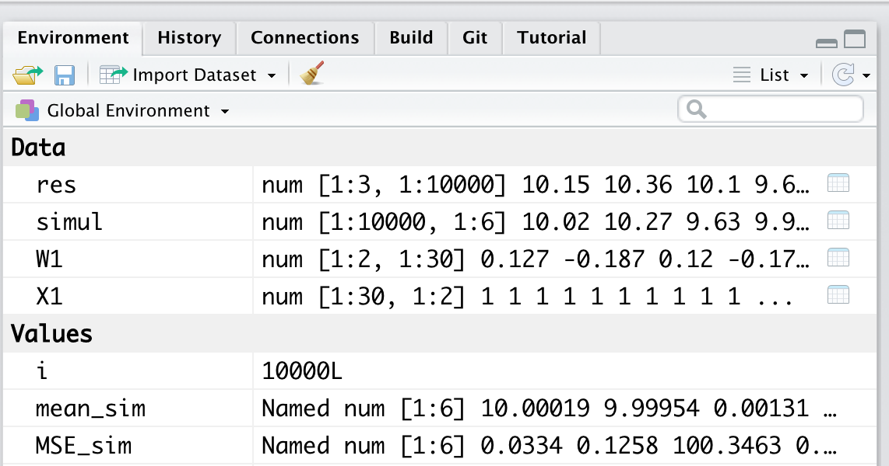
<p class="caption">(\#fig:environment2)*Environment* - List of objects and variables present in the workspace</p>
</div>

At the beginning of the work session, our Environment will be empty (see Figure \@ref(fig:environment-empty)). The `ls()` command will not return any object but will use the response `character(0)` to indicate the absence of objects, which is a zero-length character vector (see Chapter \@ref(vector)).


<div class="figure" style="text-align: center">
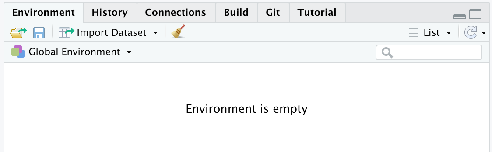
<p class="caption">(\#fig:environment-empty)Empty *Environment* at the start of the working session</p>
</div>


``` r
# Empty Environment
ls()
## character(0)
```

### Adding Objects to the Environment

Once objects are created, they will be present in our Environment, and the `ls()` command will return a character vector listing all their names.


``` r
# Create objects
x =  c(2,4,6,8)
y =  27
word = "Hello Word!"

# List object names in the Environment
ls()
## [1] "word" "x"    "y"
```

In the top right panel (see Figure \@ref(fig:environment-object)), we can find a list of the objects currently present in our Environment. Along with the name, some useful information depending on the type of object is provided. As we can see in our example, for variables with a single value (e.g., `word` and `y`), the actual values are presented. In the case of vectors (e.g., `x`), information about the type of vector and its size is also provided (see Chapter \@ref(vector)). In the example, we have a numeric vector (`num`) with 4 elements (`[1:4]`).


<div class="figure" style="text-align: center">
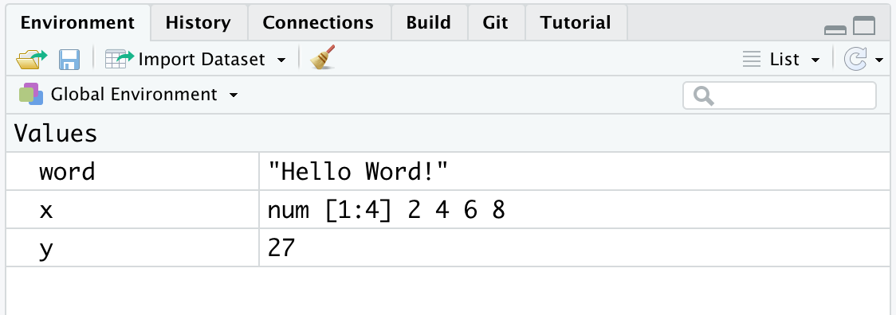
<p class="caption">(\#fig:environment-object)*Environment* containing the created objects</p>
</div>

### Removing Objects from the Environment

To remove an object from the environment, you can use the `remove()` command or its abbreviation `rm()`, specifying the object’s name in parentheses. Multiple objects can be specified, separating their names with a comma.


``` r
# Remove an object
rm(word)
ls()
## [1] "x" "y"

# Remove multiple objects at once
rm(x,y)
ls()
## character(0)
```

:::{.trick title="rm(list=ls())" data-latex="[rm(list=ls())]"}
If you need to delete all the objects currently present in your working environment, you can use the command `rm(list=ls())`. This will ensure that the environment is cleared of all objects, restoring it to its initial session conditions.
:::

:::{.design title="Keeping the Environment Organized" data-latex="[Keeping the Environment Organized]"}
Keeping your Environment organized and being aware of the objects currently present is important. This helps avoid two common errors.

- **Using objects that have not yet been created**. In this case, the error is easy to spot because R will warn us with "*object '<object-name>' not found*". You simply need to execute the command to create the requested object.


``` r
my_object
## Error: object 'my_object' not found
```

- **Using objects with "*old*" values**. If you don't keep your environment organized, it may happen that different objects are created during successive work sessions. At this point, you might lose track of the real content of the objects and end up using objects assuming they contain certain values when, in fact, they contain something else. This would make any result meaningless. Be very careful because R cannot warn you about this error (for R, they are just numbers); you must be aware of whether the executed commands make sense or not.

To maintain an organized *Environment*, we recommend not automatically saving your *workspace* when you end a work session. You can set this option in R's general settings by selecting *"Never"* for the *"save workspace to .RData on exit"* option, as shown in the following Figure.

<center>
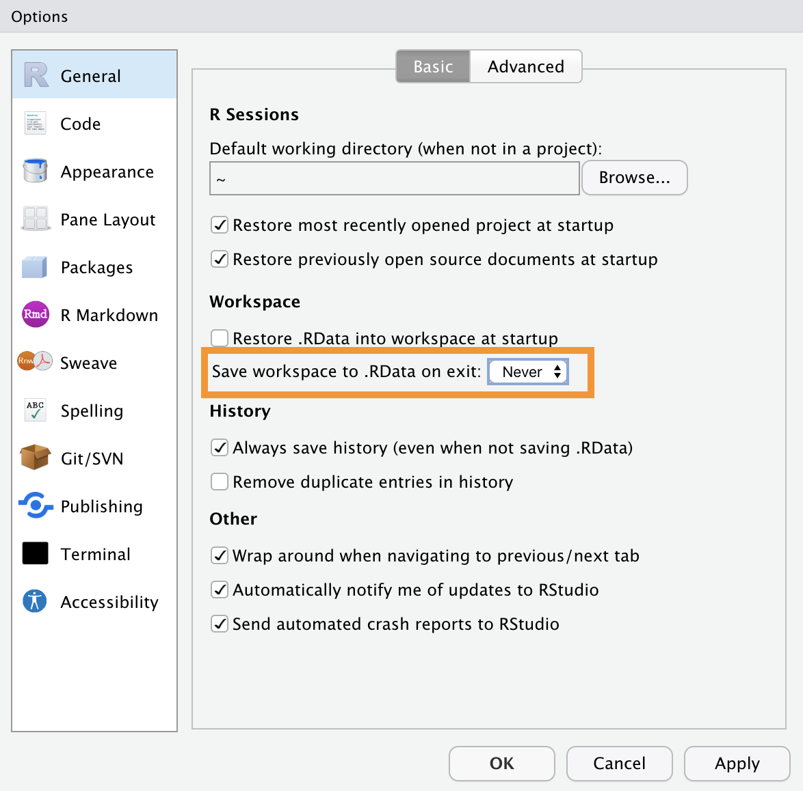{ width=75%}
</center>

This will allow you to start each new work session in an empty Environment, preventing old objects from accumulating over multiple sessions. Additionally, during your sessions, it will be helpful to run the `rm(list=ls())` command when you begin a new task to remove all the old objects.

#### Environment as Short-Term Memory {-}

The Environment is something temporary. Objects are saved in the computer’s primary memory (RAM, which we can think of as similar to Short-Term Memory in cognitive models) and will be deleted with the `rm(list=ls())` command or at the end of each work session.


Starting each session with an empty Environment will force you to gather all the steps of your analysis in an orderly script, avoiding reliance on old objects. All the objects needed during analyses will have to be recreated in each session, ensuring reproducibility and correctness (at least from a programming perspective). Ideally, in a work session, you should be able to start from an empty Environment and execute all the commands in a script in order to obtain the desired results.

It is easy to see how this is not always the most efficient solution. Some commands might take many minutes (or even days) to execute. In these cases, it would be convenient to save the results obtained so they can be used in subsequent sessions without the need to re-run all the commands. In Chapter TODO, we will see how to permanently save the created objects to the computer’s secondary memory (hard drive, analogous to long-term memory in our analogy) and how to load them in a subsequent work session.

:::

## Working Directory {#working-directory}

The concept of a *working directory* is very important but often not well understood. The *working directory* is the location within the computer where we are during our work session and from which we execute our commands.

### Computer Organization

The intuitive idea we commonly have about how a computer works is misleading. We often think the Desktop reflects the organization of the entire computer and that all actions are managed through the point-and-click interface to which modern operating systems have accustomed us. 

Without going into detail, it is more accurate to think of a computer’s organization as a system of folders and subfolders containing all our files and of its functioning as a set of processes (or commands) being executed. The programs we install are nothing more than folders containing all the scripts that determine their functioning. Even the Desktop is just a simple folder, while what we see is a program defined by the operating system that displays the folder’s contents on our screen and allows us to interact with it using the mouse.

Everything present on our computer, including our files, programs, and the operating system itself, is organized in an elaborate system of folders and subfolders. Approximately, we can think of the computer’s organization as shown in Figure \@ref(fig:file-system) (from: <https://en.wikipedia.org/wiki/Operating_system>).

Tutto quello che è presente nel nostro computer, compresi i nostri file, i  programmi e lo stesso sistema operativo in uso, tutto è organizzato in un articolato sistema di cartelle e sottocartelle. Approsimativamente possiamo pensare all'organizzazione del nostro computer in modo simile alla Figura \@ref(fig:file-system) (da: <https://en.wikipedia.org/wiki/Operating_system>).

<div class="figure" style="text-align: center">
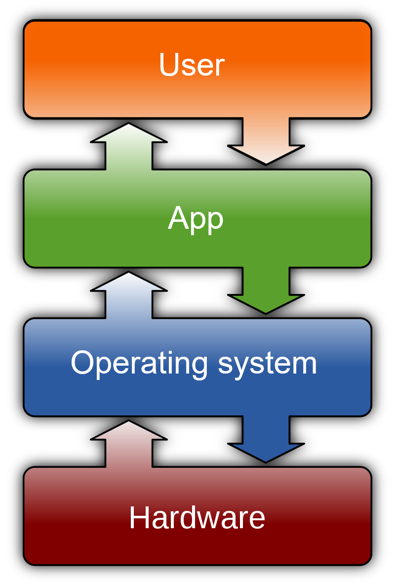
<p class="caption">(\#fig:file-system)Computer organization (from Wikipedia)</p>
</div>

At the lowest levels, we find all the system files, which users can access only with special permissions. At the higher levels, we find all the files related to the installed programs and applications, which are generally usable by multiple users on the same computer. Finally, we find all the folders and files related to the specific user.

###  Absolute Path and Relative Path 

This long preamble about the folder and subfolder organization is necessary because it is the structure the computer uses to navigate among all the files when executing commands through a command-line interface (e.g., R). If, for example, we want to load data from a specific file in R, we must provide the correct *path* (or address) that tells us exactly where the file is located within the computer’s folder structure. For example, let’s imagine we have data `My-data.Rda` saved in the `Introduction2R` folder on the Desktop.

```
Desktop/
 |
 |-  Introduction2R/
 |    |
 |    |- Dati/
 |    |   |- My-data.Rda
```

To indicate the file’s location, I could use either an:

- **absolute path** - the file’s *"absolute"* location relative to the system’s *root directory*, which is the main folder of the entire computer.


``` r
# Mac
"/Users/<username>/Desktop/Introduction2R/Dati/My-data.Rda"

# Windows Vista
"c:\Users\<username>\Desktop\Introduction2R\Dati\My-data.Rda"

```

- **relative path** - the file’s location relative to our current position in the computer from which we are executing the command, i.e., relative to the **working directory** of our work session. Continuing the previous example, if our working directory were the `Desktop/Introduction2R` folder, we would have the following relative paths:


``` r
# Mac
"Dati/My-data.Rda"

# Windows Vista
"Dati\My-data.Rda"

```

Notice how using relative paths is preferable because absolute paths are unique to the specific computer in question and therefore cannot be used on other computers.

:::{.warning title='"Error: No such file or directory"' data-latex='["Error: No such file or directory"]'}
If you use a relative path to indicate a file’s location, it is important that the current working directory is indeed the one you expect. If we were in a different folder, the indicated "relative path" would no longer be valid, and R would show us an error message.

Returning to the previous example, let’s suppose our current working directory is `Desktop` instead of `Desktop/Introduction2R`. Running the `load()` command to load the data using the now-invalid relative path would result in:


``` r
load("Dati/My-data.Rda")
## Warning in readChar(con, 5L, useBytes = TRUE): cannot open compressed file
## 'Dati/My-data.Rda', probable reason 'No such file or directory'
## Error in readChar(con, 5L, useBytes = TRUE): cannot open the connection
```

The error message indicates that R was unable to find the file based on my directions. It’s as if I asked the computer to open the fridge, but it was currently in the bedroom; I need to give it directions to the kitchen, or else it would reply *"fridge not found"*. It is therefore crucial always to be aware of the current working directory where the session is being held.

Of course, I would get the same error using an absolute path if it contained errors.
:::

:::{.design title="The Garden of Forking Paths" data-latex="[The Garden of Forking Paths]"}
As you may have noticed from the previous examples, both the structure used to organize files on the computer and the syntax used to define paths differ depending on the operating system used.

#### Mac OS e Linux{-}

- The character used to separate folders in the path definition is `"/"`:

``` r
"Introduction2R/Dati/My-data.Rda"
```
- The root-directory is indicated by starting the path with the `"/"` character:

``` r
"/Users/<username>/Desktop/Introduction2R/Dati/My-data.Rda"
```
- The user’s *home* directory (i.e., `/Users/<username>/`) is indicated by starting the path with the `"~"` character:

``` r
"~/Desktop/Introduction2R/Dati/My-data.Rda"
```

#### Windows {-}
- The character used to separate folders in the path definition is `"\"`:

``` r
"Introduction2R\Dati\My-data.Rda"
```
- The root-directory is indicated by `"c:\"`:

``` r
"c:\Users\<username>\Desktop\Introduction2R\Dati\My-data.Rda"
```
:::

### Working Directory in R 

Now let’s see the commands used in R to check and change the working directory during your session.

:::{.tip title='One "/" to Rule Them All' data-latex='[One "/" to Rule Them All]'}
Note that in the following examples, in R, the `"/"` character is always used to separate folders in the path definition, regardless of the operating system.
:::

#### Current Working Directory {-}

In R, you can check the current working directory using the `getwd()` command, which will return the absolute path of the current location.


``` r
getwd()
## [1] "/Users/<username>/Desktop/Introduction2R"
```

Alternatively, the current working directory is also displayed in the top left of the Console, as shown in Figure \@ref(fig:current-wd).

<div class="figure" style="text-align: center">

<p class="caption">(\#fig:current-wd)Working directory of the current working session</p>
</div>

By clicking the arrow next to it, the *Files* panel in the bottom right will be redirected directly to the working directory of the current session. This makes it easy to navigate through the files and folders contained within it (see Figure \@ref(fig:current-folder)).

<div class="figure" style="text-align: center">
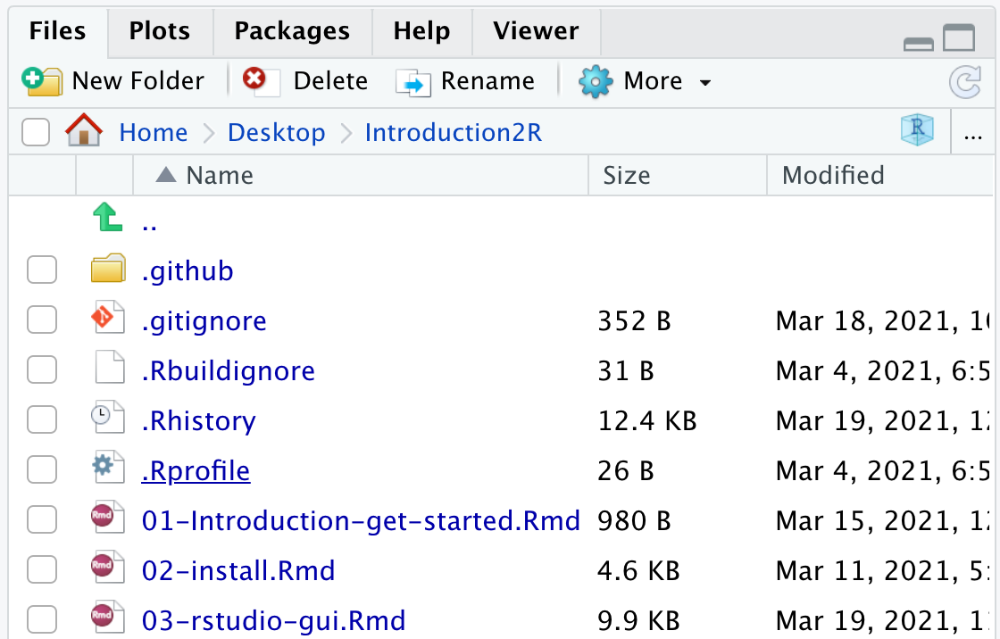
<p class="caption">(\#fig:current-folder)Working directory of the current working session</p>
</div>

#### Changing the Working Directory {-}

Per cambiare la working directory è possibile utilizzare il comando `setwd()` indicando il path (absolute o relative) della nuova working directory. Nota come, nel caso in cui venga indicato un relative path, questo dovrà indicare la posizione della nuova working directory rispetto alla vecchia working directory.


``` r
getwd()
## [1] "/Users/<username>/Desktop/Introduction2R"

setwd("Data/")

getwd()
## [1] "/Users/<username>/Desktop/Introduction2R/Data"
```

Alternatively, you can select the *"Choose Directory"* option from the *"Session"* > *"Set Working Directory"* menu, as shown in Figure \@ref(fig:set-wd). You will then be prompted to select the desired working directory and press *"Open"*.

<div class="figure" style="text-align: center">
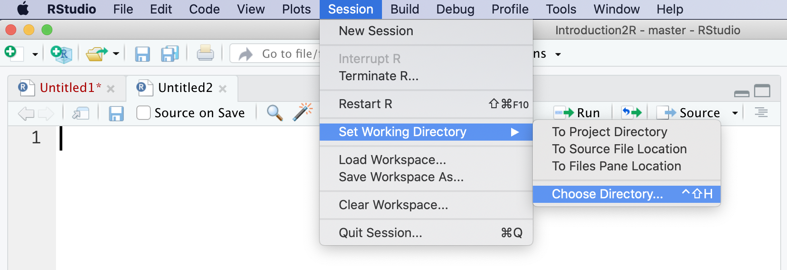
<p class="caption">(\#fig:set-wd)Setting the working directory</p>
</div>

:::{.trick title="Show me the Path" data-latex="[Show me the Path]"}
Note that you can take advantage of auto-completion when typing the path. Inside the quotes `""`, press the `Tab` key to see suggestions for paths relative to the current working directory.

<center>
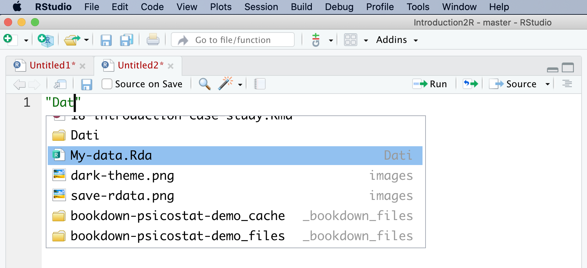{ width=75% }
</center>
<br>

Additionally, you can use the special characters `"./"` and `"../"` to refer to the current working directory and the *parent folder* (i.e., the folder that contains the current working directory), respectively. `"../"` allows us to navigate backward from our current location through the computer’s folder structure.


``` r
getwd()
## [1] "/Users/<username>/Desktop/Introduction2R"

setwd("../")

getwd()
## [1] "/Users/<username>/Desktop/"
```

:::

## R-packages {#packages}

One of the great strengths of R is the ability to extend its basic functions easily and intuitively by using new packages. Currently, there are over **19,000** packages freely available on CRAN (the official R repository). These packages have been developed by R’s immense community to perform all sorts of tasks. You could say that in R, anything is possible if you find the right package (or create it!).

When we installed R, a set of packages was automatically installed that make up the **system library**, which includes all the basic packages that allow R to function. However, other packages are not immediately available. To use the functions of other packages, a two-step procedure is required, as represented in Figure \@ref(fig:packages-process):

1. **Download and install the packages on your computer**. The packages are freely available online in the CRAN repository, a sort of archive. They are then downloaded and installed in our library, which is the collection of all R packages available on our computer.

2. **Load the package into the work session**. Even though the package is installed in our library, we are not yet ready to use its functions. First, we need to load the package into our work session. Only then will the package’s functions be available for use.

<div class="figure" style="text-align: center">
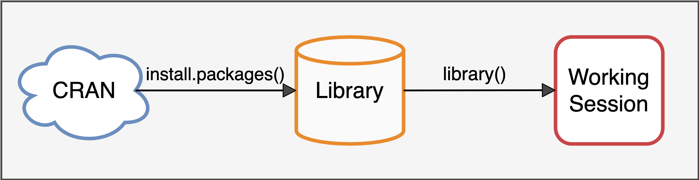
<p class="caption">(\#fig:packages-process)Using the R packages</p>
</div>

This two-step procedure might seem unintuitive. *"Why do we need to load something that is already installed?"* The answer is simple: it helps keep our work session efficient and under control. In fact, we will never need all the installed packages, but depending on the tasks we need to perform, we will use only a few specific packages at a time. If all the packages were loaded automatically every time, it would be an unnecessary waste of memory, and conflicts would easily arise. Some functions from different packages might have the same name but different purposes. This could easily lead to errors or invalid results.

Now, let’s see how to perform these operations in R.

### install.packages()

To install packages from CRAN into our library, you can use the `install.packages()` command, specifying the name of the desired package in parentheses.


``` r
# A great package for statistical analysis by John Fox
# a great statistician... known as Jonny the fox to friends ;)
install.packages("car")
```

Alternatively, you can use the *"Install"* button in the top left of the Packages panel (see Figure \@ref(fig:packages-install)), then specify the name of the desired package.

<div class="figure" style="text-align: center">
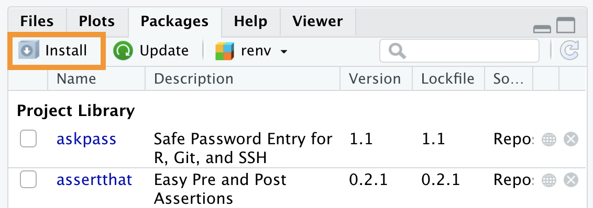
<p class="caption">(\#fig:packages-install)Installing packages via the RStudio interface</p>
</div>

Note that installing a package might also require installing other packages. This is because the package’s *dependencies* (i.e., all the packages used internally by the package of interest and necessary for its proper functioning, like a Matryoshka doll) will automatically be installed.

Once the package is installed, it will appear in the library, which is the list of available packages shown in the Packages panel (see Figure \@ref(fig:library-car)).

<div class="figure" style="text-align: center">

<p class="caption">(\#fig:library-car)The car packages is now available in the library</p>
</div>

:::{.design title="Binary or Source Version?" data-latex="[Binary or Source Version?]"}
When installing packages, R might display a message similar to the following:

``` r
There are binary versions available but the
  source versions are later:
           binary source needs_compilation
devtools   1.13.4  2.0.1             FALSE
    [... una lista di vari pacchetti...]

Do you want to install from sources the packages which need compilation?
```
In short, the answer to give is **NO** (`"n"`). But what is R actually asking? Packages are available in different formats, the most common being:

- **Binary Version** - ready to use and easy to install;
- **Source Version** - requires a particular procedure called compilation to install. 

In general, it’s always preferable to install the *Binary* version. However, in this case, R is warning us that for some packages, the most recent updates are only available in the *Source* version and is asking if we want to install them via the compilation procedure.

It’s preferable to respond *"no"*, installing the ready-to-use *Binary* version, even if it is slightly outdated. If you are required to install a package in the Source version (either because you need the latest updates or because it’s not available otherwise), you must first install **R tools** (see "**In-Depth: R Tools**" in Chapter \@ref(install-r)), which provides the necessary tools to compile the packages.

For a detailed discussion, see <https://community.rstudio.com/t/meaning-of-common-message-when-install-a-package-there-are-binary-versions-available-but-the-source-versions-are-later/2431> e  <https://r-pkgs.org/package-structure-state.html>

:::

### library()

To use the functions of a package already present in our library, we now need to load it into our work session. To do this, we can use the `library()` command, specifying the name of the required package in parentheses.


``` r
library(car)
```

Alternatively, you can check the box to the left of the package name in the Packages panel, as shown in Figure \@ref(fig:load-package). However, this procedure is not recommended. In fact, every point-and-click action must be performed in every session, while using commands included in the script ensures their automatic execution.

<div class="figure" style="text-align: center">
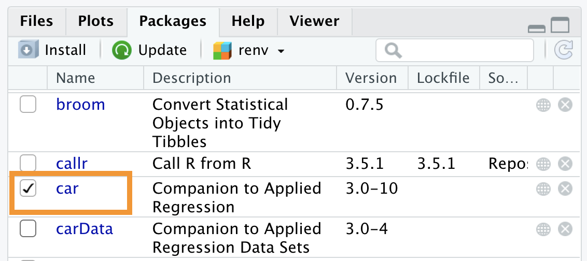
<p class="caption">(\#fig:load-package)Loading a package in the working session</p>
</div>

Now we are finally ready to use the package’s functions in our work session.

:::{.trick title="package::function()" data-latex="[package::function()]"}
There is a little trick to using a specific function from a package without having to load the package into your session. To do this, you can use the syntax:


``` r
<nome-pacchetto>::<nome-funzione>()

# Example with the Anova function from the car package
car::Anova()
```

Using `::` allows us to call the desired function directly. The difference between using `library()` and `::` concerns some fairly advanced aspects of R (for further details, see <https://r-pkgs.org/namespace.html>). In short, we can say that in some cases, it’s preferable not to load an entire package if you only need one function from it.
:::

### Updating and Removing Packages

Just like any other software, packages are updated over time, providing new features and fixing any issues. To update packages to the most recent version, you can run the `update.packages()` command without specifying anything in parentheses.

Alternatively, you can press the *"Update"* button in the top left of the Packages panel (see Figure \@ref(fig:library-version)), then specify the packages you want to update. Note how the current version is listed under the *"Version"* column in the list of packages.

<div class="figure" style="text-align: center">
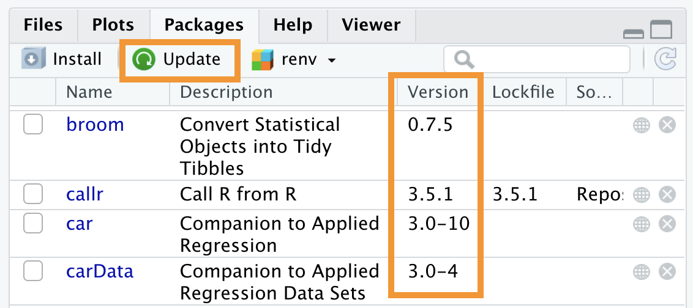
<p class="caption">(\#fig:library-version)Updating packages</p>
</div>

If you want to remove a specific package, you can run the `remove.packages()` command, specifying the package’s name in parentheses.

Alternatively, you can press the `x` button to the right of the package in the Packages panel, as shown in Figure \@ref(fig:library-remove).

<div class="figure" style="text-align: center">
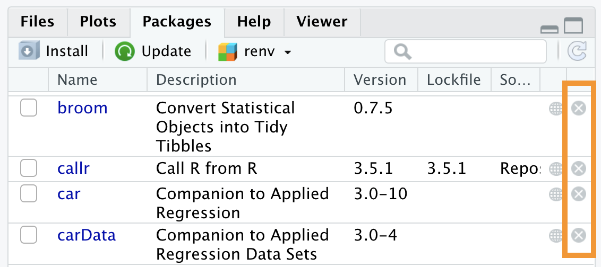
<p class="caption">(\#fig:library-remove)Removing packages</p>
</div>


### Package Documentation

Each package includes documentation for its functions and *vignettes*, which are short tutorials showing examples of the package’s use.

- **Function documentation** - To access a function’s documentation, you can use the command `?<function-name>` or `help(<function-name>)`. Remember, you must first load the package; otherwise, the function will not be available yet. Alternatively, you can broaden the search using the ?? command.

- **Vignettes** - To get a list of all vignettes for a particular package, you can use the command `browseVignettes(package = <package-name>)`. To access a specific vignette, use the `vignette("<vignette-name>")` command.

- **Entire package documentation** - Clicking on the package name in the Packages panel in the bottom right will open the list of all information related to the package, as shown in Figure \@ref(fig:package-documentation). Links to vignettes and other files related to the package’s features are provided first. Then, all the functions are listed in alphabetical order.

<div class="figure" style="text-align: center">
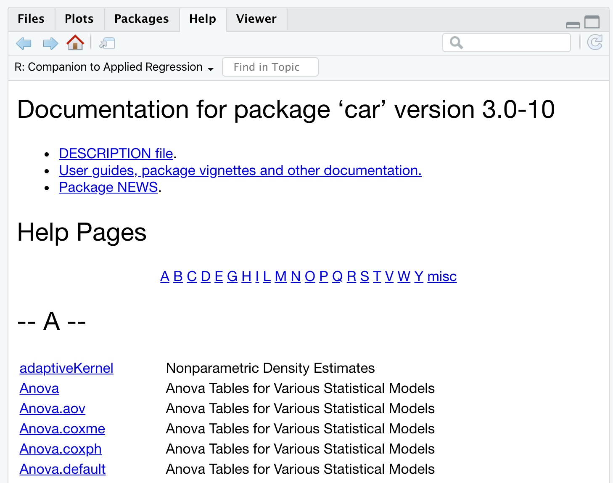
<p class="caption">(\#fig:package-documentation)Documentation of the 'car' package</p>
</div>

However, remember that the biggest source of information is always Google. Many important packages even have their own website, where they collect a lot of useful material. Nonetheless, many tutorials and examples are always available online.

:::{.design title="Github" data-latex="[Github]"}
CRAN is not the only resource where you can install R packages, but it is the official one and guarantees a certain standard and stability for the packages it hosts. There are many other repositories online that collect R packages (and software in general), with one of the most popular being GitHub (<https://github.com/>).

Github is used as a development platform for many R packages, so it’s possible to find the latest development versions of packages there, with the most recent updates, or even new packages not yet available on CRAN. However, it’s important to note that these are development versions and may have more issues. Additionally, installing packages this way requires the installation of **R tools** (see *"In-Depth: R Tools"* in Chapter \@ref(install-r)).

To install a package directly from Github, you can use the `install_github()` command from the `devtools` package, specifying the URL of the desired repository.


``` r
install.packages("devtools")

# ggplot2 the best package for graphics
devtools::install_github("https://github.com/tidyverse/ggplot2")
```
:::

