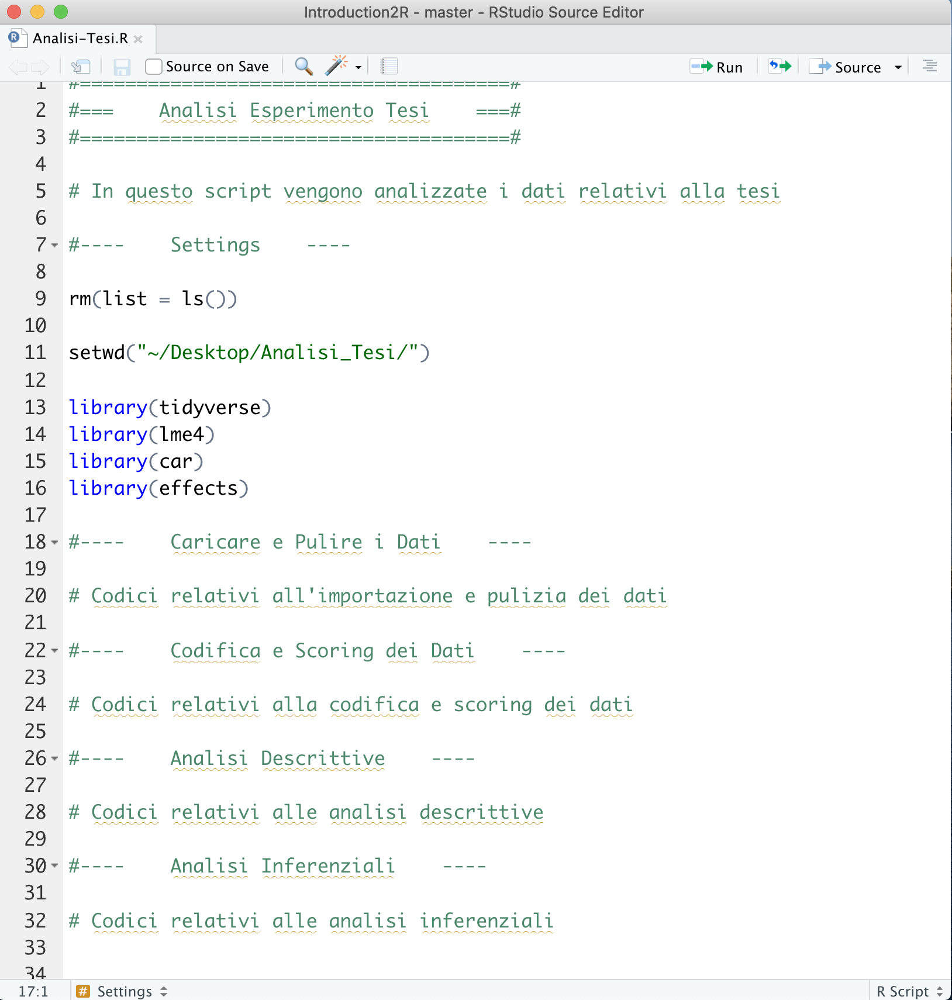
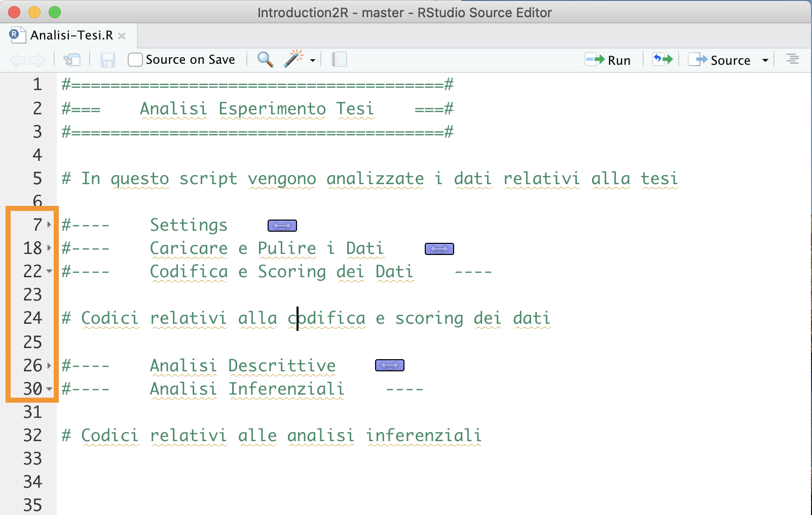
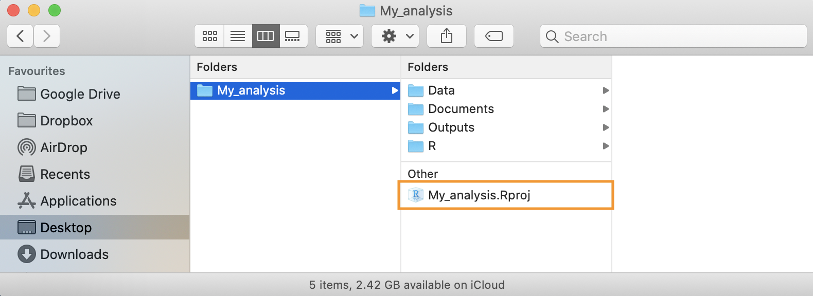

# Working Session {#working-session}


In this chapter, we will discuss some general aspects of working sessions in R. We will describe good habits for organizing scripts to be neat and efficient in your work. We will also explain how to organize your projects in folders, particularly introducing the use of *RStudio Projects*. Finally, we will go over how to handle R messages, particularly how to deal with errors.

## Organizing Scripts

We have seen that ideally, all the steps of our analyses should be organized neatly within a script. By running commands line by line in sequence, it should be possible to perform all analyses until the desired results are achieved.

Let’s now go over a set of good practices for organizing code neatly within a script and making it easier to read.

### Creating Sections

To keep the script’s organization clear and easy to understand, it is useful to divide the code into sections where different steps of the analysis are performed. In RStudio, you can create a section by adding the characters `####` or `----` at the end of a comment line. The comment text will be considered the section title, and a small arrow will appear next to the line number. You can use either `#` or `-` characters to create the desired style, as long as the line ends with at least four identical characters.


``` r
# Section 1 ####

# Section 2 ----

#----    Section 3    ----

####   Invalid Section   --##

```

As a simple example, let's look at a section division used in the script in Figure \@ref(fig:script-template).

<div class="figure" style="text-align: center">

<p class="caption">(\#fig:script-template)Example of dividing a script into sections</p>
</div>

- **Title** - A descriptive title of the script's content. You can use other characters within comments to create the desired effect.
- **Introduction** - A description and useful information regarding both the work's objective and code execution (e.g., where the data is available, any technical specifications). It may also be useful to include the author and date of the work.
- **Setting** - A key section where you set up the working environment. The steps to follow are:
  1. `rm(list = ls())` to clear the Environment of any objects so the script starts from a clean environment (see Chapter \@ref(environment)).
  2. `setwd()` to set the working directory, ensuring the commands are executed from the correct location on your computer (see Chapter \@ref(working-directory)).
  3. `library()` to load the packages used in the analyses (see Chapter @ref(packages)).
- **Loading and Cleaning Data** - A general section for importing and cleaning data.
- **Coding and Scoring Data** - A general section for coding and potentially scoring data.
- **Descriptive Analysis** - A general section for performing descriptive analyses.
- **Inferential Analysis** - A general section for performing inferential analyses.

Besides keeping your code neat and clear, dividing your script into sections allows you to easily navigate between different parts of the code. You can use the index that is automatically created. The index is accessible by clicking the button at the top right of the script and selecting the desired section (see Figure \@ref(fig:toc-side)).

<div class="figure" style="text-align: center">

<p class="caption">(\#fig:toc-side)Index at the top for section navigation</p>
</div>

Alternatively, you can use the menu at the bottom left of the script (see Figure \@ref(fig:toc-bottom)).

<div class="figure" style="text-align: center">

<p class="caption">(\#fig:toc-bottom)Bottom menu for section navigation</p>
</div>

Finally, another advantage is the ability to collapse or expand code sections in the editor by using the arrows next to the line numbers (see Figure \@ref(fig:section-closed)).

<div class="figure" style="text-align: center">

<p class="caption">(\#fig:section-closed)Compacting and expanding code sections</p>
</div>

### Syntax  {#sintax}

Here are some additional good practices for writing code that make it easier to understand.

#### Comments {-}

The use of comments is very important. It allows us to document the different parts of the code and clarify any difficult-to-understand commands. However, it's not necessary to comment on every single line of code, and it's better to avoid commenting when commands are easily interpretable by simply reading the code.

The ability to write useful comments and avoid redundant ones comes with experience. In general, a comment should not indicate *"what"* but rather the *"why"* of that part of the code. The "what" is easily interpretable from the code itself, while the "why" may be less obvious and much more helpful for understanding the entire script. For example:

``` r
x = 10 # assign the value 10 to x
x = 10 # define maximum number of responses
```
The first comment is unnecessary because it is easily understandable from the code itself, while the second comment is very useful because it clarifies the meaning of the variable and will help in understanding the code.

#### Object Names {-}

We discussed in Chapter \@ref(objects-names) the rules that distinguish valid from invalid names and the conventions to follow when defining a name. Here, we recall the characteristics that a name should have to make the code easier to understand. The name of an object should be:

- **Self-descriptive** - From the name alone, it should be possible to infer the object’s contents. It's better to avoid generic names (such as `x` or `y`) and instead use names that clearly describe the content of the object.
- **Of appropriate length** - It should neither be too short (avoiding incomprehensible acronyms) nor too long. Usually, 2 or 3 words are enough to clearly describe an object.

It's also important to be **consistent** in the choice of style when naming variables. Generally, it is preferable to use **snake_case** over **CamelCase**, but the choice is up to you. However, once a decision is made, it's best to stick with it to facilitate the understanding of the code.

#### Explicitly Name Arguments {-}

We discussed in Chapter \@ref(function-arguments) the importance of explicitly naming arguments when using functions. Specifying what each value refers to makes reading and understanding the code easier. For example:


``` r
seq(0, 10, 2)
```

It may not be clear whether we mean a sequence between 0 and 10 of length 2 or at intervals of 2. By specifying the arguments, we avoid confusion and possible errors.


``` r
seq(from = 0, to = 10, by = 2)
seq(from = 0, to = 10, length.out = 2)
```

#### Spaces, Indentation, and Alignment {-}

Unlike many other software, R does not enforce strict rules regarding the use of spaces, indentation, and alignment, and it is generally very permissive in terms of syntax. However, it is important to remember that:

> Good coding style is like using correct punctuation. You can manage without it, but it sure makes things easier to read - Hadley Wickham

Take, for example, the following lines of code, which include some advanced R functions:


``` r
# Style 1
k=10;if(k<5){x=5:15}else{x=seq(0,16,4)};y=7*2-12;mean(x/y)
## [1] 4

# Style 2
k =  10

if (k < 5){
  x = 5:15
} else {
  x = seq(from = 0, to = 16, by = 4)
}

y = 7 * 2 - 12

mean(x / y)
## [1] 4
```

As you can see, we get the same results in both cases, and for R, there is no difference. However, the use of spaces, correct indentation, and appropriate alignment makes the code easier to read and understand.

Generally, the following rules apply:

- Add spaces around operators (`+`, `-`, `=`, `<-`, etc.) to separate them from arguments, except for `:`

``` r
# Good
35 / 5 + 7
x = 0:10

# Bad
35/5+7
x=0 : 10
```

- In functions, add **spaces** around the `=` symbol that separates the argument names from their values. Add a space after each comma but do not separate the function name from the opening parenthesis.

``` r
# Good
seq(from = 0, to = 10, by = 2)

# Bad
seq (from=0,to=10,by=2)
```

- Use correct **indentation** for code blocks within curly braces. The level of indentation should reflect the nested structure of the code.

``` r
# Good
for (...) {       # outer loop
  ...
  for (...) {     # inner loop
    ...
    if (...) {    # conditional statement
      ...
    }
  }
}

# Bad
for (...) {       # outer loop
...
for (...) {     # inner loop
...
if (...) {    # conditional statement
...
}
}
}
```

- **Align** function arguments if they span multiple lines.

``` r
# Good
data.frame(id = ...,
           name = ...,
           age = ...,
           sex = ...)

# Bad
data.frame(id = ..., name = ...,
age = ..., sex = ...)
```


:::{.design title="All About Style" data-latex="[All About Style]"}
You can find more rules and tips regarding coding style at the following link <https://irudnyts.github.io/r-coding-style-guide/>
:::

## Organizing Projects

As the complexity of an analysis grows, you will soon need to manage many files of different types (e.g., data, reports, charts) and split various parts of the work into different scripts. At this point, it will be important to organize all the materials needed for the analysis and the related results in one folder.

Ideally, each analysis will be saved in a different folder, and you can, for example, organize the files using the following folder structure:

```
My_analysis/
 |-  Data/
 |-  Documents/
 |-  Outputs/
 |-  R/
```

- `Data/` - all files related to the data used in the analysis. It is important to keep both a copy of the *raw* data, which is the unmanipulated data, and the actual data used in the analysis, which has usually been cleaned and coded.
- `Documents/` - all text files (e.g., Word or similar) and reports used to describe the analyses (see especially [R-markdown](https://rmarkdown.rstudio.com/)).
- `Outputs/` - any outputs created during the analyses, such as charts and tables.
- `R/` - all scripts used for the analyses. You can number the scripts to suggest the correct order in which they should be executed, for example, `01-import-data.R`, `02-munge-data.R`, `03-descriptive-analysis.R`, etc.

This structure is purely illustrative, but it can be a useful starting point that can be adapted depending on the particular needs of each project.

### RStudio Projects

RStudio also allows you to create **R Projects**, which are workspaces that allow you to manage different projects independently. Each project will have its own working directory, workspace, history, and personalized settings. This makes it easy to switch between projects and immediately resume where you left off without worrying about other tasks.

Let's see how to create an **R Project**.

1. Select *File* > *New Project...*
<center>
{ width=75% }
</center>
<br>
2. Select *New Directory* to create an R Project in a new folder (alternatively, select *Existing Directory* to create an R Project in an existing folder)
<center>
{ width=75% }
</center>
<br>
3. Select *New Project* (in advanced usage, you can choose specific templates to use)
<center>
{ width=75% }
</center>
<br>
4. Specify the folder name (which will also be the name of the R Project) and the location where the folder will be created
<center>
{ width=75% }
</center>
<br>
5. Once the project is created, RStudio will open the project directly. Note that the RStudio icon will now include the name of the currently open project
<center>
{ width=15% }
</center>
<br>
6. To close a project, simply select *File* > *Close Project* or use the menu in the top right corner
<center>
{ width=75% }
</center>
<br>
7. To open a previous project, simply select  *File* > *Open Project* or double-click the `.Rproj` file in the project folder
<center>
{ width=75% }
</center>
<br>

Now, let's list some of the main advantages of using R Projects:

- The **working directory** is automatically set to the project folder. This means you no longer need to worry about defining it, and you can define every *path* relative to the project folder.
- When you open a project in a subsequent **work session**, the scripts and working documents will automatically open as you left them in the previous session. It's like having a desk for each project where you can leave all the useful documents and immediately resume working.
- Using projects allows you to **customize and automate** many functions, such as loading packages or running certain codes. However, this requires a good understanding of R.
- There are many **templates** for projects that implement useful features. In particular, the structure of R Projects used for package development is very useful, even in the case of statistical analyses. However, this requires a good knowledge of R.

## Messages, Warnings e Errors

R uses the console to communicate with us during our work sessions. In addition to providing the results of our commands, R also sends us other useful information through different types of messages. In particular, we have:

- **Messages**: simple messages that can update us, for example, on the progress of a task or provide suggestions on how to use a specific function or package (often shown when a package is loaded).
- **Warnings**: these messages are used by R to tell us that something strange has happened that has alerted R. R warns us that while the command was executed and we obtained a result, there were unusual behaviors or possibly automatic corrections applied. In the case of warnings, there’s no need to panic; it is important to check that the commands are correct and that we have obtained the desired result. Once sure of the results, we can proceed confidently.
- **Errors**: R informs us of any errors or problems that prevent the command from being executed. In this case, we will not get any results, but we must understand and resolve the problem before rerunning the command and proceeding.

We can see that not all the messages R sends are error messages. Therefore, it is important not to panic but to carefully read the messages. Many times, they are simply warnings or suggestions.

However, errors are always the biggest problem because you cannot proceed with the work without resolving them first. It’s important to remember that error messages are not criticisms from R for our mistakes. On the contrary, they are requests for help from R because it doesn’t know what to do. As powerful as R is, it’s still a simple program that cannot interpret our requests but relies on commands that follow a strict syntax. Sometimes, a missing comma or a character instead of a number can confuse R and require our intervention to fix it.

### Resolving Errors

When writing code, even simple code, one thing that will surely happen frequently is encountering **error** messages and finding ways to resolve them.

> Some experienced programmers would say that the essence of programming is actually resolving the errors that the code produces.

**Errors are not a defect or an unexpected event**, but an integral part of writing code. What’s important is learning how to handle them.

We’ve all seen images in movies of programmers typing code at lightning speed, but in reality, we often face **bugs**, **output errors**, or other various problems. Some useful skills to learn include:

  * Fully understanding **errors** (not always easy)
  * Knowing **how and where to find a solution** (even harder)
  * If you can’t find a solution directly, asking for help effectively

Abbiamo tutti le immagini in testa di programmatori da film che scrivono codice alla velocità della luce, quando nella realtà dobbiamo spesso affrontare **bug**, **errori di output** o altri problemi vari. Una serie di skills utili da imparare sono:

#### Understanding Errors {-}

Carefully reading error messages is very important. R is usually quite explicit in explaining the problem. For example, using a function from a package that hasn’t been loaded will usually produce an error message like Error in function : could not find function "function".

Leggere con attenzione i messaggi di errore è molto importante. R è solitamente abbastanza esplicito nel farci capire il problema. Ad esempio usare una funzione di un pacchetto che non è stato caricato di solito fornisce un messaggio del tipo `Error in my_function : could not find function "my_function"`.

However, in other situations, the messages might not be as clear. While explicit, R is also very concise, and the use of very specific language (which may be unfamiliar at first) can make it hard to understand their meaning or even render them completely incomprehensible. As you become more experienced with R, understanding the problem and how to resolve it will become easier and quicker. But when you don’t know the solution, you’ll need to find it another way.

#### Problem + Google (or chatGPT) = Solution {-}

In almost any situation, Google and chatGPT will be your best friends.

By searching for the error/warning message on Google, 99% of the time, you will find other people who had the same problem and probably a solution as well.

:::{.tip title="Google Search" data-latex="[Google Search]"}
The best way to search is to copy and paste the R error message directly into Google, for example, `Error in my_function : could not find function "my_function"` rather than describing the problem in words. Error messages are standard for everyone, but your description is not.
:::

When searching this way, you will see that many results will directly address your error:

<center>


</center>

Recent models of [chatGPT](https://chatgpt.com/), including those with free access, have become quite proficient in basic programming skills. They know virtually all base R code and most common R packages. So, if you don't know how to solve a problem, try ask chatGPT to help you fixing the code you previously wrote, or even writing some R code from scratch: it will probably perform fairly well! 

#### Asking for a Solution to Human Users {-}

If your problem isn’t an error message but a specific use of R, the best approach is to search for something like: `topic + brief description of the problem + R`. In the following sections, you’ll see other aspects of programming in detail, but if you want to calculate the **mean** in R, you could write `compute mean in R`. Always search in **English** because the chances of finding a solution are much higher.

After some searching, you’ll notice that the site you’ll see most often is called [**Stack Overflow**](https://stackoverflow.com/). This is a godsend for all programmers, at any level of expertise. It’s a community where, through questions and answers, you can learn to solve various problems and even find new ways to do the same thing. It’s really useful and also a great way to learn.

The last point in this small guide to finding solutions is not just about searching but also about asking. After browsing through various posts from people asking for help, you’ll notice that questions and answers always follow a similar structure. This is not just for style but is very useful for making the question and the answer clear, in the spirit of sharing. There’s also a [dedicated guide](https://stackoverflow.com/help/how-to-ask) on how to write the perfect question.

In general[^stack]:

- Title: a concise summary of the problem
- Context: language (e.g., R), which operating system (e.g., Windows)
- Problem/Request Description: clear and simple but not too generic
- Code and any data to understand the problem

The last point on this list is perhaps the most important and is called in technical jargon [**REPREX**](https://community.rstudio.com/t/faq-whats-a-reproducible-example-reprex-and-how-do-i-create-one/5219) (**Rep**roducible **Ex**ample). It’s a slightly more advanced topic, but the basic idea is to provide all the necessary information to reproduce (and thus possibly solve) someone else’s code on your computer.

If I say "R won't let me create a new object, what's the error?" it's different from saying "the command object -> 10 gives me this error `Error in 10 <- object : invalid (do_set) left-hand side to assignment`, how can I fix it?"

:::{.trick title="reprex" data-latex="[reprex]"}
There are also several R packages that make creating these reproducible code examples automatic, such as the [`reprex`](https://www.tidyverse.org/help/) package.
:::

[^stack]: Source: [Writing the perfect question - Jon Skeet](https://codeblog.jonskeet.uk/2010/08/29/writing-the-perfect-question/)

