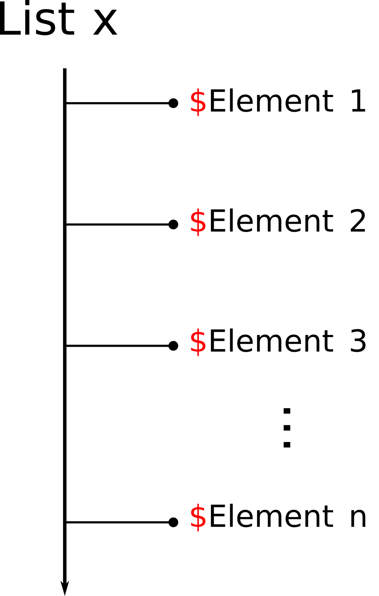
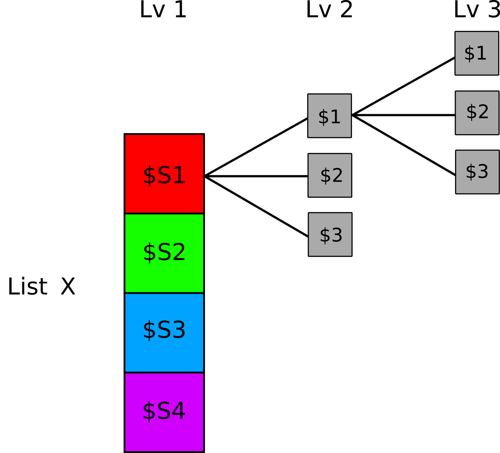

# Lists {#list}


**Lists** are one of the most versatile and useful objects in R. We can think of lists as large containers for other objects. The main feature of lists is their ability to contain **different types of objects** inside them, such as vectors, data frames, matrices, and even other lists.

Unlike data frames and matrices, where the elements are related, the elements of a list are completely independent. A `list`, in fact, can contain completely different objects in both type and size without any relation or constraint.

A useful way to imagine a list (see Figure \@ref(fig:list-example)) is to think of a hotel hallway where each door leads to a room with different characteristics, number of elements, and so on. It is important to note that the elements are arranged in a specific order, allowing them to be identified by their **position index**, similarly to what we saw with vector elements.

<div class="figure" style="text-align: center">

<p class="caption">(\#fig:list-example)Conceptual example of a list</p>
</div>

Practically speaking, a list is a very simple object, similar to a vector, and many of its characteristics are shared with other objects we've already encountered. However, the main difficulty lies in its indexing because, due to their versatility, the structures of lists can become quite complex.

Let’s now see how to create a list and the different ways to select its elements. As we will see, there are many similarities to the use of data frames and matrices. When necessary, we will refer to the previous chapter to point out common aspects and differences between these two data structures.

## Creating Lists

The command to create a list is `list()`:


```r
list_name = list(
  object_name_1 = object_1,
  ...,
  object_name_n = object_n)
```

Although the `object_name_x` parameter is not necessary, as we will see, it is highly recommended to name all elements of the list to make indexing easier. If we don't name the elements, they will be identified only by their position index, i.e., a progressive number $1...n$, just like in the case of vectors. This makes subsequent element selection less intuitive.

So, if we have different objects in our workspace, such as a simple `variable`, a `vector`, and a `dataframe`, we can gather all these elements into a single list. For example:


```r
# A variable
my_value = "Test"

# A vector
my_vector = c(1, 3, 5, 6, 10)

# A data frame
my_data = data.frame(id = 1:6,
                      gender = rep(c("m", "f"), times = 3),
                      y = 1:6)

# Create the list
my_list = list(element_1 = my_value,
                element_2 = my_vector,
                element_3 = my_data)

my_list
## $element_1
## [1] "Test"
## 
## $element_2
## [1]  1  3  5  6 10
## 
## $element_3
##   id gender y
## 1  1      m 1
## 2  2      f 2
## 3  3      m 3
## 4  4      f 4
## 5  5      m 5
## 6  6      f 6
```


### Exercises {-}

Considering the objects created in previous chapters, perform the following exercises ([solutions](https://github.com/psicostat/Introduction2R/blob/master/exercises/chapter-11-lists.R)):

1. Create the list `experiment_1` containing:
    - DataFrame `data_wide`
    - matrix `A`
    - vector `x`
    - variable `info = "First data collection"`
2. Create the list `experiment_2` containing:
    - DataFrame `data_long`
    - matrix `C`
    - vector  `y`
    - variable `info = "Second data collection"`

## Selecting Elements

As mentioned earlier, each element of a list has its **position index**, i.e., a progressive numeric value just like the elements of a vector. However, there is an important difference in the selection method based on the type of object you want to retrieve. While with vectors we used single square brackets `my_vector[i]` to access the element at position $i$, with lists we have two alternatives:

- `my_list[i]` - using **single square brackets** (`[i]`), we get a list containing the element at position $i$. However, this does not allow us to directly access its values.
- `my_list[[i]]` - using **double square brackets** (`[[i]]`), we extract the element at position $i$ from the list and obtain the object itself, allowing us to directly access its values.

Let's see the difference in the following example:

```r
my_list
## $element_1
## [1] "Test"
## 
## $element_2
## [1]  1  3  5  6 10
## 
## $element_3
##   id gender y
## 1  1      m 1
## 2  2      f 2
## 3  3      m 3
## 4  4      f 4
## 5  5      m 5
## 6  6      f 6

# Indexing with [ ]
my_list[2]
## $element_2
## [1]  1  3  5  6 10
class(my_list[2]) # a list
## [1] "list"

# Indexing with [[]]
my_list[[2]]
## [1]  1  3  5  6 10
class(my_list[[2]]) # a vector
## [1] "numeric"
```

This difference in the result obtained by using **single square brackets** (`[ ]`) or **double square brackets** (`[[ ]]`) is very important because it affects subsequent operations we might perform. Remember that in the first case ([ ]), we get a list with only the selected elements, while in the second case (`[[ ]]`), we directly access the selected object.

This distinction becomes clear when applying a generic function to the same element indexed differently or using the `str()` function to understand the structure. We will see that only by directly accessing the element can we perform normal operations, while with single brackets, the obtained object is a list with a single element.


```r
# Apply mean to the vector `element_2` indexed with 1 or 2 brackets
mean(my_list[2])
## Warning in mean.default(my_list[2]): argument is not numeric or logical:
## returning NA
## [1] NA
mean(my_list[[2]])
## [1] 5

# Check structure
str(my_list[2])
## List of 1
##  $ element_2: num [1:5] 1 3 5 6 10
str(my_list[[2]])
##  num [1:5] 1 3 5 6 10
```

:::{.design title="[ ] vs [[ ]]" data-latex="[{[ ] vs [[ ]]}]"}
The different type of selection obtained by using single or double square brackets is defined as follows:

- **single square brackets** (`[ ]`) - returns an object of the same class (i.e., type) as the original object
- **double square brackets** (`[[ ]]`) - extracts an element from the original object, returning an object not necessarily of the same class (i.e., type)

We can use double square brackets even with vectors and data frames, but in these cases, the result does not differ from the normal selection procedure.

```r
# Vectors
my_vector[2]
## [1] 3
my_vector[[2]]
## [1] 3

# Data frame
my_data[, 2]
## [1] "m" "f" "m" "f" "m" "f"
my_data[[2]] # selection is only possible on columns
## [1] "m" "f" "m" "f" "m" "f"
```

Finally, note that single square brackets (`[ ]`) allow you to select multiple elements simultaneously, while double square brackets (`[[ ]]`) allow you to extract only one element at a time.


```r
my_list[c(1,2)]
## $element_1
## [1] "Test"
## 
## $element_2
## [1]  1  3  5  6 10

my_list[[c(1,2)]]
## Error in my_list[[c(1, 2)]]: subscript out of bounds
```
:::

#### Selection using `$` {-}

As an alternative to using **double square brackets** (`[[ ]]`), you can, similar to data frames, access the elements of a list using the `$` operator and specifying their name:

- `my_list$element_name` - the `$` operator allows us to directly access the desired object.

Let's see some examples using the list `my_list` created earlier.

```r
# Select "element_1"
my_list$element_1
## [1] "Test"

# Select "element_3"
my_list$element_3
##   id gender y
## 1  1      m 1
## 2  2      f 2
## 3  3      m 3
## 4  4      f 4
## 5  5      m 5
## 6  6      f 6
```

Note that the element names can also be used with square brackets.

```
## $element_1
## [1] "Test"
## 
## $element_2
## [1]  1  3  5  6 10
```

#### Using Elements and Subsequent Selections {-}

Once we have extracted an element from a list, we can use the object in any way we want. We can either assign the element to a new object for future use or execute functions or other generic operations directly on the selection command.


```r
# Mean of the values of "element_2"

# Assign the object
my_values = my_list$element_2
mean(my_values)
## [1] 5

# Calculate directly
mean(my_list$element_2)
## [1] 5
```

Clearly, the operations we can perform, such as further selections, depend on the specific type and structure of the selected object.


```r
# ---- Select the first value of "element_2" ----

my_list$element_2
## [1]  1  3  5  6 10

my_list$element_2[1]
## [1] 1
my_list[[2]][1] # equivalent to the previous
## [1] 1

# ---- Select the "gender" column from "element_3" ----

my_list$element_3$gender
## [1] "m" "f" "m" "f" "m" "f"

# Other equivalent methods
my_list[[3]]$gender
## [1] "m" "f" "m" "f" "m" "f"
my_list[[3]][, 2]
## [1] "m" "f" "m" "f" "m" "f"
my_list[[3]][, "gender"]
## [1] "m" "f" "m" "f" "m" "f"
```

### Advanced Selection Uses

Now let's see some advanced uses of element selection from a data frame.

#### Modifying Elements {-}

Similar to other objects, we can modify values by selecting the old element from the list and using the `=` (or `<-`) operator to assign a new element. Note that in this case, you can use both single square brackets (`[ ]`) and double square brackets (`[[ ]]`).


```r
my_list
## $element_1
## [1] "Test"
## 
## $element_2
## [1]  1  3  5  6 10
## 
## $element_3
##   id gender y
## 1  1      m 1
## 2  2      f 2
## 3  3      m 3
## 4  4      f 4
## 5  5      m 5
## 6  6      f 6

# Replace the first element
my_list[1] = "A new element"

# Replace the second element
my_list[[2]] = "Another new element"

my_list
## $element_1
## [1] "A new element"
## 
## $element_2
## [1] "Another new element"
## 
## $element_3
##   id gender y
## 1  1      m 1
## 2  2      f 2
## 3  3      m 3
## 4  4      f 4
## 5  5      m 5
## 6  6      f 6
```

#### Deleting Elements {-}

Similar to other objects, to **delete** elements from a list, you need to specify the position indices of the elements you intend to delete within square brackets, preceded by the `-` (*minus*) operator. In this case, the use of single square brackets (`[ ]`) is required.


```r
# Deleting the second element
my_list[-2]
## $element_1
## [1] "A new element"
## 
## $element_3
##   id gender y
## 1  1      m 1
## 2  2      f 2
## 3  3      m 3
## 4  4      f 4
## 5  5      m 5
## 6  6      f 6
```

Remember that deletion is still a selection operation. Therefore, you need to save the resulting list if you want to keep the changes.

### Exercises {-}

Complete the following exercises ([solutions](https://github.com/psicostat/Introduction2R/blob/master/exercises/chapter-11-lists.R))

1. Using **numeric indices**, select the data for subjects `subj_1` and `subj_4` regarding the variables `age`, `gender`, and `group` from the `data_wide` dataframe contained in the list `experiment_1`.
2. Perform the same selection as the previous exercise, but this time use the name of the object to select the DataFrame from the list.
3. In the list `experiment_2`, select the objects `data_long`, `y`, and `info`.
4. Change the names of the objects contained in the list `experiment_2` to `"experiment_data"`, `"VCV_matrix"`, `"Id_codes"`, and `"notes"`, respectively.

## Functions and Operations

Let’s now look at some frequently used functions and common operations performed with lists (see Table \@ref(tab:table-list-functions)).

<table class="table table-striped table-hover table-condensed table-responsive" style="width: auto !important; margin-left: auto; margin-right: auto;">
<caption>(\#tab:table-list-functions)(\#tab:table-list-functions)Functions and operations with lists</caption>
 <thead>
  <tr>
   <th style="text-align:left;"> Function </th>
   <th style="text-align:left;"> Description </th>
  </tr>
 </thead>
<tbody>
  <tr>
   <td style="text-align:left;"> length(nome_df) </td>
   <td style="text-align:left;"> Number of elements in the list </td>
  </tr>
  <tr>
   <td style="text-align:left;"> names(nome_df) </td>
   <td style="text-align:left;"> Names of the list elements </td>
  </tr>
  <tr>
   <td style="text-align:left;"> nome_list$nome_obj &amp;lt;- oggetto </td>
   <td style="text-align:left;"> Add a new element to the list </td>
  </tr>
  <tr>
   <td style="text-align:left;"> c(nome_df) </td>
   <td style="text-align:left;"> Merge multiple lists </td>
  </tr>
  <tr>
   <td style="text-align:left;"> unlist(nome_df) </td>
   <td style="text-align:left;"> Get a vector of all elements </td>
  </tr>
  <tr>
   <td style="text-align:left;"> str(nome_df) </td>
   <td style="text-align:left;"> Structure of the dataframe </td>
  </tr>
  <tr>
   <td style="text-align:left;"> summary(nome_df) </td>
   <td style="text-align:left;"> Summary of the dataframe </td>
  </tr>
</tbody>
</table>


Let’s now describe in detail some particular uses, using the example list `my_list` defined here. Note that the element names have been deliberately omitted.


```r
my_list = list(my_value,
                my_vector,
                my_data)
```

### Attributes of a List

Like other objects, lists have *attributes*, which provide useful information about the object itself. Let’s now see how to evaluate the size of a list and the names of its elements.

#### Size {-}

To evaluate the size of a list, i.e., the number of elements it contains, we can use the `length()` function.


```r
# Number of elements
length(my_list)
## [1] 3
```

#### Element Names {-}

To access the names of the elements in a list, you can use the `names()` function. If the names were not specified at the time of creation, the result will be `NULL`.


```r
# Check current names
names(my_list)
## NULL
```

To assign names to the elements, you will need to assign a character vector with the names to `names(my_list)`.


```r
# Assign names
names(my_list) = c("Variable", "Vector", "Dataframe")

my_list
## $Variable
## [1] "Test"
## 
## $Vector
## [1]  1  3  5  6 10
## 
## $Dataframe
##   id gender y
## 1  1      m 1
## 2  2      f 2
## 3  3      m 3
## 4  4      f 4
## 5  5      m 5
## 6  6      f 6
```

### Merging Lists

To add elements to a list, you can either create a new element using the `$` operator, similar to data frames, or combine multiple lists using the `c()` function.

#### `my_list$name = new_obj` {-}

By writing `my_list$name = new_obj` you can add a new element to the list, specifying the name and assigning the object `new_obj` to it. 


```r
# Add a new element
my_list$new_obj = "A new element"

my_list
## $Variable
## [1] "Test"
## 
## $Vector
## [1]  1  3  5  6 10
## 
## $Dataframe
##   id gender y
## 1  1      m 1
## 2  2      f 2
## 3  3      m 3
## 4  4      f 4
## 5  5      m 5
## 6  6      f 6
## 
## $new_obj
## [1] "A new element"
```

#### `c()` {-}

With the `c()` function, you can combine multiple lists. Note that any new objects you want to include must actually be a list, or you might not get the desired result:

```r
# ERROR: combining a list with a vector
new_vector = 1:3
c(my_list, new_vector)
## $Variable
## [1] "Test"
## 
## $Vector
## [1]  1  3  5  6 10
## 
## $Dataframe
##   id gender y
## 1  1      m 1
## 2  2      f 2
## 3  3      m 3
## 4  4      f 4
## 5  5      m 5
## 6  6      f 6
## 
## $new_obj
## [1] "A new element"
## 
## [[5]]
## [1] 1
## 
## [[6]]
## [1] 2
## 
## [[7]]
## [1] 3

# CORRECT: combining a list with another list
c(my_list, list(new_vector = 1:3))
## $Variable
## [1] "Test"
## 
## $Vector
## [1]  1  3  5  6 10
## 
## $Dataframe
##   id gender y
## 1  1      m 1
## 2  2      f 2
## 3  3      m 3
## 4  4      f 4
## 5  5      m 5
## 6  6      f 6
## 
## $new_obj
## [1] "A new element"
## 
## $new_vector
## [1] 1 2 3
```

In this case, you will need to save the resulting list to preserve the changes.

### List Information

Finally, let’s look at some common functions used to obtain summary information about the elements of a list:

- `str()` allows you to evaluate the structure of the list, providing useful information such as the number of elements and their types.

```r
str(my_list)
## List of 4
##  $ Variable : chr "Test"
##  $ Vector   : num [1:5] 1 3 5 6 10
##  $ Dataframe:'data.frame':	6 obs. of  3 variables:
##   ..$ id    : int [1:6] 1 2 3 4 5 6
##   ..$ gender: chr [1:6] "m" "f" "m" "f" ...
##   ..$ y     : int [1:6] 1 2 3 4 5 6
##  $ new_obj  : chr "A new element"
```
- `summary()` provides summary information about the elements, though it is not very useful for lists.

```r
summary(my_list)
##           Length Class      Mode     
## Variable  1      -none-     character
## Vector    5      -none-     numeric  
## Dataframe 3      data.frame list     
## new_obj   1      -none-     character
```

## Nested Structure

Unlike vectors, which extend in *length*, or data frames/matrices, characterized by rows and columns, the peculiarity of lists (in addition to length, as we have seen) is the concept of **depth**. A list can contain one or more lists within it, thus creating a **very complex nested structure**. Despite the more complex structure, the principle of indexing and creation remains the same. Figure \@ref(fig:list-depth) represents the idea of a nested (or hierarchical) list:

<div class="figure" style="text-align: center">

<p class="caption">(\#fig:list-depth)Conceptual representation of a nested list</p>
</div>

For a practical example, imagine that $n$ subjects have completed $k$ different experiments, and we want to organize this data structure in R efficiently and orderly. We can imagine an `experiments` list that contains:

* Each subject as a list, named `s1`, `s2`, ..., `sn`
* Each element of the subject list is a data frame for the specific experiment, named `exp1, exp2, ..., expn`


```r
# For simplicity, repeat the same experiment and subject

# Generic experiment
exp_x = data.frame(
  id = 1:10,
  gender = rep(c("m", "f"), each = 5),
  y = 1:10
)

# Generic subject
sx = list(
  exp1 = exp_x,
  exp2 = exp_x,
  exp3 = exp_x
)

# Complete list
experiments = list(
  s1 = sx,
  s2 = sx,
  s3 = sx
)

str(experiments)
## List of 3
##  $ s1:List of 3
##   ..$ exp1:'data.frame':	10 obs. of  3 variables:
##   .. ..$ id    : int [1:10] 1 2 3 4 5 6 7 8 9 10
##   .. ..$ gender: chr [1:10] "m" "m" "m" "m" ...
##   .. ..$ y     : int [1:10] 1 2 3 4 5 6 7 8 9 10
##   ..$ exp2:'data.frame':	10 obs. of  3 variables:
##   .. ..$ id    : int [1:10] 1 2 3 4 5 6 7 8 9 10
##   .. ..$ gender: chr [1:10] "m" "m" "m" "m" ...
##   .. ..$ y     : int [1:10] 1 2 3 4 5 6 7 8 9 10
##   ..$ exp3:'data.frame':	10 obs. of  3 variables:
##   .. ..$ id    : int [1:10] 1 2 3 4 5 6 7 8 9 10
##   .. ..$ gender: chr [1:10] "m" "m" "m" "m" ...
##   .. ..$ y     : int [1:10] 1 2 3 4 5 6 7 8 9 10
##  $ s2:List of 3
##   ..$ exp1:'data.frame':	10 obs. of  3 variables:
##   .. ..$ id    : int [1:10] 1 2 3 4 5 6 7 8 9 10
##   .. ..$ gender: chr [1:10] "m" "m" "m" "m" ...
##   .. ..$ y     : int [1:10] 1 2 3 4 5 6 7 8 9 10
##   ..$ exp2:'data.frame':	10 obs. of  3 variables:
##   .. ..$ id    : int [1:10] 1 2 3 4 5 6 7 8 9 10
##   .. ..$ gender: chr [1:10] "m" "m" "m" "m" ...
##   .. ..$ y     : int [1:10] 1 2 3 4 5 6 7 8 9 10
##   ..$ exp3:'data.frame':	10 obs. of  3 variables:
##   .. ..$ id    : int [1:10] 1 2 3 4 5 6 7 8 9 10
##   .. ..$ gender: chr [1:10] "m" "m" "m" "m" ...
##   .. ..$ y     : int [1:10] 1 2 3 4 5 6 7 8 9 10
##  $ s3:List of 3
##   ..$ exp1:'data.frame':	10 obs. of  3 variables:
##   .. ..$ id    : int [1:10] 1 2 3 4 5 6 7 8 9 10
##   .. ..$ gender: chr [1:10] "m" "m" "m" "m" ...
##   .. ..$ y     : int [1:10] 1 2 3 4 5 6 7 8 9 10
##   ..$ exp2:'data.frame':	10 obs. of  3 variables:
##   .. ..$ id    : int [1:10] 1 2 3 4 5 6 7 8 9 10
##   .. ..$ gender: chr [1:10] "m" "m" "m" "m" ...
##   .. ..$ y     : int [1:10] 1 2 3 4 5 6 7 8 9 10
##   ..$ exp3:'data.frame':	10 obs. of  3 variables:
##   .. ..$ id    : int [1:10] 1 2 3 4 5 6 7 8 9 10
##   .. ..$ gender: chr [1:10] "m" "m" "m" "m" ...
##   .. ..$ y     : int [1:10] 1 2 3 4 5 6 7 8 9 10
```

Now the structure is much more complex, but if you have a clear understanding of Figure \@ref(fig:list-depth) and the indexing of previous lists, accessing elements of the `experiments` list is simple and intuitive. If we want to access the dataset for `subject 3` related to `experiment 2`:


```r
# Using numeric indices
experiments[[3]][[2]] # element 3 (a list) and then element 2
##    id gender  y
## 1   1      m  1
## 2   2      m  2
## 3   3      m  3
## 4   4      m  4
## 5   5      m  5
## 6   6      f  6
## 7   7      f  7
## 8   8      f  8
## 9   9      f  9
## 10 10      f 10

# Using names (much more intuitive)
experiments$s3$exp2
##    id gender  y
## 1   1      m  1
## 2   2      m  2
## 3   3      m  3
## 4   4      m  4
## 5   5      m  5
## 6   6      f  6
## 7   7      f  7
## 8   8      f  8
## 9   9      f  9
## 10 10      f 10
```


:::{.tip title="What are lists useful for?" data-latex="[What are lists useful for?]"}
If the advantage of a data frame over a matrix is clear, what is the real utility of lists, which are "simply" containers? The main advantages that make lists extremely powerful objects are:

* **Organize complex data structures**: As seen in the previous example, sets of nested objects can be organized into a single object without cluttering the workspace with dozens of individual objects.
* **Perform complex operations on multiple objects simultaneously**: Imagine having a list of data frames that are structurally similar but contain different data. If you want to apply a function to each data frame, you can organize the data into a list and use functions from the `apply` family (this is for more advanced users).

Finally, due to their flexibility, lists are often used by various packages to return the results of statistical analyses. Knowing how to access the various elements of a list is therefore essential to obtaining specific information and results.
:::
